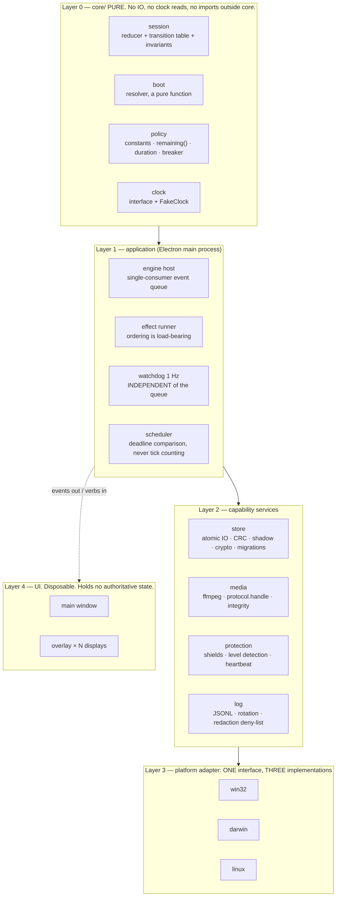
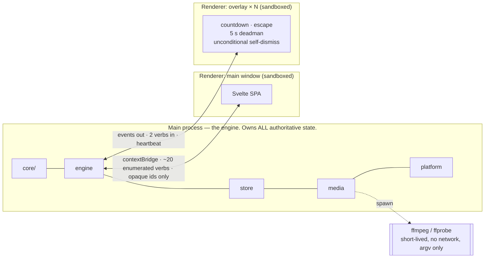
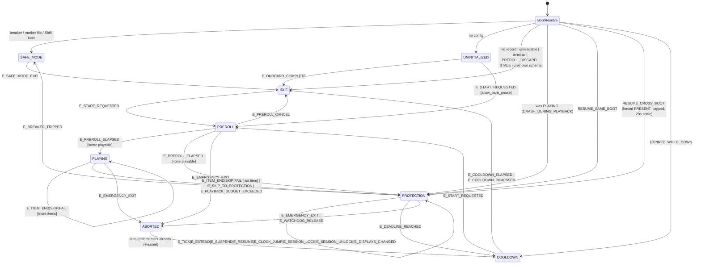

# Mind Pause — System Architecture

**Status:** architecture of record · **Last reviewed:** 2026-09-26
**Change policy:** a change to anything in §2, §4, §5, §6 or §8 requires an ADR under `docs/adr/`.
Rationale and rejected alternatives live in [docs/TECHNICAL_PLAN.md](docs/TECHNICAL_PLAN.md).

---

## 1. Stack

| Layer | Choice |
|---|---|
| Shell | **Electron**, current stable major, upgraded quarterly |
| Language | **TypeScript**, `strict` + `noUncheckedIndexedAccess`, everywhere |
| Renderer | **Svelte 5 + Vite**, static SPA, **no SvelteKit** |
| Engine | A **pure `src/core/` module** — no `electron`, no `node:*`, no IO, no `Date.now()` |
| Media tooling | **LGPL FFmpeg + ffprobe**, trimmed, bundled, invoked as **subprocesses** |
| Crypto | `@noble/ciphers` (XChaCha20-Poly1305), `@noble/hashes` (BLAKE3, Argon2id) |
| Native | Two N-API addons: `clock` (MVP), `audiodev` (V1) |
| Packaging | `electron-builder` → NSIS (Windows) · DMG universal (macOS) · AppImage static type-2 (Linux) |
| Test | Vitest (unit, integration) · Playwright + `_electron` (E2E) |
| Storage | **Plain files, atomically written.** No database. |

**Why Electron and not Tauri**, in one sentence: it is the only stack that ships *one media decoder
on all three platforms*, and it is the only one whose custom-protocol handler supports
`Content-Type` **and** HTTP `Range` **and** an on-the-fly decryption hook uniformly — and media
playback is the entire product. The full matrix, the near-tie with Tauri+libmpv, and the four
conditions under which this reverses are in
[TECHNICAL_PLAN §7–8](docs/TECHNICAL_PLAN.md#7-technology-evaluation).

---

## 2. Layering



**The dependency rule is one-directional and enforced by lint, not by convention.**
`core/` imports nothing. Layer 1 imports `core/`. Layer 2 imports Layer 1 types and Layer 3
interfaces. Layer 3 imports nothing from above. **Layer 4 imports nothing at all** — it receives
serialized events across the contextBridge.

### Three structural decisions, and what each prevents

| Decision | Prevents |
|---|---|
| **`core/` is pure, with an injected clock** | Every recovery scenario becoming a manual ritual. The part that can trap a user is table-driven and provable, and its whole suite runs in milliseconds with no app, no display, no filesystem and no real clock. |
| **The watchdog does not go through the event queue** | A wedged reducer wedging the release path. This is the single most important structural decision in the resilience story. |
| **One platform interface, three implementations, one `process.platform` switch** | Platform-specific behaviour leaking across the codebase and becoming untestable and unreviewable |

### What is deliberately absent

No services, daemons, watchdog processes, IPC servers, databases, ORMs, DI containers, plugin
systems, or event buses beyond the single queue. This is a three-media offline utility; the above is
the floor that satisfies the resilience requirements.

---

## 3. Process and trust model



| Boundary | Rule |
|---|---|
| Renderer → main | **The renderer is not a trust boundary.** Every IPC argument is validated in the main process as if hostile, because an XSS makes it hostile. Opaque ids only — never a path, never a glob. |
| Main → ffmpeg | ffmpeg parses arbitrary user bytes. Short-lived subprocess, no network, argv-only, hard timeout. A malformed file kills a helper, not the app. |
| Store → disk | Nothing plaintext and sensitive is ever written. Decryption is in-memory, streamed into the `protocol.handle` response. |
| App → network | **There is none.** No HTTP client is linked; CI enforces it. |

**Resilience.** Electron runs each renderer in its own OS process, so a renderer crash leaves the
engine running — "resilient engine, disposable UI" inside one binary, with no second daemon, no
second installer, no second autostart entry, and no IPC channel to secure.

**We deliberately ship no watchdog, service, or respawn.** A process the user cannot kill is
malware-shaped, would break notarization and AV reputation, and would violate the never-trap
constraint. The resilience story is *"persist state and resume on the next natural start"*, never
*"cannot be stopped"*.

---

## 4. Session state machine

**The criterion for what earns a state:** a distinct phase is justified **only** if it changes
(a) the set of legal events, (b) the set of running effects, or (c) what the boot resolver decides.
Anything else is a field.

Applying it removes most of the obvious design: `PLAYING_1/2/3` becomes one `PLAYING` phase with a
`playIndex`; `DEGRADED` becomes `flags.degraded`; `COMPLETED`/`FAILED` become an `outcome` enum on
one `COOLDOWN` phase; and **`RECOVERING` is not a state at all** — it is a pure function, because a
persistable `RECOVERING` phase can be recovered *into* recursively, with no defined exit.



`ABORTED` is kept as a real, momentary phase **only** because its effect ordering — *tear down
enforcement, then write the terminal record* — must be visible in the transition table rather than
hidden in a handler.

### Invalid transitions: three tiers, never a throw

`reduce()` is total.

- **Tier A** — benign, idempotent or late. Drop, debug-log, bump a counter. (Includes `E_ITEM_END`
  for a stale `mediaId`: a late callback from the previous item, which is very common in real
  players.)
- **Tier B** — impossible but harmless. Reject, warn-log.
- **Tier C** — an invariant fired. **Force to safe**, which always means *release enforcement*.

> **Governing bias: safe means less restrictive, never more.**

### Invariants, asserted by the watchdog every second

| | |
|---|---|
| **I1** | `enforcementActive ⇒ phase === PROTECTION` |
| **I2** | `PROTECTION ⇒ deadline present ∧ 0 < remaining ≤ planned + extends ≤ HARD_MAX` |
| **I3** | `rev` strictly increasing per write |
| **I4** | At most one non-terminal session |
| **I5** | `0 ≤ playIndex < playlist.length` |
| **I6** | `enforcedWallElapsed ≤ planned + extends + 120 s` |

**I1 and I6 are the anti-lockout invariants**, and they are asserted by a watchdog independent of
the reducer, so a wedged reducer cannot suppress them.

---

## 5. Timing

Three primitives, implemented per OS by the `clock` addon. **Never let a framework's default
"monotonic" leak in** — the defaults differ on exactly the axis that matters.

| Primitive | Purpose | Linux | macOS | Windows |
|---|---|---|---|---|
| `nowWall()` | Steppable; bridges reboots only | `CLOCK_REALTIME` | `CLOCK_REALTIME` | `GetSystemTimePreciseAsFileTime` |
| `nowElapsed()` | **Monotonic INCLUDING suspend — the countdown uses this** | `CLOCK_BOOTTIME` | `mach_continuous_time()` | `QueryInterruptTimePrecise()` |
| `nowActive()` | Monotonic EXCLUDING suspend; diagnostics only | `CLOCK_MONOTONIC` | `mach_absolute_time()` | `QueryUnbiasedInterruptTimePrecise()` |

> **The inversion that a shared core gets wrong:** on Linux `CLOCK_MONOTONIC` *excludes* suspend;
> on Darwin it *includes* it. The addon exposes semantics, not API names, for exactly this reason.

**Authority rule — one implementation, in `core/policy/remaining.ts`:**

```ts
remaining = sameBoot(record)
  ? planned + extends - (nowElapsed() - startedElapsed)   // monotonic is authoritative
  : deadlineWall + extends - nowWall()                    // only evidence left, across a reboot
remaining = clamp(remaining, 0, planned + extends)        // HARD: never grows
```

Not `min(wall, mono)` — a forward clock jump would end the pause instantly. Not `max(wall, mono)` —
a backward jump (NTP correcting a bad RTC, a timezone fix) would trap the user for the difference.
**The final clamp is the whole anti-punishment guarantee.**

**The non-obvious consequence:** when the process dies but the boot is the same, the monotonic clock
is *still* authoritative — it is a property of the kernel, not the process. So crash recovery within
a boot needs no wall clock, and **clock tampering cannot help a user who kills the app and restarts
it**. Only across a reboot does the wall clock survive, and that path is separately capped.

Tamper *detection* is separate and never feeds the deadline: a wall-versus-monotonic drift of more
than 2 s emits `E_CLOCK_JUMP`, which logs and (above +60 s) shows one non-blocking line. No
accusation, no penalty.

---

## 6. Data

### 6.1 No database

Total durable non-media state is one session record (<1 KB), a settings blob, a breaker record, and
an index of at most three items. One writer, enforced by the single-instance lock. No query, no
join, no concurrency. SQLite would add a WAL, a schema to version for five years, a migration
framework, a native dependency, and a binary file you cannot read at 2am — for query capabilities
over three rows. The security argument for SQLCipher was encrypted history, and **there is no
history**.

### 6.2 Layout

| | Config | State / logs | Media & index |
|---|---|---|---|
| Windows | `%APPDATA%\MindPause\` | `%LOCALAPPDATA%\MindPause\` | `%LOCALAPPDATA%\MindPause\media\` |
| macOS | `~/Library/Application Support/MindPause/` | same + `~/Library/Logs/<bundle-id>/` | same + `/media/` |
| Linux | `$XDG_CONFIG_HOME/mind-pause/` | `$XDG_STATE_HOME/mind-pause/` | `$XDG_DATA_HOME/mind-pause/media/` |

**Never** Documents, Videos, Pictures, Desktop, or Windows **Roaming** AppData — OneDrive Known
Folder Move, iCloud "Desktop & Documents", and dotfile repos all silently exfiltrate otherwise.

**And the path constant is not trusted.** At every launch the resolved directory is canonicalized
and its ancestors are walked for sync markers (`.dropbox`, the OneDrive CLSID in `desktop.ini`, the
OneDrive user folder from the registry, reparse points and cloud-placeholder attributes, macOS
`.icloud` placeholders and fileprovider mounts, `~/Nextcloud`/`~/Insync`/`~/pCloudDrive`). On a hit:
refuse, explain in one sentence, offer relocation.

```
<state>/  session.json · session.prev.json · breaker.json · SAFE_MODE · EMERGENCY.txt · events.log{,.1..4}
<config>/ config.json                       # non-sensitive settings only
<data>/   key (0600) · index.bin · index.prev.bin
          media/<32-hex>      # AEAD-sealed, NO extension
          posters/<32-hex>    # AEAD-sealed, NO extension
          .metadata_never_index
```

**Extensionless, content-addressed, encrypted blobs** defeat the common real-world snooping path for
free: no Finder/Explorer thumbnail, no QuickLook, no double-click-to-play, no search-index hit, and
nothing playable recovered by a backup viewer or an undelete tool. **Posters are encrypted too** —
an unencrypted `poster.jpg` would let the file manager thumbnail the user's face and falsify the
whole "opaque blobs" claim.

### 6.3 Atomic writes, per platform

- **Linux** — temp in the same directory → `fsync(file)` → `rename` → **`fsync(dir)`**. The
  directory fsync is not optional on ext4/xfs.
- **macOS** — plain `fsync` reaches the drive cache, not the platter. `F_FULLFSYNC` (10–50 ms) on
  the three writes that matter; plain `fsync` elsewhere.
- **Windows** — `FlushFileBuffers` → `MoveFileExW(..., REPLACE_EXISTING | WRITE_THROUGH)`. No
  directory fsync exists; the guarantee rests on `WRITE_THROUGH` plus the shadow copy. **Retry the
  replace up to 10× with 20 ms backoff** — AV and indexer handles cause transient sharing
  violations; on exhaustion, log and keep the in-memory state authoritative rather than crashing.

Always shadow to `X.prev` before the rename. On load: CRC the current, fall back to the shadow, else
treat as no record and go IDLE with enforcement released — **the same code path and the same log
event as a user deliberately editing the file**, never phrased as an accusation.

### 6.4 Durability policy

Force a barrier only where losing the write would change the resolver's decision: session creation ·
`→ PROTECTION` (**before** enforcement engages) · `PROTECTION → COOLDOWN|ABORTED` (**after**
enforcement is released) · `E_EXTEND` · pre-suspend · breaker updates · clean shutdown. **≤8 barriers
per session.** The 5–15 s checkpoint and the `PLAYING` self-loop are lazy. **The per-second countdown
value is never written** — it is recomputable, and writing it would be 300 fsyncs per session for
zero information.

### 6.5 Media lifecycle

**Copy into app storage. Never reference. Never hardlink.** A reference that resolves at import and
fails six months later, offline, during an urge, is the worst failure this product can have —
Downloads folders self-clean, Photos libraries relocate contents opaquely, cloud placeholders need a
network round trip, external drives get unplugged, and macOS TCC can prompt at playback time.

Every import is **normalized to one guaranteed profile**: **MP4 / H.264 High / yuv420p 8-bit /
≤1080p / ≤30 fps / ≤6 Mbps + AAC-LC 48 kHz / faststart** (audio-only → M4A / AAC-LC 160 kbps). That
single decision delivers compatibility, **security** (the risky parse of an arbitrary file happens
once, at a calm moment, in a short-lived subprocess; at run time the decoder only sees bytes our own
encoder produced), privacy (metadata stripping), disk savings, and posters.

The byte path at playback, end to end:

```
media/<32-hex> (AEAD, 64 KiB chunks)
  → protocol.handle('mindpause')   resolve opaque id → parse Range → chunk-aligned decrypt in memory
  → 200/206 with Content-Type: video/mp4
  → <video src="mindpause://m/<id>">
```

No temp files, no plaintext across IPC, no `file://`, and no loopback socket.

---

## 7. Protection

### 7.1 The one policy

> **We take the screen. We never take the input.**

| | |
|---|---|
| R1 | No `WH_KEYBOARD_LL`, no `CGEventTap` in `.defaultTap`, no `XGrabKeyboard`/`XGrabPointer`, no `EVIOCGRAB`, no `zwp_keyboard_shortcuts_inhibit_v1` |
| R2 | Never intercept an OS-reserved combination — Ctrl+Alt+Del, Win, Cmd+Tab, Cmd+Q, Alt+F4, Ctrl+Alt+F*n*, Ctrl+Cmd+Q |
| R3 | Focus taken **once** at start; re-asserted ≤3 times, ≤once per 10 s; then never |
| R4 | **Zero refocus when assistive technology is present — or when detection is unavailable** |
| R5 | Tab cycles within the window; Escape, Alt+Tab and the OS switcher always leave |
| R6 | A close request **always visibly opens the exit confirmation**. Never silently ignored, never refused. |
| R7 | No policy writes, no system settings changes, nothing that outlives the process |

This resolves the malware-fingerprint, App-Review, accessibility-hazard and never-trap problems in
one move — and costs nothing real, because input capture is defeated by a reboot anyway.

### 7.2 Enforcement level — honesty encoded in the data model

| Level | Meaning | Permitted copy |
|---|---|---|
| `SHIELDED` | Above-normal window on **every** display we could target, platform honours always-on-top | "Your screen is held for the next 5 minutes." |
| `PRESENT` | Always-on-top exists but coverage is partial, or activation was refused | "Mind Pause is staying on top for the next 5 minutes." |
| `OBSERVING` | Countdown runs; nothing reliably on top | "Your pause is running. On this desktop Mind Pause can't stay on top — it's a reminder, not a cover." |

Detected at session start, **persisted on the record**, and it **binds the UI copy**. A release test
asserts that no `OBSERVING` session renders blocking language.

Per-platform: Windows → `SHIELDED` (degrade on `QUNS_RUNNING_D3D_FULL_SCREEN`) · macOS → `SHIELDED`
if the app became active, else **`PRESENT`** (cooperative activation on macOS 14+ can be refused,
and if it is, presentation options are never honoured — this must be *detected*, not assumed) ·
Linux X11 → `SHIELDED` · Linux Wayland KWin/wlroots with the layer-shell helper → `SHIELDED` ·
**GNOME Wayland → `OBSERVING`** · any Flatpak build → `OBSERVING` · anything unknown → `OBSERVING`.

### 7.3 Enforcement is a lease — five independent releases

| # | Mechanism | Fails safe if… |
|---|---|---|
| 1 | 1 Hz watchdog asserting I1/I2/I6, tearing down **first**, never waiting on the queue | the reducer wedges |
| 2 | Overlay **5-second deadman** — no heartbeat, it dismisses itself | the main process is SIGKILLed |
| 3 | Overlay **unconditional self-dismiss** at `start + planned + extends + 120 s` | every clock is wrong |
| 4 | Crash-loop **breaker** → `SAFE_MODE` (3 in 10 min, or 2 within 60 s of login) | the app crashes at login |
| 5 | The **`SAFE_MODE` marker file** and Shift-at-launch, checked before anything else | **our code is the problem** |

Mechanism 5 is the important one: the guarantee that a locked-out user always has a documented way
back that does not require our code to be working.

### 7.4 Shield surface

One borderless window per display at full display bounds (not the work area). Level **above
normal/floating/modal, below the OS security layer** — on macOS specifically
`CGShieldingWindowLevel() - 1` or `.screenSaver`, **never exactly `CGShieldingWindowLevel()`**,
which is the level macOS reserves for SecurityAgent authentication panels; a full-screen opaque peer
there suppresses Touch ID and admin-password sheets, turning "awkward" into a real lockout. Leave
`kCGAssistiveTechHighWindowLevel` headroom.

Capture exclusion applied (Windows `WDA_EXCLUDEFROMCAPTURE`, which is also the documented Windows
Recall opt-out; macOS `NSWindow.sharingType = .none`; Wayland has no equivalent and the UI says so).

**What still draws above the shield everywhere, and must be cosmetically survivable rather than
treated as a failure:** the lock screen and login window · UAC's secure desktop and the
Ctrl+Alt+Del screen · macOS Control Center, Notification Center, the volume/brightness HUD ·
**other applications' notification banners**, which will show previews of exactly the content the
user is avoiding (no API lets an app enable a Focus mode, so the honest mitigation is to suggest it).

### 7.5 Multiple displays

**All outputs by default** — an uncovered second monitor makes the feature meaningless. Reconcile on
display change with a 300–500 ms debounce; key the window map on a **stable display id**, not array
position. **Wayland caveat:** a client cannot choose which output its window opens on, because
Wayland forbids global screen coordinates. Per-output coverage on Wayland is best-effort in the main
app and only correct in the optional layer-shell helper (V1, KWin and wlroots only).

---

## 8. Platform adapter

One interface, three implementations, and **exactly one `process.platform` switch** in the codebase
(the factory in `src/main/platform/index.ts`, enforced by a custom lint rule).

```ts
interface PlatformAdapter {
  dataDir(): string; stateDir(): string; logDir(): string;
  isInsideCloudSyncRoot(p: string): SyncRootVerdict;
  emergencyDocPath(): string;

  createTray(menu: TrayModel): TrayHandle;      // must survive a shell restart
  trayRegistered(): Promise<boolean>;

  autostart(): { supported: boolean; enabled: boolean; disabledByOs: boolean; settingsDeepLink?(): void };
  setAutostart(on: boolean): Promise<void>;

  enumerateDisplays(): DisplayInfo[];
  createShield(d: DisplayInfo): ShieldHandle;
  probeEnforcementLevel(): EnforcementLevel;
  assistiveTechPresent(): boolean;              // unknown => true

  onPower(cb: (e: PowerEvent) => void): Disposable;
  holdDisplayAwake(ttlMs: number): Disposable;  // playback only, always TTL-bounded

  registerHotkey(accel: string): HotkeyResult;  // { ok } | { unsupported, reason, guidance }
}
```

**Every method has a documented degraded return.** `probeEnforcementLevel() === 'OBSERVING'` is a
normal outcome on GNOME Wayland, not an error: it changes the copy, it does not fail the session.

### Per-platform summary

| | Windows | macOS | Linux |
|---|---|---|---|
| **Tray** | `Shell_NotifyIcon` (the only supported API). **New icons default into the Win11 overflow flyout.** Owner must be a normal hidden top-level HWND, not `HWND_MESSAGE`, to receive the `TaskbarCreated` broadcast. Avoid `NIF_GUID`. | `NSStatusItem` + `LSUIElement`. **On notched MacBooks a full menu bar silently parks new items off-screen and `isVisible` still returns true.** Use a template image (Tahoe's menu bar is transparent). | **StatusNotifierItem over D-Bus.** Stock GNOME ships no watcher; Ubuntu preinstalls the extension, **Fedora does not**. Detect via `NameHasOwner` + `NameOwnerChanged` and degrade visibly. |
| **Autostart** | `HKCU\...\Run`. **The user's Startup-apps toggle writes `StartupApproved\Run` rather than deleting our value — we read it and report it, and never silently rewrite it** (that is a malware pattern). | `SMAppService.mainApp.register()`. macOS posts a "background item added" notification and the user can disable it. **`KeepAlive` is forbidden** — it is the primary lockout hazard on macOS. | XDG `~/.config/autostart/*.desktop`. systemd user unit is an advanced toggle with `Restart=on-failure` only. Under Flatpak, the Background portal — **and `autostart` must be passed explicitly, or the portal deletes the user's existing entry**. |
| **Ceiling** | Tier 2, zero admin at install and run | Tier 2, Developer ID, **no TCC prompts at all** | Tier 2 on X11/KWin/wlroots; `OBSERVING` on GNOME Wayland |
| **Never** | Ctrl+Alt+Del · Win+L · resisting termination · kernel drivers · policy keys · `uiAccess` (it would work, but it requires claiming to be assistive technology, which we are not) | SIGKILL · power-button hold · Ctrl+Cmd+Q · fast user switching · **Screen Time (iOS/Catalyst only — no AppKit availability)** · MDM profiles | Wayland input grab · `ext-session-lock-v1` (**the spec requires the compositor to stay locked if the client dies** — the exact trap we forbid) · `EVIOCGRAB` · Ctrl+Alt+F*n* |

Full detail: [TECHNICAL_PLAN §15–17](docs/TECHNICAL_PLAN.md#15-windows-strategy).

---

## 9. Security boundaries

| Boundary | Enforcement |
|---|---|
| **Same OS user** | **Nothing.** No cryptography an unprivileged app performs keeps data from a process running as the same user. This is the defining limit and it invalidates most intuitive reasoning. The honest recommendation for the primary adversary — a family member on the same login — is a separate OS account, and onboarding says so. |
| **Other local accounts** | 0700/0600 set **at creation** (never create-then-chmod, which is a TOCTOU window), verified by a `stat`; Windows **protected** DACL for the user SID + SYSTEM |
| **Cloud sync / backup / search indexes / thumbnailers** | Encryption at rest + path choice + active sync-root detection + index-exclusion markers + extensionless blobs. **This is what encryption actually buys, and it is what the UI claims — no more.** |
| **Renderer (XSS)** | `contextIsolation` on, `nodeIntegration` off, `sandbox` on, `default-src 'none'` CSP with no `unsafe-inline` and **no `data:`/`blob:` in `script-src`** (a nonce gives zero protection alongside a scheme source), all navigation denied, ~20 enumerated preload verbs, every argument validated in main, **opaque ids only**, and a lint rule banning `innerHTML` and `{@html}` |
| **Imported files** | Canonicalize + contain · `O_NOFOLLOW` / `FILE_FLAG_OPEN_REPARSE_POINT` · regular-file check · reject **UNC paths** (they leak an NTLM challenge off-box), ADS, reserved device names, trailing dots. **After import, no path crosses IPC again.** |
| **Network** | There is no HTTP client in the graph, and CI fails the build if one appears. The truthful claim is *"Mind Pause never sends your data anywhere"* — not *"zero network traffic"*, because the OS still performs notarization/OCSP, SmartScreen and webview lookups on its own. |
| **Logs** | An absolute deny-list: no filenames, paths, titles, notes, transcripts — and **never** window titles, URLs, or the names of processes the user tried to open. Media appears as an opaque ULID, **not** a content hash (a hash would let a log-holder test it against a candidate file). |

### Key management

One DEK, chunked XChaCha20-Poly1305 (64 KiB chunks, chunk-index nonce, STREAM-style final tag —
which is what makes HTTP Range work). Wrapped LUKS-keyslot style by up to three independent keys:

| Slot | Tier | Note |
|---|---|---|
| **Keyfile** (`<data>/key`, 0600) | **MVP, default, always present** | Casual-access protection, described in the UI in exactly those words. **It can never fail at the moment of urge** — the property that matters most. |
| OS keychain | V1, optional | Adds resistance to other local accounts reading the keyfile |
| Argon2id passphrase | V1, opt-in | The only thing that helps against a **same-login** snooper, with an unmissable no-recovery warning |

**A passphrase prompt in front of the panic button is a safety defect, not friction.** Default is
keyfile only, with no prompt anywhere in the pause flow. And **"Export my recordings" always ships**
— encryption must never mean the user loses access to their own voice.

---

## 10. Failure and recovery

### The boot resolver (pure, runs once, first match wins)

1. Breaker tripped, `SAFE_MODE` marker, or Shift held → **`SAFE_MODE`**
2. No config → `UNINITIALIZED`
3. No record, both copies fail CRC, or a terminal phase → `IDLE`
4. `PREROLL` → `IDLE` (pre-commitment; discard)
5. Unknown phase string (a downgrade) → `IDLE`, quarantine the file, **do not trip the breaker**
6. `PLAYING` → **`PROTECTION`** with the full duration. *Auto-replaying a personal confession after
   a crash is jarring, and the media may be what crashed the decoder.* A manual "play my message"
   button is offered; never auto-play.
7. `PROTECTION` → the resume table below

### Resume decision table

| Input | Resume? | Level |
|---|---|---|
| Clean quit, or a user escape | No | — |
| Crash/kill, **same boot**, remaining > 0 | **Yes** | Re-detected |
| Crash/kill, same boot, expired within stale grace | No → COOLDOWN | — |
| Crash/kill, same boot, beyond stale grace | No → IDLE, silent | — |
| **Reboot**, unexpired, within a 20-min window, breaker clear, **same app version** | **Yes, declawed** | **Forced `PRESENT`**, capped 10 min, after a 20 s login settle, once |
| App version changed across an unclean restart | No → COOLDOWN: *"Your pause ended when the app updated."* | — |

**No crash tax.** A crash is far more often the app's fault than the user's; charging the user for
the maintainer's bug is the fastest way to lose the trust the product depends on. Resume the
remainder, never restart the duration, never add penalty time. Three recoveries of one session →
`ABORTED(RECOVERY_LOOP)`.

### Power and session events

| Event | Behaviour |
|---|---|
| Suspend / resume | **Continues** (boot-time clock). Durable checkpoint pre-suspend; recompute **before the desktop is interactive** on resume. *Closing the lid for five minutes is five minutes away from the urge.* |
| Display off | Continues. Idle inhibitor held **during playback only**, TTL-bounded. |
| Session lock / unlock | Continues; re-engage on unlock |
| Fast user switch | Continues (per-user by design) |
| Critical battery | Continues; the suspend/reboot rows take over |
| Shutdown / logout | **Honoured immediately.** Write the terminal record; **never block.** |
| Lid close | Continues — **and this is stated in onboarding** |

### Upgrade

`schema_version` on every file · an unknown **future** version → SAFE_MODE with a readable message,
never a crash or a guess · a backup copy before any migration · a migration registry tested against
committed fixtures of every shipped version · **media are never re-normalized on a profile bump** —
tag and leave.

---

## 11. Repository map

See [TECHNICAL_PLAN §21](docs/TECHNICAL_PLAN.md#21-project-folder-structure) for the full tree.

```
src/core/       PURE — session · policy · boot · clock
src/main/       engine · store · media · protection · platform/{win32,darwin,linux} · ipc · log · cli
src/preload/    the contextBridge surface
src/renderer/   Svelte 5 SPA
native/         clock (MVP) · audiodev (V1)
resources/      ffmpeg per target · EMERGENCY.txt.tmpl · tone.m4a · icons
test/           unit (core) · integration · e2e · fixtures (generated) · replay
docs/           TECHNICAL_PLAN · adr/ · BUILD · RELEASE · SUPPORT_MATRIX · THREAT_MODEL
```

### Four lint rules that hold the architecture up

| Rule | Prevents |
|---|---|
| `src/core/**` may not import `electron`, `node:*`, or anything outside `core/` | The pure engine quietly acquiring IO |
| No `Date.now()` / `new Date()` / `performance.now()` in `src/core/**` | Non-injected clocks, which break determinism and replay |
| No `innerHTML` / `outerHTML` / `insertAdjacentHTML` / `{@html}` anywhere | XSS → the full IPC surface |
| `process.platform` only in `src/main/platform/index.ts` | Platform behaviour leaking out of the adapter |

Plus, in CI: **no HTTP client or socket package anywhere in the dependency graph.**

---

## 12. Frozen identity strings

Immutable once shipped — changing any of these breaks user-visible state or resets reputation.

| | |
|---|---|
| Product display name | `Mind Pause` (user-configurable *display* string in V1 — UI only) |
| Binary / process name | `mindpause` |
| macOS bundle id / Flatpak app id | **`io.github.<GITHUB-USERNAME>.MindPause`** — Flathub's convention for a GitHub-hosted project with no domain. **The username is still outstanding and blocks Phase 0.** |
| Windows AUMID | `MindPause.Desktop` |
| Autostart entry name | `MindPause` |

**No recovery or addiction vocabulary appears in any of them**, and changing the user-facing display
name never changes any of them.
