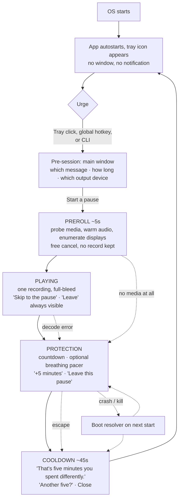
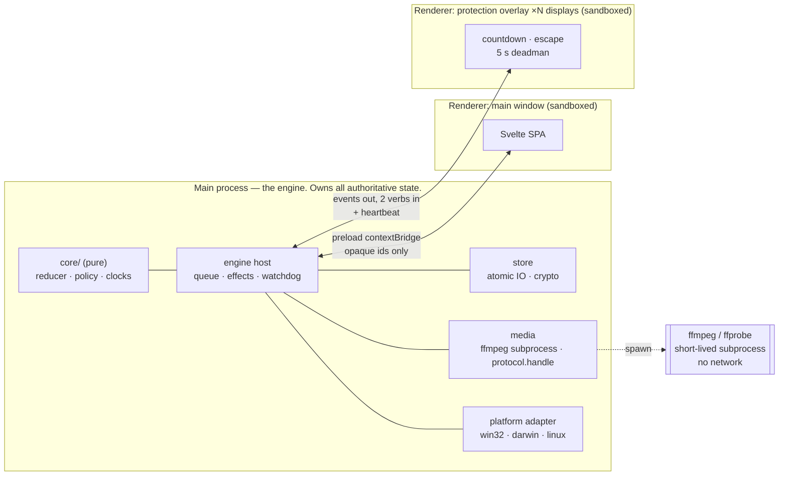
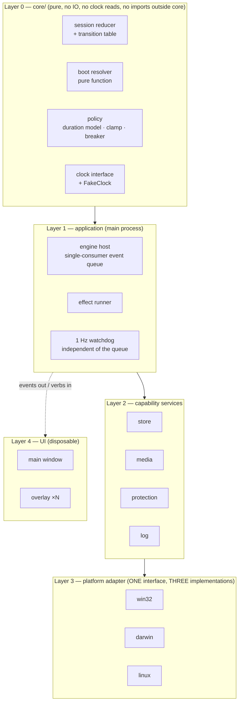
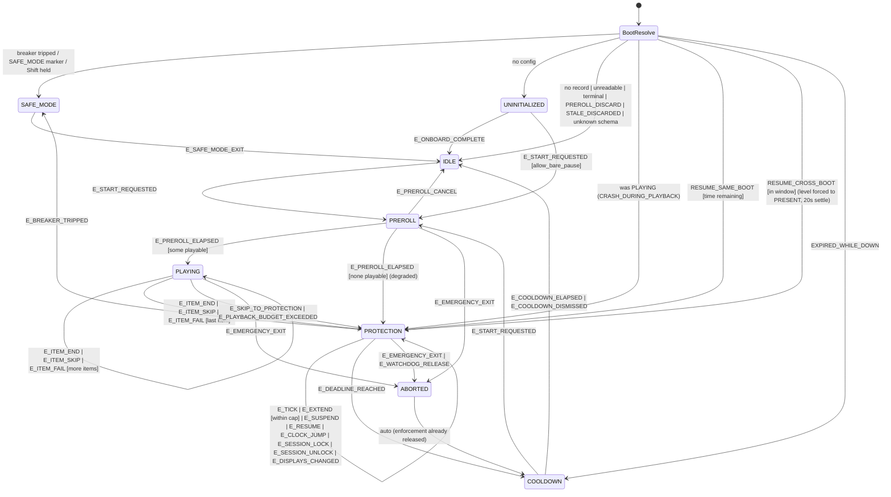
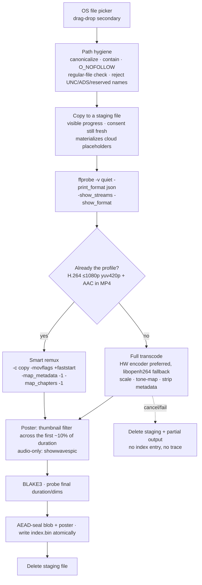

# Mind Pause — Technical & Product Plan

**Status:** Draft 1 for implementation · **Date:** 2026-09-26 · **Horizon:** 3–5 years, one maintainer
**Audience:** the senior engineer who will build this (possibly the author, 18 months from now)

> This document is the architecture of record. Where it contradicts a later note, this document is
> wrong and must be edited — not worked around. Every decision that could reasonably have gone the
> other way is recorded in §29 with the reason it did not.

---

## Table of contents

| § | Section | § | Section |
|---|---|---|---|
| 1 | [Executive Summary](#1-executive-summary) | 16 | [macOS Strategy](#16-macos-strategy) |
| 2 | [Product Definition](#2-product-definition) | 17 | [Linux Strategy](#17-linux-strategy) |
| 3 | [Core User Journey](#3-core-user-journey) | 18 | [Security & Privacy Architecture](#18-security--privacy-architecture) |
| 4 | [Product Principles](#4-product-principles) | 19 | [Failure & Recovery Strategy](#19-failure--recovery-strategy) |
| 5 | [Functional Requirements](#5-functional-requirements) | 20 | [UX/UI Architecture](#20-uxui-architecture) |
| 6 | [Non-Functional Requirements](#6-non-functional-requirements) | 21 | [Project Folder Structure](#21-project-folder-structure) |
| 7 | [Technology Evaluation](#7-technology-evaluation) | 22 | [Testing Strategy](#22-testing-strategy) |
| 8 | [Final Technology Decision](#8-final-technology-decision) | 23 | [Build & Release Strategy](#23-build--release-strategy) |
| 9 | [High-Level Architecture](#9-high-level-architecture) | 24 | [MVP Scope](#24-mvp-scope) |
| 10 | [Detailed Module Architecture](#10-detailed-module-architecture) | 25 | [V1 Scope](#25-v1-scope) |
| 11 | [Local Data Architecture](#11-local-data-architecture) | 26 | [Future Scope](#26-future-scope) |
| 12 | [Session State Machine](#12-session-state-machine) | 27 | [Engineering Roadmap](#27-engineering-roadmap) |
| 13 | [Media Architecture](#13-media-architecture) | 28 | [Risks & Mitigations](#28-risks--mitigations) |
| 14 | [Protection Architecture](#14-protection-architecture) | 29 | [Architecture Decision Records](#29-architecture-decision-records) |
| 15 | [Windows Strategy](#15-windows-strategy) | 30 | [Final Implementation Checklist](#30-final-implementation-checklist) |

---

## 1. Executive Summary

Mind Pause is a small, offline, single-user desktop application that inserts a deliberate interval
between an impulse and acting on it. The user keeps up to three short recordings they made
themselves; when they feel an urge they trigger a *pause* from the tray, one recording plays, and a
calm countdown surface holds the screen for a duration they chose in advance. Then it ends.

**Three things about this product are not negotiable, and they shape every decision below.**

1. **It cannot lock a computer, and it must never claim to.** On all three platforms an
   unprivileged application can cover the screen; it cannot own the machine. Ctrl+Alt+Del, Force
   Quit, a TTY switch, a reboot, a second account, or a phone all defeat it in seconds. Anything
   strong enough to change that requires admin, a signed driver, or an Apple entitlement that does
   not exist for this use case — and would make the app malware-shaped, unsignable, and a genuine
   hazard to its own user. We ship *friction*, we say so in the product, and we publish the bypass
   list as a feature of the design.
2. **There must always be a safe, documented way out.** The escape path is a safety requirement,
   not a UX nicety. Emergencies are certainties over a five-year horizon.
3. **The recordings are among the most private files a person owns.** No account, no backend, no
   telemetry, no network client linked into the binary — so "we send nothing" is verifiable with a
   dependency-tree query rather than taken on trust.

**The headline technical decisions.**

| Decision | Choice | The one-line reason |
|---|---|---|
| Shell | **Electron** (pinned major, quarterly bumps) | It is the only stack that ships *one media decoder on all three platforms*, and media playback is the entire product. |
| Frontend | **Svelte 5 + Vite + TypeScript**, static SPA | Least code per screen for a solo maintainer; compiles away to near-zero runtime; no runtime npm dependencies. |
| Engine | **Pure TypeScript `core/` module**, zero Node/Electron/IO imports, injected clock | The part that can trap a user is table-driven and unit-testable without launching an app. |
| Media | **Normalize every import to one guaranteed profile** (H.264 High / yuv420p / ≤1080p + AAC-LC in MP4) with a bundled LGPL FFmpeg invoked as a subprocess | Kills HEVC, container, rotation, metadata and decoder-attack-surface problems in one pass, at a calm moment, once. |
| Playback | Electron `protocol.handle` with `Content-Type` + HTTP `Range` + on-the-fly AEAD decryption | One code path, three platforms, no temp files, no loopback socket. |
| Storage | **Plain files, atomically written. No database.** | Total durable state is under a few KB plus blobs. SQLite would add a schema, migrations and a binary you cannot read at 2am. |
| Protection | **"We take the screen, never the input."** No keyboard hooks, no event taps, no input grabs, ever. | Resolves the malware-resemblance, App-Review, accessibility-hazard and never-trap problems in one move — and costs nothing real, because input capture is defeated by a reboot anyway. |
| Timing | Boot-time-inclusive monotonic clock is authoritative inside a boot; wall clock only bridges reboots; remaining time is clamped and can never grow | Clock tampering fails inside a boot, and no anomaly can ever punish the user with extra time. |
| Updates | **No auto-updater in the binary.** Signed artifacts, published hashes, OS package channels. | An offline-first privacy app should not phone home, and the update channel is the one path by which one compromised secret reaches every user's recordings. |

**What is deliberately not being built:** accounts, sync, streaks, counters, history, website or app
blocking, URL/process detection, AI coaching, social accountability, analytics, a mobile app, a
privileged helper, a watchdog, and any friction on uninstall. Each exclusion is justified in §26.

**Where the risk actually is.** Not in the state machine, which is well understood. It is in
(a) Linux/Wayland, where an app-enforced overlay is genuinely weaker than on Windows and macOS and
the honest answer is a *support tier table* rather than a promise; (b) code signing, which is a
recurring cost and cannot buy a warning-free first run on Windows; and (c) the import/normalize
pipeline, which is the largest single piece of new code and owns a CVE feed for five years.

**Effort.** Roughly 13–15 weeks of focused solo work to a shippable MVP (the sum of Phases 0–8
in §27; beta runs alongside), with signing and
notarization proven in Phase 0 rather than discovered in Phase 8.

---

## 2. Product Definition

### 2.1 What it is

> Mind Pause puts your own words between you and the reflex, for as long as you decided in advance.

A tray-resident desktop utility. The user prepares up to three short personal recordings. On demand
they start a *pause*: one recording plays, then a calm countdown holds the screen for a chosen
duration (default five minutes), then normal use resumes.

### 2.2 What it is not

- Not a medical, clinical, diagnostic or therapeutic tool. It makes no treatment claims and applies
  no label to the user.
- Not a blocker, a filter, or a lock. It does not know or care what the user is doing.
- Not a monitor. It reads no window titles, no URLs, no process lists, no keystrokes, no clipboard,
  no screen contents — and no dependency in the tree may do so either.
- Not a tracker. There is no history, no streak, no score, and nothing that timestamps a "failure".

### 2.3 The mechanism, stated honestly

Two ingredients with real support in the literature, and one that is scaffolding:

1. **A self-recorded message is self-administered episodic future thinking.** Vivid, personalized
   future cues reliably reduce delay discounting and, in several samples, craving. A user describing
   in their own voice what they want tomorrow to feel like *is* that cue, with perfect
   personalization. **This is the mechanism, and the recording step is therefore the highest-value
   part of the product** — not the playback chrome.
2. **Choosing the duration in advance makes it an implementation intention.** Gollwitzer & Sheeran's
   meta-analysis (94 studies) reports d ≈ 0.65, with larger effects for discrete, time-bound acts
   (d ≈ 0.79) than sustained ones (d ≈ 0.31). A pause is the favourable case.
3. **The countdown itself is scaffolding.** The `one sec` RCT (PNAS 2023) found ~36% dismissal of
   the consumption attempt and ~37% fewer opening attempts — and identified the *dismiss option*,
   not the delay, as the most effective ingredient. Minutes of mandatory media is not where the
   effect lives.

**Corollary that governs the whole design:** a user who presses the button and leaves at 0:40 still
got the deliberation the mechanism is made of. Nothing in copy, UI, or data may treat an early exit
as failure.

### 2.4 Challenged assumptions

The brief contained four assumptions that do not survive contact with the evidence or the platforms.
Each is changed here, with the reason.

| Brief said | Plan says | Why |
|---|---|---|
| Play all three recordings sequentially | **Play one per session, by rotation.** "Play everything" is a visible secondary button. | Three items sequentially is an 8–14 minute commitment *before* the pause starts. The scarce resource is willingness to press the button while ambivalent, and every second of expected duration raises that cost. Keep three for habituation resistance (the same clip heard 40 times goes dead); play one. Rotation not random — random can serve the same clip three sessions running. |
| A 5-minute *lock* on the *whole computer* | **A calm, always-on-top *presence*, on a duration the user chose.** | The lock is fictional (§14), and a whole-machine takeover also blocks the things the user might do *instead* — writing, music, a call with a friend. That is not protection, it is collective punishment, and it is the main generator of the "punitive" feeling that precedes uninstall. |
| Fixed 5 minutes | **User-chosen in advance (2/5/10/20, default 5), with a prominent "+5 minutes".** | Fixed duration is imposed; chosen duration is an if-then plan. Voluntary extension is the behaviour worth encouraging and the only honest efficacy signal available offline. |
| A tray click is the trigger | **Tray click + global hotkey (where the platform allows) in MVP; scheduled pauses in V1.** | A person in the grip of an impulse does not open a tray menu. The realistic user is the *ambivalent* person in the 20–60 second approach phase, and the person doing a preventive pause. Designing for the mid-binge user is where this product starts lying. |

Two further honest limits, stated in the product itself rather than buried:

- **Uninstall is a one-click bypass on every platform**, and no version of this product may try to
  change that. Saying so out loud reduces reactance — the user stops testing the cage because there
  is no cage — and it is the trust asset this category lacks.
- **It cannot follow the user to a phone**, which is where a large share of the target behaviour
  actually happens. Onboarding says this in one sentence.

### 2.5 Safety posture

The product touches gambling and pornography — populations with measurable distress and, for
gambling, substantially elevated suicide risk, concentrated in acute post-loss states. That mandates,
as hard requirements rather than polish:

- An escape reachable in ≤2 interactions from second zero, keyboard-only, never passphrase-gated.
- No streaks, no counters, no relapse/failure vocabulary, no evaluative adjective applied to the
  user (including positive ones — praise implies a scale, and a scale implies the other end).
- One quiet, non-preachy line: *"This app isn't treatment. Talking to someone helps."*
- No region-locked crisis-helpline list (it cannot be kept correct offline for five years); instead
  a user-entered "Someone I can call" (V1).

---

## 3. Core User Journey

### 3.1 The happy path



### 3.2 First run

Three screens, about sixty seconds, **zero mandatory inputs and zero permission prompts**.

1. **The promise.** One sentence on what it does, one on what it is not, and the escape promise:
   *"You can end any pause. Hold Esc for three seconds."* No feature tour, no testimonials.
2. **Your first message.** Primary: *Add a message* (OS file picker). Helper: *"A voice memo on your
   phone is the easiest way — record it there, then bring the file here."* Secondary: *Skip for now*.
3. **When and how.** Pause length (2/5/10/20, default 5), global hotkey (with a sane default and a
   live conflict check), *Start with my computer* (on). Explains, before it happens, that macOS will
   post a "background item added" notification and that Windows shows the app in Startup apps.

Then: land on the main window with a tray hint. Never a modal.

### 3.3 The moment that matters most

From urge to first frame must be under three seconds, and the app must **never fail at this moment**.
The degradation ladder (§13.6) guarantees that: if a file is missing, the next one plays; if all are
missing, the pause still runs with a calm timer; if audio cannot be heard, the written note shows.
*The protection period runs no matter what happens to the media.* A codec problem must never abort a
session the user asked for.

---

## 4. Product Principles

Eight principles. Each is falsifiable by a test the maintainer can actually run, and each test is a
release gate.

| # | Principle | Release gate |
|---|---|---|
| P1 | **The escape is always ≤2 interactions, visible, and keyboard-reachable.** | *Panic test:* three people who have never seen the app must exit a running pause within 10 seconds with no instruction. Any failure blocks the release. |
| P2 | **We ship soft commitment, and we say so.** | No code path elevates privileges, installs a service, respawns after a kill, hides a process, or impedes uninstall. Grep-and-review gate every release. |
| P3 | **Urge to first frame under 3 seconds.** | Cold start to tray ≤1.5 s and first media frame ≤1.5 s more, measured on the designated five-year-old reference machine. |
| P4 | **Zero bytes leave the machine.** | A full session under a deny-all egress firewall with packet capture shows zero connection attempts from our process. The pcap is a release artifact. |
| P5 | **We never read what you do.** | No window-title, URL, process-enumeration, keystroke, clipboard or screenshot API anywhere in the app **or its dependency tree**. A dependency that needs one is rejected. |
| P6 | **Nothing persisted can be used against the user.** | Every persisted field is enumerated in §11.6 with a written justification. Nothing timestamps a "failure". "Delete everything" removes media, config and logs in one action. |
| P7 | **Every screen works keyboard-only, at 200% zoom, with a screen reader** — the protection screen most of all. | Per-release checklist on NVDA, VoiceOver and Orca. Orca is tested *first*, not last: it is the weakest combination and it will shape the UI. |
| P8 | **Scope veto.** Any feature requiring an account, a server, a browser extension, or an OS accessibility permission is out by default and needs a written exception in an ADR. | The checklist itself. |

Two rules that follow from P1 and P2 and are worth stating separately because they are the ones a
future contributor will be tempted to break:

- **The UI never owns session state.** The renderer renders events. If it dies, the engine is
  unaffected and the overlay is rebuilt (capped) or the session ends cleanly. Fail open, always.
- **Safe means less restrictive, never more.** Every ambiguous recovery path releases enforcement.

---

## 5. Functional Requirements

Identifiers are stable and are referenced by the traceability matrix in
[PRODUCT_REQUIREMENTS.md](../PRODUCT_REQUIREMENTS.md). **M** = MVP, **V** = V1, **F** = Future.

### 5.1 Onboarding and setup

| ID | Requirement | Tier |
|---|---|---|
| FR-01 | First run shows exactly three screens, completable in ~60 s with zero mandatory inputs and zero OS permission prompts. | M |
| FR-02 | A pause can be started **before** onboarding completes and **with zero media** (`allow_bare_pause`, default true). Onboarding is never a gate on the core value. | M |
| FR-03 | Autostart is offered on screen 3, default on, with the platform's own consequence explained *before* it happens. | M |
| FR-04 | The app states, once, in onboarding: what it is, what it is not, where files live, and that leaving is always allowed. | M |
| FR-05 | A user-entered "Someone I can call" contact, shown on the completion screen only if set. | V |

### 5.2 Media library

| ID | Requirement | Tier |
|---|---|---|
| FR-10 | Import audio or video through the OS file picker (primary) or drag-and-drop (secondary). | M |
| FR-11 | The library holds **at most 3** items, presented as three fixed slots, not a list. Empty slots read as invitations. | M |
| FR-12 | Every import is copied into app storage and **normalized to one guaranteed profile** (§13.2). The user's original is never modified, moved, or referenced again. | M |
| FR-13 | Import is asynchronous, shows progress, and is cancellable; a cancelled import leaves no partial file and no index entry. | M |
| FR-14 | Per item the app stores: opaque id, title (user-editable, defaulting to something neutral — never the source filename), duration, dimensions, has-audio, poster, created-at, slot, optional free-text note. | M |
| FR-15 | Replace, delete and reorder an item. Delete is immediate and irreversible, with a confirmation that honestly states backups and snapshots may retain copies. | M |
| FR-16 | An optional free-text note per item, displayed during playback and on the protection screen. This is the caption/accessibility answer and the mute fallback. | M |
| FR-17 | *Rehearse the full pause* — run the whole sequence with a 20-second protection period, so the user proves it works before the first real urge. | M |
| FR-18 | Record audio in-app (native capture, not the webview). | V |
| FR-19 | Trim / re-take a recording. | V |
| FR-20 | On-device transcription behind an explicit, opt-in model download. | F |

### 5.3 Session

| ID | Requirement | Tier |
|---|---|---|
| FR-30 | Start a pause from: the tray/menu-bar popover, the main window, a global hotkey (where the platform allows), or the CLI. | M |
| FR-31 | Default playback is **one item per session, chosen by rotation**. "Play everything" is a visible non-default. | M |
| FR-32 | PREROLL (default 5 s, 0–15 s) probes each file, warms the audio device, enumerates displays, and offers a free cancel that leaves no record. | M |
| FR-33 | Playback: no seek, no scrub, no skip-within-item. Pause **is** allowed (a phone rings) but the protection countdown is not affected and playback auto-resumes after 60 s. Exactly one escape, always visible. | M |
| FR-34 | Protection period: countdown, optional breathing pacer, "+5 minutes", "Leave this pause". Duration presets 2/5/10/20 min, default 5, min 1 min, hard maximum **30 minutes including all extensions**. | M |
| FR-35 | Media time does **not** count toward the protection duration. The media is the interrupt; the protection period is the wait. | M |
| FR-36 | Completion screen: no score, no streak, no counter, no confetti. One optional secondary: "Another five?". | M |
| FR-37 | Playback and protection are independently enterable: *Just the message* and *Just five quiet minutes* are both first-class. | M |
| FR-38 | Scheduled and idle-cued pauses (clock and idle timer only — no content inspection). | V |

### 5.4 Protection surface

| ID | Requirement | Tier |
|---|---|---|
| FR-40 | The protection surface covers **all displays by default** (settable to "just the one I'm using") and re-reconciles on display hotplug within 1 s. | M |
| FR-41 | The app **never** captures, hooks, grabs or suppresses input on any platform. Every OS shortcut keeps working. | M |
| FR-42 | The achieved enforcement level (`SHIELDED` / `PRESENT` / `OBSERVING`, §14.3) is detected at session start, persisted, and **binds the UI copy**. The UI may never claim more than the level says. | M |
| FR-43 | Focus may be taken once at session start, then re-asserted at most 3 times and no more than once per 10 s, then never again. If assistive technology is detected, the refocus cap is **zero**. | M |
| FR-44 | The window-close request (Alt+F4, Cmd+Q, close button, `xdg_toplevel.close`) always visibly does something: it opens the exit confirmation. It is never silently ignored. | M |
| FR-45 | Screen-capture protection is applied to the playback window and the message library on Windows and macOS. Linux/Wayland has no equivalent and the UI says so. | M |
| FR-46 | "Firm mode": duck other applications' audio during protection. | V |

### 5.5 Escape and safety

| ID | Requirement | Tier |
|---|---|---|
| FR-50 | **Tier 1 escape** — "End this pause": hold for 3 s (configurable 0–10 s), with a visible progress ring. Space/Enter held works for keyboard and AT users. | M |
| FR-51 | **Tier 2 escape** — "I need my computer now": one click, no hold, enforcement released in <100 ms, always present. | M |
| FR-52 | Hold Esc for 3 s ends any pause from any surface, always. | M |
| FR-53 | `mind-pause end` ends any pause from a terminal or another session. | M |
| FR-54 | A `SAFE_MODE` marker file at a documented path, creatable from a recovery shell, another account, Safe Mode, or a live USB, prevents any enforcement at next start. | M |
| FR-55 | Holding Shift during launch enters safe mode (unreliable on Wayland; the marker file is the documented route there). | M |
| FR-56 | Enforcement is released **before** the terminal record is written, never after. | M |
| FR-57 | `EMERGENCY.txt` exists at a stable path **outside the app bundle**, containing the exact escape commands for that platform. Its content is also printed on the protection screen as selectable text. | M |
| FR-58 | Early exit is recorded only as an outcome enum on the (single, overwritten) session record. It is never counted, never compared, and never framed as failure. | M |

### 5.6 System integration

| ID | Requirement | Tier |
|---|---|---|
| FR-60 | Tray / menu-bar item with at most six entries. Left-click opens a small popover with one large Start button — a stray click never launches a five-minute takeover. | M |
| FR-61 | The tray is **never the only entry point**. Fallbacks: main window, `.desktop` Actions (Linux), global hotkey, CLI. The app detects a failed tray registration and explains it once. | M |
| FR-62 | Autostart via the platform's own user-visible mechanism, and the app **detects and reports** when the OS has disabled it rather than silently re-enabling it. | M |
| FR-63 | Single instance per OS user. A second launch forwards its verb to the first and exits 0. | M |
| FR-64 | Suspend, resume, screen lock, unlock, fast-user-switch, and shutdown are all handled explicitly per §19.4. | M |
| FR-65 | CLI: `pause`, `end`, `safe`, `status`, `doctor`, `replay` — identical verbs and exit codes on all three platforms. | M |

### 5.7 Data and privacy

| ID | Requirement | Tier |
|---|---|---|
| FR-70 | All app data lives in the platform's non-synced local app-data directory, and the app **verifies at every launch** that this directory is not inside a cloud-sync root; if it is, it refuses to store media there and offers relocation. | M |
| FR-71 | Media blobs, posters and the media index are encrypted at rest with a keyfile-wrapped DEK (§18.4), with the UI stating exactly what that does and does not protect against. | M |
| FR-72 | "Export my recordings" writes decrypted copies to a folder the user picks. Encryption must never mean losing access to your own voice. | M |
| FR-73 | "Delete everything" removes media, posters, index, keyfile, session and breaker state, logs, the autostart entry and the safe-mode marker, in one action. | M |
| FR-74 | File logging is off by default. A troubleshooting toggle states exactly what will be written, caps total log size, and auto-reverts after 24 hours. | M |
| FR-75 | Diagnostics are exported to a user-chosen file after the user has read the exact bytes in-app. There is no upload path and no crash-reporting SDK. | M |
| FR-76 | Optional second and third DEK wrappings: OS keychain, and an Argon2id passphrase with an unmissable no-recovery warning. | V |

### 5.8 The 30 required scenarios, mapped

| # | Scenario | Where it is specified |
|---|---|---|
| 1 | First-run onboarding | §3.2, FR-01..04 |
| 2 | Media upload/import | §13.3, FR-10..13 |
| 3 | Maximum 3 media items | FR-11; enforced in `core/policy` |
| 4 | Audio support | §13.2 (audio profile), FR-16 (audio-only presentation) |
| 5 | Video support | §13.2 |
| 6 | Media metadata | FR-14, §11.4 |
| 7 | Media replacement/removal | FR-15 |
| 8 | Session creation | §12.3 (`E_START_REQUESTED`), FR-30 |
| 9 | Sequential playback | §12.2 (one `PLAYING` phase + `play_index`), FR-31 |
| 10 | Session completion | §12.3 (`COOLDOWN`), FR-36 |
| 11 | Focus/protection period | §14, FR-34, FR-40..45 |
| 12 | Countdown | §12.6 (deadline comparison, never tick counting) |
| 13 | Tray/menu-bar quick action | §15.1, §16.1, §17.1, FR-60..61 |
| 14 | Autostart | §15.2, §16.2, §17.2, FR-62 |
| 15 | Settings | §20.6 |
| 16 | Local persistence | §11 |
| 17 | Crash recovery | §19.2 |
| 18 | Restart during an active session | §19.3 row *crash/kill, same boot* |
| 19 | Sleep/wake during an active session | §19.4 |
| 20 | Reboot during an active session | §19.3 row *reboot* |
| 21 | App update behavior | §19.6, §23.5 |
| 22 | Media file deletion/movement | §11.7 — impossible by construction (we copy); integrity ladder §13.5 |
| 23 | Corrupted media handling | §13.6 degradation ladder |
| 24 | Multiple monitors | §14.6 |
| 25 | Accessibility | §20.8 |
| 26 | Keyboard handling | §14.2 ("never the input"), §20.8 |
| 27 | Unexpected app termination | §19.3, §19.5 (overlay deadman) |
| 28 | Deliberate bypass attempts | §14.7 stance table |
| 29 | Emergency/escape path | §14.8, FR-50..58 |
| 30 | Privacy/security of stored media | §18 |

---

## 6. Non-Functional Requirements

Every number below is an assertion in the per-release manual matrix (§22.6). A budget nobody
measures is a wish.

### 6.1 Performance

| ID | Requirement | Measured on |
|---|---|---|
| NFR-01 | Cold start (process launch → tray icon visible and clickable) ≤ **1.5 s** | Reference machine R1 (§22.5) |
| NFR-02 | Trigger (hotkey/tray click) → protection or playback surface on screen ≤ **500 ms** | R1 |
| NFR-03 | Trigger → first media frame ≤ **1.5 s** (so urge-to-frame ≤ 3 s end to end) | R1 |
| NFR-04 | Idle RSS, tray-resident, no window shown ≤ **200 MB** total across all processes | R1, after 30 min idle |
| NFR-05 | Idle CPU, tray-resident ≤ **0.5%** averaged over 5 minutes | R1 |
| NFR-06 | CPU during 1080p playback ≤ **25%** of one core | R1 |
| NFR-07 | Import normalize throughput ≥ **1× realtime** on R1 for 1080p input, ≥ **0.3× realtime** for 4K HEVC input, always with visible cancellable progress | R1 |
| NFR-08 | Peak RSS during a 4K transcode ≤ **1.5 GB** (ffmpeg subprocess included) | R1 |
| NFR-09 | Escape (Tier 2 click → all enforcement released) ≤ **100 ms** | All tiers |
| NFR-10 | State transition write, including a full durability barrier, ≤ **50 ms** p99 | All tiers |

### 6.2 Resources

| ID | Requirement |
|---|---|
| NFR-11 | Installed size ≤ **400 MB** (Electron + bundled trimmed FFmpeg). Installer ≤ **180 MB**. |
| NFR-12 | Durable non-media state ≤ **64 KB**. Logs capped at **3 MB** total across rotation. |
| NFR-13 | Media storage: warn at 2 GB; the 3×5-minute soft cap keeps the realistic case under ~250 MB. |
| NFR-14 | No background work while idle beyond the tray message loop and one 60 s heartbeat. No polling of anything the OS can signal. |

### 6.3 Reliability, integrity, upgrade

| ID | Requirement |
|---|---|
| NFR-20 | No single crash, kill, power loss, or torn write may leave the machine enforced with no valid session. Guaranteed by invariant I1 + the 1 Hz watchdog + the overlay deadman (§19.5). |
| NFR-21 | Enforcement is bounded absolutely at `planned + extensions + 120 s` by a check computed at overlay creation and re-verified against both clocks. Even with every clock insane, the machine is free within 2 minutes of the intended end. |
| NFR-22 | Every durable write is atomic (temp + barrier + rename), CRC-checked, and shadowed by a previous-good copy. A zero-filled or truncated record is a logged non-event, never undefined behaviour. |
| NFR-23 | An unknown *future* `schema_version` enters SAFE_MODE with a readable message. It never crashes and never guesses. |
| NFR-24 | A migration writes a backup copy of every file it touches before touching it. Migrations are tested against committed fixtures of every previously shipped version. |
| NFR-25 | Crash-loop circuit breaker: 3 unclean starts in 10 minutes, **or** 2 within 10 minutes both occurring within 60 s of login, disables all enforcement until the user re-enables it. |

### 6.4 Privacy and security

| ID | Requirement |
|---|---|
| NFR-30 | No HTTP client, socket library, or network-capable crate/package in the dependency graph. CI fails the build if one appears. |
| NFR-31 | No API in the app or its dependency tree that can read window titles, URLs, process lists, keystrokes, the clipboard, or screen contents. |
| NFR-32 | Zero outbound connections from our processes during a full session under packet capture. |
| NFR-33 | No plaintext media, poster, title, note or transcript is ever written outside the encrypted store — including temp files, crash dumps, and logs. |
| NFR-34 | Directories created at mode 0700 and files at 0600 **at creation time**, verified after creation; on Windows, an explicit protected DACL for the user SID plus SYSTEM. |
| NFR-35 | Renderer CSP is `default-src 'none'` with no `unsafe-inline`, no remote origins, and no `data:`/`blob:` in `script-src`. Context isolation on, node integration off, sandbox on. |
| NFR-36 | No IPC channel accepts a filesystem path. Every parameter is an opaque id validated in the main process. |

### 6.5 Accessibility and UX

| ID | Requirement |
|---|---|
| NFR-40 | Every flow completable keyboard-only, including import and escape. |
| NFR-41 | WCAG 2.1 AA throughout; **AAA (≥7:1)** for the countdown and both escape controls, *including at the dimmest setting of the dim mode* — the dim ramp is clamped by contrast, not by luminance. |
| NFR-42 | Screen-reader pass on NVDA, VoiceOver and Orca each release. The countdown is `aria-hidden`; a polite live region announces at start, halfway, one minute remaining, and end — never per second. |
| NFR-43 | Hit targets ≥44×44 pt, ≥56 pt for "Start a pause" and both escape controls; the escape controls are never within 24 px of anything destructive. |
| NFR-44 | `prefers-reduced-motion` honoured, plus an independent in-app toggle. Motion budget ≤300 ms per transition; the breathing pacer is the only continuous animation. |
| NFR-45 | Everything survives 200% OS zoom and Windows forced-colors / macOS Increase Contrast without clipping. |
| NFR-46 | State is carried by number + text + shape, never by hue alone. |

### 6.6 Offline behaviour

| ID | Requirement |
|---|---|
| NFR-50 | Every feature works with no network, permanently, on first run and forever. There is no degraded offline mode because there is no online mode. |
| NFR-51 | The installer contains everything needed. Nothing is fetched at install or first run. |
| NFR-52 | The honest public claim is **"Mind Pause never sends your data anywhere"** — not "this program generates zero network traffic", because the OS still performs notarization/OCSP, SmartScreen and webview-update lookups on its own. |

---

## 7. Technology Evaluation

### 7.1 What this product actually needs

Weights are derived from the product, not from generic desktop scoring, and are stated so they can
be argued with.

| Criterion | Weight | Why this weight |
|---|---|---|
| **Guaranteed media decode on all 3 OSes** | 16 | The core loop is "the user's own recording plays, first try, every time". If it fails, there is no product. |
| **Uniform media serving (Content-Type + Range + decryption hook)** | 8 | Required by encryption-at-rest and by seeking; the place where webview shells diverge most. |
| Reach to native OS APIs | 9 | Reduced from the obvious weight of ~14 **because** the protection policy is visual-only (§14.2); most of what remains is exposed by the shell. |
| Tray / menu-bar on all 3 | 10 | Tray-first product. |
| Single-maintainer productivity over 5 years | 12 | One person, touching the code a few times a year. |
| Idle RAM | 6 | Resident 24/7, but on a machine already running a browser. |
| Startup to tray | 6 | NFR-01. |
| Installer / disk size | 4 | Matters for trust and download, not for function. |
| Autostart | 4 | Solved everywhere. |
| Packaging / signing / notarization | 8 | The classic end-of-project ambush; a real recurring cost. |
| Security posture | 6 | Offline, no remote content, no user HTML → the realistic XSS surface is the dependency tree. |
| Testability | 5 | The engine is testable by design discipline in any language. |
| 5-year ecosystem health / bus factor | 6 | The maintainer must still be able to build this in 2031. |
| **Total** | **100** | |

### 7.2 The decision matrix

Scores 1–5. Weighted total out of 500.

| Criterion (w) | **Electron** | Tauri v2 + libmpv | Tauri v2 + webview | Flutter | Qt 6 C++ | Avalonia 12 | Native ×3 + shared core | Slint / Dioxus / GPUI | Wails v3 |
|---|---|---|---|---|---|---|---|---|---|
| Guaranteed decode (16) | **5** | 5 | 2 | 3 | 4 | 1 | 4 | 1 | 2 |
| Uniform media serving (8) | **5** | 3 | 2 | 3 | 4 | 2 | 3 | 2 | 2 |
| Native API reach (9) | 3 | 5 | 5 | 3 | 5 | 4 | 5 | 5 | 3 |
| Tray on all 3 (10) | 4 | 3 | 3 | 2 | 5 | 3 | 5 | 3 | 3 |
| Solo productivity (12) | **5** | 4 | 4 | 4 | 2 | 3 | 1 | 2 | 4 |
| Idle RAM (6) | 2 | 4 | 4 | 3 | 4 | 3 | 5 | 5 | 4 |
| Startup (6) | 3 | 5 | 5 | 4 | 4 | 3 | 5 | 5 | 5 |
| Size (4) | 2 | 4 | 4 | 3 | 3 | 3 | 5 | 5 | 5 |
| Autostart (4) | 5 | 5 | 5 | 3 | 3 | 3 | 5 | 3 | 3 |
| Packaging/signing (8) | **5** | 4 | 4 | 3 | 2 | 3 | 3 | 2 | 3 |
| Security posture (6) | 2 | 4 | 4 | 4 | 4 | 4 | 5 | 5 | 3 |
| Testability (5) | 4 | 4 | 4 | 4 | 3 | 4 | 3 | 3 | 4 |
| 5-year health (6) | **5** | 4 | 4 | 3 | 4 | 3 | 4 | 2 | 2 |
| **Weighted /500** | **–** | – | – | – | – | – | – | – | – |
| | **404** | 411 | 366 | 326 | 372 | 302 | 396 | 292 | 320 |

**Read the top of that table honestly.** Tauri+libmpv scores highest (411) and Electron second (404)
— a 1.7% gap, which is inside the noise of my own weighting. The matrix does not decide this; the
qualitative analysis in §7.4 does, and it turns on facts the matrix cannot express.

**Sensitivity.** Raise "guaranteed decode" to 20 and both leaders rise together (nothing reorders).
Drop Linux entirely and Tauri-with-plain-webview jumps to 402 (WebView2 and WKWebView both handle
H.264/AAC) while Electron falls to ~390 on size and RAM — **dropping Linux is the single change that
flips this decision**, and it is a product decision, not a technical one. If in-app recording becomes
MVP (producing the guaranteed profile directly, so no arbitrary file is ever decoded), Tauri also
wins. Both are recorded as switch conditions in §8.4.

### 7.3 What was ruled out, and why

- **Flutter desktop.** The official `video_player` plugin has **no desktop support**; the ecosystem
  answer (`media_kit`, `fvp`) is a libmpv or libavcodec wrapper. So Flutter does not solve the codec
  problem — it makes you take the same libmpv dependency, behind a community Dart package you do not
  control, on Google's lowest-priority Flutter target. Tray is community plugins of varying quality.
- **.NET MAUI.** No Linux, four years in. Out on constraints alone.
- **Avalonia 12.** Real cross-platform and good P/Invoke, but the documented media path is
  **Avalonia Pro MediaPlayer, a paid tier**, and the free alternative is LibVLCSharp — bundling VLC
  (~80 MB) with its own GPL/LGPL analysis. Its own docs describe `TrayIcon` as working on "some Linux
  distributions", which is a weaker guarantee than a tray-first app can accept.
- **Qt 6 C++.** The strongest non-web contender and genuinely underrated here: `QSystemTrayIcon` is
  the most battle-tested tray anywhere, native access is trivial, and **QtMultimedia has used a
  bundled FFmpeg backend by default since 6.5**, which largely solves the codec problem. It loses on
  packaging, the absence of a viable auto-update story, the C++ maintenance tax for one person
  returning after eight months, and a licensing shape where the open-source LTS branches are
  commercial-only. PySide6 fixes productivity and destroys RAM, startup, size and packaging at once.
- **Native ×3 + shared core (396).** Technically the best product and the worst plan for one person.
  Three hand-written UIs, three test matrices, three release pipelines. That single axis is the
  entire difference.
- **Slint / egui / Dioxus / GPUI.** No media story at all — you would build the player yourself *on
  top of* the libmpv work you already owe. Dioxus is a 0.x with the next major already in alpha.
  GPUI is not published to crates.io and its authors have said they lack the resources to maintain
  it as a standalone library.
- **Wails v3.** In beta, GA not shipped. Go + system webview inherits Tauri's exact WebKitGTK codec
  problem with none of Tauri's mitigations and cgo instead of Rust for native work.

### 7.4 The two finalists, decided on facts the matrix cannot hold

**The Linux codec chain, stated correctly.** An earlier draft of this analysis claimed Fedora ships
with the Cisco OpenH264 repository disabled and no AAC decoder. Both are wrong: the repository has
been enabled by default since Fedora 33, and Fedora has shipped out-of-box AAC decode via
`fdk-aac-free` since Fedora 31. The accurate statement is narrower and still decisive: the
**package** `gstreamer1-plugin-openh264` is not installed by default, so H.264 video decode is absent
until GNOME Software's missing-codec prompt or an explicit `dnf install` runs — **and WebKitGTK does
not raise that prompt from a `<video>` element.** A user's imported recording silently fails with
`MEDIA_ERR_SRC_NOT_SUPPORTED`, and nothing inside the webview can fix it.

And the likely input file is worse than H.264. **iPhones have defaulted to HEVC since iOS 11**
("High Efficiency" is the shipped camera setting; "Most Compatible" is the opt-in). No stock Linux
GStreamer decodes HEVC, Windows has no HEVC decoder without a paid Store extension, and Chromium's
HEVC path is **hardware-only** — it vanishes on older GPUs, in VMs, over RDP, and whenever the GPU
process falls back to software. This is why "just drop Linux and use HTML5 `<video>`" is the most
dangerous idea in this space: it removes the mitigation while leaving the failure in place on
Windows.

**This is resolved by normalize-on-import, not by the shell.** Once every file is re-encoded at
import to H.264 High / yuv420p / ≤1080p + AAC-LC in MP4, HEVC and exotic containers are gone from
the playback path forever. That collapses the requirement to: *can the shell play H.264+AAC in MP4,
everywhere?* WebView2 yes. WKWebView yes. **WebKitGTK: only if the distro installed the plugin.**
So one platform, one codec, is the entire residual gap — and it is the platform where it cannot be
fixed from inside the app.

Three ways to close it:

| Option | Cost |
|---|---|
| **Bundle libmpv** (Tauri) | 30–50 MB; GPL contamination of the whole app (mpv's `-Dgpl=false` build loses X11 video output and upstream does not treat the switch as a licence grant); `tauri-plugin-libmpv` is not production-ready (Linux embedding broken, macOS untested) so you own the window/render glue on three platforms; the render-context path needs you to own a GL context and drive it on the right thread; and **vendoring libmpv on Linux is the unsolved part** — it drags in ALSA/PulseAudio/PipeWire, X11/Wayland and EGL/Vulkan, which is the same distro roulette the decision was meant to eliminate. |
| **Mandate Flatpak on Linux** (Tauri) | Contradicts AppImage-first, which is the only format that works before the user has made a packaging decision; and Flatpak attaches `wp_security_context_v1`, so the sandbox that fixes codecs is the sandbox that hides the privileged overlay protocols. |
| **Bundle Chromium** (Electron) | ~150 MB installer and ~300–400 MB on disk, and a Chromium security bump roughly every 8 weeks for five years. |

**Two more facts settle it.**

1. **Media serving.** Encryption at rest requires serving decrypted bytes to the player with correct
   `Content-Type` *and* HTTP `Range`. Electron's `protocol.handle` does all three in one function on
   all three platforms. On Tauri this is not uniform: WebKit bug 203302 means `WKURLSchemeHandler`
   requests carry **no Range headers**, so on macOS you cannot serve 206 responses — which breaks
   seeking and breaks the byte-range-to-chunk mapping the AEAD design depends on. Tauri's own asset
   protocol is worse: it reads whole files into a `Vec<u8>` absent a Range header, caps range
   responses at ~1 MB, and has documented seek hangs and crashes on long video. The workaround is a
   loopback HTTP server — extra surface, a listening socket on a possibly shared machine, and it
   muddies the "no network code in the binary" property that makes P4 auditable.
2. **The protection layer no longer needs deep native reach.** Under "we take the screen, never the
   input" (§14.2), what remains is: a borderless always-on-top window per display, screen-capture
   exclusion, power and session events, and display-change events. Electron exposes every one of
   these — `alwaysOnTop: 'screen-saver'`, `setContentProtection()` (which *is*
   `SetWindowDisplayAffinity(WDA_EXCLUDEFROMCAPTURE)` on Windows and `NSWindow.sharingType = .none`
   on macOS), `powerMonitor`, `screen` events, `setVisibleOnAllWorkspaces`, `setKiosk`. And on
   Wayland **neither** stack can place a window on a chosen output, because Wayland deliberately
   forbids clients from using global screen coordinates — so per-output coverage is best-effort in
   both. The native-access axis, which is Rust's biggest advantage, is largely neutralised by the
   policy decision.

**What Electron genuinely costs, stated without flinching.** A ~150 MB installer, ~300–400 MB on
disk, and 150–250 MB
resident (not disqualifying for an app on a machine already running a browser, and anyone who says
otherwise has not costed the alternative). A Chromium major every ~8 weeks with a three-major support
window, so falling four behind means shipping known CVEs — budget one upgrade sprint per quarter,
forever. And **two small native addons** are genuinely required, because pure JS cannot provide them:

- `now_elapsed()`, a suspend-inclusive monotonic clock. `performance.now()` and
  `process.hrtime.bigint()` are `CLOCK_MONOTONIC`-family and **stop during suspend**; `os.uptime()`
  is boot-inclusive on Linux and Windows but on macOS is derived from `sysctl kern.boottime` minus
  the wall clock, so it is tamperable — exactly the property we need it not to have. ~60 lines.
- Default-audio-output-device change notification (V1; §13.8 ships a cheaper MVP approximation).
  ~150 lines.

Two addons, rebuilt per Electron major, is a real and bounded cost. It is smaller than owning libmpv
integration and Linux decoder packaging on three platforms.

---

## 8. Final Technology Decision

### 8.1 The stack

| Layer | Choice | Pin |
|---|---|---|
| Shell | **Electron**, current stable major at Phase 0, upgraded on a quarterly cadence | exact version in `package.json`, `pnpm-lock.yaml` committed |
| Language | **TypeScript** everywhere (`strict`, `noUncheckedIndexedAccess`) | `tsconfig.base.json` |
| Frontend | **Svelte 5 + Vite**, static SPA, **no SvelteKit** (no SSR, no adapters, no server runtime) | exact versions |
| Engine | **A pure `src/core/` module**: no `electron`, no `node:*`, no IO, no `Date.now()`. Clocks and config are injected. | enforced by an ESLint `no-restricted-imports` rule that fails the build |
| Media tooling | **LGPL FFmpeg + ffprobe**, trimmed build, invoked as **subprocesses** | vendored per target under `resources/ffmpeg/` |
| Crypto | `@noble/ciphers` (XChaCha20-Poly1305) + `@noble/hashes` (BLAKE3, Argon2id) — audited, zero-dependency, pure TS | exact versions |
| Native | Two small N-API addons: `clock` (MVP), `audiodev` (V1) | built in CI per platform + arch |
| Packaging | `electron-builder` → NSIS (Windows), DMG (macOS, universal), AppImage (Linux, static type-2 runtime) | |
| Test | Vitest (unit/integration), Playwright + `_electron` (E2E) | |

**Why Svelte 5 and not React.** Seven screens, and *all* state that matters lives in the main
process — the renderer is a set of near-stateless views over engine events. React's entire advantage
is ecosystem gravity: component libraries, data layers, hiring. There is no data layer, no team, and
no third-party component. We would pay the largest runtime and the noisiest documentation for
benefits we will never claim. Svelte 5 wins the axis that dominates solo maintenance — least code to
re-read in eighteen months — and compiles away to a runtime of a few KB, which also serves the
"zero runtime npm dependencies in the renderer" goal better than any alternative.
**Runner-up: Lit / plain TS + web components**, which is the honest "still builds unchanged in 2031"
answer; pick it instead if framework churn is the risk you fear most. **Vue 3** is a close third and
the right pick if you weight churn over terseness (no breaking rewrite since 2020, versus Svelte's
3→4→5). **SolidJS is avoided deliberately**: Solid 2.0 is mid-transition, and starting a five-year
app on the far side of an unfinished major with the thinnest bus factor is avoidable risk.

### 8.2 Process and trust model



**Trust boundaries.**

| Boundary | Rule |
|---|---|
| Renderer → main | The renderer is **not** a trust boundary. Every IPC argument is validated in the main process as if it were hostile, because an XSS makes it hostile. Opaque ids only — never a path, never a glob, never a SQL fragment. |
| Main → ffmpeg | ffmpeg parses arbitrary user bytes. It runs as a short-lived subprocess with no network, argv-only input, and a hard timeout. A malformed file kills a helper, not the app. |
| Store → disk | Nothing plaintext and sensitive is ever written. Decryption happens in memory, streamed into the `protocol.handle` response. |
| App → network | There is none. No HTTP client is linked; CI enforces it. |

**Resilience.** Electron already runs each renderer in its own OS process, so a renderer crash leaves
the engine running. That gives us "resilient engine, disposable UI" inside a single binary, with no
second daemon, no second installer, no second autostart entry, and no IPC channel to secure.
**We deliberately do not ship a watchdog or a respawning service:** a process the user cannot kill is
malware-shaped, would break notarization and AV reputation, and would violate our own never-trap
constraint. The resilience story is *"persist state and resume on the next natural start"*, never
*"cannot be stopped"*.

### 8.3 What we are buying and what we are paying

**Buying:** one decoder on three platforms; `protocol.handle` with Range and a decryption hook in one
function; a mature tray on all three; `setContentProtection` for free (which is also the documented
Windows Recall opt-out); the best packaging and signing tooling in the desktop space; one language
end to end; and a near-certain ability to build this in 2031.

**Paying:** a ~150 MB installer, ~300–400 MB on disk and 150–250 MB resident; a Chromium security
bump every ~8 weeks;
two small native addons; a weaker XSS-to-native story than Tauri's capability model (mitigated by
having no remote content, no user-supplied HTML, a `default-src 'none'` CSP, sandboxed renderers, and
a command surface of a couple of dozen validated verbs).

### 8.4 Switch conditions — when this decision should be revisited

Revisit **only** if one of these becomes true. Each is a one-line ADR amendment, not a rewrite,
because the pure `core/` module, the file formats, the media profile and the platform-adapter
interface are all deliberately shell-agnostic.

1. **Linux is dropped from scope.** WebView2 and WKWebView both play H.264/AAC natively; the whole
   bundled-decoder argument evaporates and Tauri v2 + Svelte becomes clearly better on size, RAM and
   startup. *(You must still normalize on import — HEVC still fails on Windows without hardware
   decode.)*
2. **In-app recording becomes MVP and import is dropped.** Capture produces the guaranteed profile
   directly; no arbitrary file is ever decoded; the decoder requirement collapses.
3. **The Chromium upgrade cadence proves unsustainable** in practice over two or three real cycles.
4. **Electron's Linux story breaks** — e.g. AppImage becomes unshippable on the Tier-1 target and
   Flatpak-only is unacceptable.

Reasons that are **not** sufficient to switch: binary size, idle RAM, "Rust is nicer", or a new
framework release.

---

## 9. High-Level Architecture

### 9.1 Layering



**The dependency rule is one-directional and enforced by lint:** `core/` imports nothing. Layer 1
imports `core/`. Layer 2 imports Layer 1 types and Layer 3 interfaces. Layer 3 imports nothing from
above. **Layer 4 imports nothing at all** — it receives serialized events over the contextBridge.

### 9.2 Why this shape

- **`core/` is pure so the part that can trap a user is table-driven and provable.** Its entire test
  suite runs in milliseconds with no app, no display, no filesystem and no real clock. A crash-during-
  protection scenario is a unit test, not a manual ritual.
- **The watchdog does not go through the queue.** A wedged reducer must never be able to wedge the
  release path. This is the single most important structural decision in the resilience story.
- **One platform interface, three implementations.** Every platform-specific behaviour is behind
  `PlatformAdapter` (§10.5). There is exactly one `process.platform` switch in the codebase — the
  factory that picks an implementation. A lint rule fails the build on any other.
- **The UI is disposable by construction.** It holds no authoritative state, so "what happens if the
  renderer dies" has one answer everywhere: rebuild it, capped; if the cap is exceeded, end the
  session cleanly. Fail open.

### 9.3 What is deliberately absent

No services. No daemons. No watchdog process. No IPC server. No database. No ORM. No dependency
injection container. No event bus beyond the single queue. No plugin system. No abstraction over the
filesystem beyond a dozen functions. This is a three-media offline utility; the architecture above is
the floor that satisfies the resilience requirements, and anything more is the over-engineering the
brief forbids.

---

## 10. Detailed Module Architecture

### 10.1 `core/session` — the reducer

```
reduce(phase, event, ctx) -> { phase', patch, effects[] }
```

Pure, **total** (every `(phase, event)` pair returns something), and driven by a declarative
transition table. `ctx` carries the current record, the three clock readings, and the resolved
config — never read from the environment. Effects are **descriptions**, not actions:
`{kind: 'ENGAGE_ENFORCEMENT', level, displays}`, `{kind: 'PERSIST', durability: 'BARRIER'}`,
`{kind: 'PLAY_ITEM', mediaId}`. The effect runner in Layer 1 interprets them.

The transition table is data, and a generator emits both the dispatcher and the Mermaid diagram in
§12.3 from it, so the diagram can never drift from the code.

### 10.2 `core/policy` — the rules that can hurt someone

One module, no IO, holds every threshold and **the single place remaining time is computed**:

```
remainingMs(record, clocks) -> number   // the ONLY implementation; clamped; never grows
```

Also owns: the duration model and its hard ceiling, the extension cap, the breaker, the cross-boot
resume window and cap, and config clamping on load (a hand-edited `config.json` must not be able to
produce an eight-hour lockout — the UI is not the security boundary).

### 10.3 `core/boot` — the resolver

`resolveBoot(record, breaker, markers, clocks, config) -> {phase, record, effects}`. A pure function
run **once, before the event loop starts**. RECOVERING is deliberately not a state (§12.2). Because
it is pure, every recovery scenario is a table test, and `mind-pause replay <log>` feeds the logged
inputs back through the same function to reproduce any user's decision exactly.

### 10.4 Layer 1 — the engine host

- **Event queue.** Single consumer, single writer to the store. Every input — tray click, IPC verb,
  power event, timer, CLI forward — becomes an event on this queue. Nothing mutates state directly.
- **Effect runner.** Interprets effect descriptions. **Ordering is load-bearing and asserted:**
  `ENGAGE_ENFORCEMENT` happens *after* a durable write; `RELEASE_ENFORCEMENT` happens *before* the
  terminal write. Enforced-but-unrecorded is a lockout; released-but-unrecorded is harmless.
- **Watchdog.** 1 Hz, independent of the queue, asserts invariants I1–I6 (§12.5). On failure it tears
  enforcement down **first** and emits `E_WATCHDOG_RELEASE` **second**.
- **Scheduler.** Never `setInterval(1000)` with tick counting. Every iteration computes
  `sleepUntil = min(nextDisplayTick, deadline)` from the clock. The 1 Hz tick is a *display* refresh;
  `E_DEADLINE_REACHED` fires from a clock comparison. Under Chromium background throttling, App Nap
  or Windows timer coalescing a counted tick loop drifts by seconds to minutes; a deadline comparison
  does not drift at all — it only makes the display stutter.

### 10.5 Layer 3 — the platform adapter

One interface. Three implementations. No `process.platform` anywhere else.

```ts
interface PlatformAdapter {
  // identity & paths
  dataDir(): string; stateDir(): string; logDir(): string;
  isInsideCloudSyncRoot(p: string): SyncRootVerdict;
  emergencyDocPath(): string;

  // tray
  createTray(menu: TrayModel): TrayHandle;          // must survive shell restart
  trayRegistered(): Promise<boolean>;               // Linux: watch the SNI watcher name

  // autostart — report, never silently repair
  autostart(): { supported: boolean; enabled: boolean; disabledByOs: boolean; settingsDeepLink?: () => void };
  setAutostart(on: boolean): Promise<void>;

  // protection surface
  enumerateDisplays(): DisplayInfo[];
  createShield(display: DisplayInfo): ShieldHandle;  // borderless, above-normal, capture-excluded
  probeEnforcementLevel(): EnforcementLevel;         // SHIELDED | PRESENT | OBSERVING
  assistiveTechPresent(): boolean;                   // unknown => true (assume present)

  // power & session
  onPower(cb: (e: PowerEvent) => void): Disposable;  // suspend/resume/lock/unlock/user-switch/shutdown
  holdDisplayAwake(ttlMs: number): Disposable;       // playback only, always TTL-bounded

  // hotkey
  registerHotkey(accel: string): HotkeyResult;       // { ok } | { unsupported, reason, guidance }
}
```

Every method has a **documented degraded return**. `probeEnforcementLevel()` returning `OBSERVING`
is a normal outcome on GNOME Wayland, not an error, and it changes the UI copy rather than failing
the session.

### 10.6 Module inventory

| Module | Owns | Never does |
|---|---|---|
| `core/session` | phases, events, transitions, invariants | IO, clock reads, logging |
| `core/policy` | durations, clamp, breaker, resume rules | IO |
| `core/boot` | the resolver | IO |
| `core/clock` | the `Clock` interface + `FakeClock` | real clock reads |
| `main/engine` | queue, effects, watchdog, scheduler | UI, platform calls (goes through the adapter) |
| `main/store` | atomic IO, CRC, shadow copy, crypto, migrations | knowing anything about sessions |
| `main/media` | import pipeline, ffmpeg subprocesses, index, `protocol.handle` | writing plaintext to disk |
| `main/protection` | shield windows, level detection, heartbeat, refocus cap | deciding *whether* to protect |
| `main/ipc` | channel schema + validation | business logic |
| `main/log` | JSONL, rotation, the redaction deny-list | deciding what is sensitive (that is a lint rule too) |
| `platform/*` | one `PlatformAdapter` implementation each | anything in `core/` |
| `renderer/*` | pixels | state, decisions, timers of record |

---

## 11. Local Data Architecture

### 11.1 Is SQLite appropriate? No.

The total durable non-media state is: one live session record (<1 KB), a settings blob, a breaker
record, and an index of **at most three** media items. There is exactly one writer, enforced by the
single-instance lock. There is no history, no query, no join, no concurrency.

SQLite would add a WAL and journal to reason about, a schema to version for five years, a migration
framework, a lock file, a native dependency (SQLCipher additionally adds a C build and a second
crypto stack), and a binary file you cannot open in a text editor at 2am when a user sends you their
state — in exchange for query capabilities over three rows. **The security argument for SQLCipher was
"encrypted session history"; we removed session history (§11.6), so the argument goes with it.**

Decision: **plain files, atomically written, CRC-checked, with a previous-good shadow copy.** Atomic
rename is the whole durability story we need, it is the one that matters (a torn write to the session
file is what could strand a user with a corrupt deadline), and it is trivially testable. Recorded as
[ADR-006](#29-architecture-decision-records).

### 11.2 Where the files live

| | Config | State / logs | Media & index |
|---|---|---|---|
| **Windows** | `%APPDATA%\MindPause\` | `%LOCALAPPDATA%\MindPause\` | `%LOCALAPPDATA%\MindPause\media\` |
| **macOS** | `~/Library/Application Support/MindPause/` | same + `~/Library/Logs/<bundle-id>/` | `~/Library/Application Support/MindPause/media/` |
| **Linux** | `$XDG_CONFIG_HOME/mind-pause/` | `$XDG_STATE_HOME/mind-pause/` | `$XDG_DATA_HOME/mind-pause/media/` |

**Never** `Documents`, `Videos`, `Pictures`, `Desktop`, or Windows **Roaming** AppData. This is not
tidiness — it is the difference between an offline promise and a silent upload:

- Windows **OneDrive Known Folder Move** redirects Desktop/Documents/Pictures on many consumer Win11
  setups. Roaming AppData is also copied by roaming profiles and Enterprise State Roaming.
- macOS **iCloud Drive "Desktop & Documents Folders"** syncs those two trees; it never syncs
  `~/Library`.
- Linux: users symlink `~/.config` into a dotfiles repo that gets pushed to a public GitHub — so
  config must contain nothing sensitive, which is why the index lives in the data dir, not config.

**And the path constant is not trusted.** At every launch the app canonicalizes the resolved data
directory and walks its ancestors for sync markers: a `.dropbox` sibling; a `desktop.ini` naming the
OneDrive CLSID; a path under the OneDrive user folder from
`HKCU\Software\Microsoft\OneDrive\Accounts\*\UserFolder`; `FILE_ATTRIBUTE_REPARSE_POINT` or the
cloud-placeholder attributes `FILE_ATTRIBUTE_RECALL_ON_DATA_ACCESS` / `FILE_ATTRIBUTE_OFFLINE`;
macOS `.icloud` placeholders or a `com.apple.fileprovider` mount; `~/Nextcloud`, `~/Insync`,
`~/pCloudDrive`. On a hit: refuse to store media there, explain in one sentence, offer relocation.
Re-checked every launch, because the user can enable KFM after install.

### 11.3 The files

```
<state>/
  session.json          # the live session record, <1 KB. Plaintext (no content, opaque ids only).
  session.prev.json     # previous good copy
  breaker.json          # crash-loop circuit breaker
  SAFE_MODE             # marker file; presence alone disables all enforcement
  EMERGENCY.txt         # written at first run; escape instructions for this platform
  events.log{,.1..4}    # JSONL diagnostics, off by default, 5 × 600 KB
<config>/
  config.json           # non-sensitive settings only
<data>/
  key                   # 0600. The wrapped DEK. See §18.4.
  index.bin             # AEAD-sealed. Media metadata, titles, notes, intention.
  index.prev.bin
  media/<32-hex>        # AEAD-sealed normalized media. NO file extension.
  posters/<32-hex>      # AEAD-sealed poster JPEG. NO file extension.
  .metadata_never_index # keeps Spotlight out; NOT_CONTENT_INDEXED attribute set on Windows
```

**Extensionless, content-addressed, encrypted blobs** defeat the most common real-world snooping path
for free: no Explorer/Finder thumbnail, no QuickLook preview, no double-click-to-play, no obvious
filename, no search index hit, and nothing playable recovered by a backup viewer or an undelete tool.
An earlier draft stored posters as `posters/<id>.jpg` in the clear — Finder and Explorer would
cheerfully thumbnail the user's face, which falsifies the entire "opaque blobs" claim. Posters are
encrypted and extensionless like everything else.

### 11.4 Record shapes

```jsonc
// session.json — plaintext by design: it contains no content, only opaque ids and numbers.
{
  "schema": 1,
  "rev": 57,                       // u64, +1 per write; higher rev wins on a torn rename
  "crc32": "a1b2c3d4",             // over the canonical serialization of everything else
  "sessionId": "01JB…",            // ULID
  "phase": "PROTECTION",
  "outcome": null,                 // COMPLETED | ABORTED_USER | ABORTED_EMERGENCY |
                                   // ABORTED_INTERNAL | ABORTED_BREAKER | EXPIRED_WHILE_DOWN |
                                   // RECOVERY_LOOP
  "bootId": "…",                   // Linux /proc/sys/kernel/random/boot_id; elsewhere the estimate
  "bootEpochEstMs": 1750000000000, // round_to_5s(nowWall - nowElapsed); ±10 s tolerance
  "appVersion": "0.4.1",           // a change across an unclean restart forbids cross-boot resume
  "createdWallMs": 1758900000000,
  "playlist": [ { "mediaId": "01JB…", "ok": true, "probedMs": 42000 } ],
  "playIndex": 0,
  "protection": {
    "plannedMs": 300000, "extendsMs": 0,
    "startedWallMs": 1758900045000, "startedElapsedNs": "…",
    "deadlineWallMs": 1758900345000,
    "enforcement": "SHIELDED",     // what was ACTUALLY achieved; binds the UI copy
    "creditedMs": 137000,          // liveness watermark, lazily written
    "creditedAtWallMs": 1758900182000
  },
  "flags": { "degraded": false, "degradedReason": null,
             "recoveredCount": 0, "crossBootResume": false }
}
```

```jsonc
// index.bin (decrypted view)
{
  "schema": 1, "profileVersion": 1,
  "rotationPointer": 0,            // justified in §11.6
  "intention": "…",                // optional, user-typed; encrypted
  "items": [{
    "id": "01JB…",                 // ULID; NOT a content hash — a hash lets a log-holder
                                   // test it against a candidate file
    "blobId": "9f2c…",             // 32 hex, the filename under media/
    "blake3": "…", "bytes": 18234112, "mtimeMs": 1758800000000,
    "durationMs": 42000, "width": 1920, "height": 1080, "hasAudio": true,
    "title": "Message 1",          // NEVER defaulted from the source filename
    "note": "…",                   // the caption / mute fallback
    "posterId": "3a1b…",
    "slot": 0, "createdAtMs": 1758800000000,
    "quarantined": false, "quarantineReason": null,
    "aead": { "alg": "xchacha20poly1305", "chunk": 65536, "nonceBase": "…" }
  }]
}
```

### 11.5 Atomic write, per platform

The recipe differs in ways that matter, and getting it wrong is the failure that strands a user.

- **Linux:** open `X.tmp` **in the same directory**, write, `fsync(tmpfd)`, close, `rename(tmp, X)`,
  then `open(dir, O_DIRECTORY)` + `fsync(dirfd)` + close. **The directory fsync is not optional** on
  ext4/xfs — without it the rename itself is not guaranteed durable across power loss.
- **macOS:** plain `fsync()` returns when data reaches the drive's cache, not the platter. Durability
  needs `fcntl(fd, F_FULLFSYNC)`, which costs 10–50 ms. Use it on **only** the three writes that
  matter (protection start, protection end, pre-suspend) and plain `fsync` elsewhere. Directory fsync
  applies on APFS too.
- **Windows:** write tmp, `FlushFileBuffers`, close, then
  `MoveFileExW(tmp, X, MOVEFILE_REPLACE_EXISTING | MOVEFILE_WRITE_THROUGH)`. There is no
  directory-fsync equivalent, so the guarantee rests on `WRITE_THROUGH` plus the shadow copy.
  **Real-world gotcha:** AV and indexer handles cause transient `ERROR_SHARING_VIOLATION` /
  `ERROR_ACCESS_DENIED` on the replace — retry up to 10 times with 20 ms backoff, then log
  `persist_error` and keep the in-memory state authoritative rather than crashing.
  *(Node's `fs.renameSync` does not set `WRITE_THROUGH`; this is one of the few places the `clock`
  addon earns its keep by also exposing an atomic-replace helper on Windows.)*

Before the rename that replaces the live file, copy the outgoing file to `X.prev`. On load: parse and
CRC the current; on failure, parse and CRC the previous; if both fail, treat as no record, go IDLE
with all enforcement released, and log `RECORD_UNREADABLE` — **the same code path and the same log
event as a user deliberately editing the file**, and never phrased as an accusation.

### 11.6 Every persisted field, justified

P6 requires this list, and the list is the check. If a field is not here, it is not written.

| Field | Why it must exist | Why it is not a scorecard |
|---|---|---|
| `phase`, `outcome`, `rev`, `crc32`, `schema` | The boot resolver's entire input | Overwritten every session; one row ever exists |
| `sessionId` | Correlates a log with a record | Random ULID, no meaning |
| `bootId` / `bootEpochEstMs` / `appVersion` | Decides whether the monotonic anchor is comparable, and whether an update happened | Not about the user |
| `startedWallMs` / `startedElapsedNs` / `deadlineWallMs` / `plannedMs` / `extendsMs` | The timing model (§12.6) | Not retained after the session ends |
| `creditedMs` / `creditedAtWallMs` | Liveness watermark for cross-boot down-time | 15 s granularity; overwritten |
| `enforcement` | **Binds the UI copy**; the honesty constraint in the data model | — |
| `playlist[]` / `playIndex` | Which item is playing; degraded handling | Opaque ids |
| `flags.*` | Degradation and recovery decisions | Counters reset per session |
| `rotationPointer` (index) | So the same clip is not served three sessions running | A single integer with **no timestamp**; it records nothing about *when* or *whether* a pause happened |
| `breaker.events[]` | The anti-lockout circuit breaker | Kinds and coarse timings only; cleared after a clean 10-minute run |

**Not persisted, ever:** a count of sessions, a count of early exits, a streak, a "last pause" time,
a per-day tally, anything derived from them, or any timestamp of a failure. There is no history
feature, and the absence is architectural rather than a UI choice.

### 11.7 Media file lifecycle

**Copy into app storage. Never reference. Never hardlink.**

Referencing the user's own file is fragile in exactly the ways that bite at the worst moment:
Downloads and Desktop get cleaned; Photos libraries relocate their contents opaquely; OneDrive and
iCloud Files-On-Demand placeholders need a network round trip and simply fail offline; external
drives get unplugged; macOS TCC can prompt at playback time. A reference that resolves at import and
fails six months later, offline, during an urge, is the single worst failure this product can have.

Hardlinks are worse than both: they cannot cross volumes, they are invisible to the user (deleting
"their" file frees no space, which reads as a bug), and the mutation semantics surprise in both
directions.

So: copy synchronously with visible progress **at import time, while consent is fresh** (and while
any TCC grant and any cloud-placeholder materialization is still in effect), then normalize.

| Event | Behaviour |
|---|---|
| User moves, renames or deletes the **original** | Nothing happens. We own a normalized copy. The original remains the user's own backup. |
| Our blob is missing, zero-byte, or fails its integrity check | Item marked `quarantined`. The library shows a quiet marker **before** it is needed. At session time the degradation ladder (§13.6) handles it silently. **Never auto-delete** — quarantine and prompt calmly *after* the session. |
| Uninstall | Leaves the data directory. The uninstaller offers "also delete my recordings" (default **off** — silently destroying someone's only copy is worse than leaving a file). The exact path is printed. |
| Backup | The user's problem, honestly stated: encrypted blobs plus the keyfile are both in the data dir, so a full backup of it restores fine on the same machine. |
| Moving to a new machine | "Export my recordings" (FR-72) writes decrypted copies to a folder. That is the portability answer — there is no sync and there will not be. |

---

## 12. Session State Machine

### 12.1 The criterion for what earns a state

> A distinct phase is justified **only** if it changes (a) the set of legal events, (b) the set of
> running effects/timers, or (c) what the boot resolver decides.

Anything that changes none of those is a **field**, not a state. This single rule removes most of the
strawman in the brief, and it is the rule a future contributor must be held to.

### 12.2 Applying it

| Strawman | Verdict | Becomes |
|---|---|---|
| `PLAYING_MEDIA_1/2/3` | **Rejected.** Same legal events, same effects, same recovery. | One `PLAYING` phase with `playIndex`. See below. |
| `DEGRADED` | **Rejected.** Same events, same timers, same recovery. | `flags.degraded` + `degradedReason ∈ {FILE_MISSING, DECODE_UNSUPPORTED, PERMISSION_DENIED, PROBE_TIMEOUT, NO_MEDIA_YET}` |
| `COMPLETED` / `FAILED` | **Rejected.** All terminal states mean "no enforcement + cooldown UI". | `outcome` enum on one `COOLDOWN` phase |
| `RECOVERING` | **Rejected, and dangerous.** If it is a phase it can be persisted — and then a crash *during* recovery recovers into `RECOVERING`, a recursive state with no defined exit. | A **pure function** run once before the event loop (§10.3) |
| `STARTING` | **Renamed and kept** as `PREROLL` — it earns its place: `E_PREROLL_CANCEL` exists nowhere else, it runs distinct effects (probe, audio warm-up, display enumeration), and the resolver *discards* it rather than resuming. |

**Why one `PLAYING` state and not three.** With N states you write N copies of the ended/skipped/
failed/timeout handlers — O(N×E) table rows instead of O(E), and every copy is a place to get the
index wrong. The state *name* would encode data, so persistence must string-parse `PLAYING_2` and
recovery must know the max N of the build that wrote the file. An index is a serializable integer
with a range invariant. Changing the cap from 3 to 4, or handling a user who has only 2 items, is a
config change with an index and a code change with named states. And a degraded playlist where item
2 is unplayable is natural with an index (`playlist[i].ok === false → skip`) and awkward with named
states (`PLAYING_2` must exist and immediately self-cancel).

### 12.3 States and transitions



**Eight persisted phases:** `UNINITIALIZED`, `IDLE`, `PREROLL`, `PLAYING`, `PROTECTION`, `COOLDOWN`,
`ABORTED`, `SAFE_MODE`.

`ABORTED` is kept as a real, momentary phase **only** because it has a distinct effect set — *tear
down enforcement, then write the terminal record* — and because that ordering constraint must be
visible in the transition table rather than hidden in a handler.

`COOLDOWN → PREROLL` is deliberately allowed: a user who wants a second pause immediately should get
one, with a fresh `sessionId`.

**Event alphabet.** `E_START_REQUESTED`, `E_ONBOARD_COMPLETE`, `E_PREROLL_ELAPSED`,
`E_PREROLL_CANCEL`, `E_ITEM_END`, `E_ITEM_SKIP`, `E_ITEM_FAIL`, `E_SKIP_TO_PROTECTION`,
`E_PLAYBACK_BUDGET_EXCEEDED`, `E_TICK`, `E_EXTEND`, `E_DEADLINE_REACHED`, `E_EMERGENCY_EXIT`,
`E_SUSPEND`, `E_RESUME`, `E_SESSION_LOCK`, `E_SESSION_UNLOCK`, `E_DISPLAYS_CHANGED`, `E_CLOCK_JUMP`,
`E_WATCHDOG_RELEASE`, `E_BREAKER_TRIPPED`, `E_COOLDOWN_ELAPSED`, `E_COOLDOWN_DISMISSED`,
`E_SAFE_MODE_EXIT`, `E_QUIT_REQUESTED`.

### 12.4 Invalid transitions — three tiers, never a throw

`reduce()` is total. Misses are classified, not crashed on.

| Tier | Response | Members |
|---|---|---|
| **A — benign / idempotent / late.** Drop, no state change, debug log, bump a counter. | `E_START_REQUESTED` in PREROLL/PLAYING/PROTECTION (also: focus the running session's window); `E_ITEM_END` for a `mediaId` that is not `playlist[playIndex]` (**a late callback from the previous item — very common in real players**); `E_DEADLINE_REACHED` in COOLDOWN/IDLE; `E_EMERGENCY_EXIT` in IDLE/COOLDOWN/ABORTED (still run the idempotent teardown); duplicate `E_SUSPEND`/`E_RESUME`; `E_TICK` outside PROTECTION. |
| **B — impossible but harmless.** Reject, no state change, warn log. | `E_PREROLL_ELAPSED` outside PREROLL; `E_ITEM_*` outside PLAYING; `E_EXTEND` outside PROTECTION; `E_PREROLL_CANCEL` during PROTECTION *(this one also sets a UI hint that reveals the escape control — a user hammering a control we reject is a usability signal, not just a log line)*; `E_DEADLINE_REACHED` in PROTECTION when the guard says the deadline is not reached (**error** level: that is a timer bug). |
| **C — the state itself is incoherent (an invariant fired).** Force to safe. | `SAFE := release all enforcement (idempotent); if a session was genuinely live → ABORTED(ABORTED_INTERNAL) → COOLDOWN, else IDLE; write rev+1; error log with the invariant id.` One refinement: if the incoherence is inside PROTECTION but the deadline is present and sane, clamp and continue rather than dropping a legitimate session; if the deadline cannot be validated, enforcement is released unconditionally. |

**Governing bias: safe means less restrictive, never more.**

### 12.5 Invariants

Checked by the watchdog every second; all cheap.

| | Invariant |
|---|---|
| **I1** | `enforcementActive ⇒ phase === PROTECTION` |
| **I2** | `PROTECTION ⇒ deadline present ∧ 0 < remaining ≤ planned + extends ≤ PROTECTION_HARD_MAX_MS` |
| **I3** | `rev` strictly increasing per write |
| **I4** | At most one non-terminal session exists |
| **I5** | `0 ≤ playIndex < playlist.length` |
| **I6** | `enforcedWallElapsed ≤ planned + extends + HARD_STOP_OVERRUN_MS` |

**I1 and I6 are the anti-lockout invariants** and are asserted by a watchdog *independent of the
reducer*, so a wedged reducer cannot suppress them.

### 12.6 Timing

**Three clock primitives, implemented per OS. Never let a framework's default "monotonic" leak in —
the defaults differ on exactly the axis that matters.**

| Primitive | Purpose | Linux | macOS | Windows |
|---|---|---|---|---|
| `nowWall()` | Steppable; survives reboot; used only to bridge boots | `CLOCK_REALTIME` | `CLOCK_REALTIME` | `GetSystemTimePreciseAsFileTime` |
| `nowElapsed()` | **Monotonic INCLUDING suspend — the countdown uses this** | `CLOCK_BOOTTIME` | `mach_continuous_time()` | `QueryInterruptTimePrecise()` |
| `nowActive()` | Monotonic EXCLUDING suspend; diagnostics only (`sleptMs = Δelapsed − Δactive`) | `CLOCK_MONOTONIC` | `mach_absolute_time()` | `QueryUnbiasedInterruptTimePrecise()` |

**The cross-platform trap, stated explicitly because a shared core gets it wrong:** on Linux
`CLOCK_MONOTONIC` **excludes** suspend and you need `CLOCK_BOOTTIME`; on Darwin `CLOCK_MONOTONIC`
**includes** it and `mach_absolute_time()` does not. The semantics invert. This is why the `clock`
addon exposes the three primitives by *meaning*, not by platform API name.

**Authority rule — precise.**

```
if (sameBoot(record)) remaining = plannedMs + extendsMs - (nowElapsed() - startedElapsedNs)
else                  remaining = deadlineWallMs + extendsMs - nowWall()     // only evidence left
remaining = clamp(remaining, 0, plannedMs + extendsMs)                        // HARD: never grows
```

Three things this gets right that naive rules do not:

- **Not `min(wall, mono)`.** That means the earliest deadline wins, so a clock jump forward ends the
  pause instantly — the bypass succeeds and the product is a paper tiger.
- **Not `max(wall, mono)`.** That means a clock jump *backward* extends the pause: a laptop whose NTP
  steps back 40 minutes after a bad RTC read, or a user fixing a timezone, gets trapped for 40 extra
  minutes. That is punishment for something the user did not do.
- **The final clamp is the whole anti-punishment guarantee.** No clock anomaly, no recovery path, no
  extension arithmetic may ever produce a remaining time larger than what the user agreed to.
  `E_EXTEND` is the only thing that may raise the total, it is user-initiated, and it is capped.

**The non-obvious consequence:** when the process dies but the boot is the same, the monotonic clock
is *still* authoritative — `nowElapsed()` is a property of the kernel, not the process. So **crash
recovery within a boot does not need the wall clock at all, and clock tampering cannot help a user
who kills the app and restarts it.** Only across a reboot is the wall clock the sole surviving
evidence, and that path is separately bounded (§19.3).

`sameBoot` test: compare stored `bootId` to the live one where available (Linux
`/proc/sys/kernel/random/boot_id`); elsewhere `bootEpochEstMs = round_to_5s(nowWall − nowElapsed)`
with ±10 s tolerance. If the estimate moved more than the tolerance, treat the monotonic value as
incomparable and fall through to the cross-boot path — deliberately conservative, because a false
"same boot" would let a stale anchor produce nonsense.

**Tamper detection (separate from timing; never feeds the deadline).**

```
wallDrift = (nowWall - startedWall) - (nowElapsed - startedElapsed)
if (|wallDrift - lastDrift| > 2000ms) emit E_CLOCK_JUMP(delta)
```

On `E_CLOCK_JUMP` the deadline does not move (monotonic already made it immune). Log it. If
`delta > +60 s`, show **one** non-blocking line: *"System clock changed by +12m. This timer runs on a
clock that doesn't follow it."* That is the product's posture in one sentence: honest friction, no
accusation, no penalty. On Linux this comes free and precisely from a `timerfd` on `CLOCK_REALTIME`
armed with `TFD_TIMER_CANCEL_ON_SET`.

### 12.7 Durability policy — fsync where it changes the resolver's decision

The right rule is sharper than "fsync every transition". Durability buys exactly one thing: that the
boot resolver sees the truth. So force a barrier precisely where losing the write would change the
resolver's decision.

**FORCED** (`F_FULLFSYNC` on macOS, `WRITE_THROUGH` on Windows, `fsync` + dir `fsync` on Linux):
session creation · `→ PROTECTION` (**must complete BEFORE enforcement engages**) · `PROTECTION →
COOLDOWN|ABORTED` (**enforcement released FIRST, record written after**) · `E_EXTEND` · the
pre-suspend hook · every `breaker.json` update (always before enforcement engages) · clean shutdown.
That is **≤8 barriers per session**, tens of milliseconds total. Not a cost.

**LAZY** (rename, no fsync): the 5–15 s protection checkpoint (`creditedMs` only), and the `PLAYING`
self-loop. The self-loop is the clean demonstration of the rule — it *is* a transition, but because
the resolver never resumes playback, its durability buys literally nothing.

**NEVER WRITTEN:** the per-second countdown value. It is recomputable; writing it would be 300 fsyncs
per five-minute session for zero information.

What the lazy checkpoint is actually for: it is a **liveness watermark, not a timer**.
`creditedAtWallMs` is the last moment we know the app was alive and enforcing, which is the input to
the cross-boot down-time calculation. 15-second granularity is therefore entirely sufficient, and
saying so here prevents someone "improving" it to 1 Hz later.

### 12.8 Constants

One module. Every user-adjustable value has a hard ceiling **enforced in `core/policy`, not in the
UI** — the UI is not the security boundary, and a hand-edited `config.json` must not be able to
produce an eight-hour lockout. Clamp on load, log `config_clamped{key, requested, applied}`, carry on.

```
PREROLL_MS                 = 5_000        # 0..15_000
PROTECTION_DEFAULT_MS      = 300_000      # 5 min; presets 2/5/10/20
PROTECTION_MIN_MS          = 60_000
PROTECTION_HARD_MAX_MS     = 1_800_000    # 30 min TOTAL including extensions; not user-raisable
                                          # owner decision 2026-09-26: a distressed user must not be
                                          # able to commit the machine for an hour. Two "+5"s still
                                          # fit above the longest 20-min preset.
EXTEND_GRANULARITY_MS      = 300_000      # "+5 minutes"
COOLDOWN_MS                = 45_000
STALE_GRACE_MS             = max(2 * plannedMs, 900_000)
REBOOT_RESUME_WINDOW_MS    = 1_200_000    # 20 min since the last liveness checkpoint
REBOOT_RESUME_CAP_MS       = 600_000      # 10 min max resumed after a reboot
LOGIN_SETTLE_MS            = 20_000
STABLE_RUN_MS              = 90_000       # clears start_pending
BREAKER_N / WINDOW         = 3 / 600_000  # 2 if both within 60 s of login
WATCHDOG_PERIOD_MS         = 1_000
OVERLAY_HEARTBEAT_TIMEOUT  = 5_000
HARD_STOP_OVERRUN_MS       = 120_000      # absolute enforcement ceiling
ESCAPE_HOLD_MS             = 3_000        # 0..10_000
CHECKPOINT_MS              = clamp(remaining / 4, 5_000, 15_000)
CLOCK_JUMP_THRESHOLD_MS    = 2_000
ITEM_START_TIMEOUT_MS      = 5_000
ITEM_MAX_MS                = min(1.5 * probedMs + 10_000, 900_000)
PLAYBACK_BUDGET_MS         = 1_200_000
MAX_RECOVERIES_PER_SESSION = 3
TRAY_DEBOUNCE_MS           = 400
REFOCUS_CAP / INTERVAL     = 3 / 10_000   # 0 when assistive tech is present
RENAME_RETRIES / BACKOFF   = 10 / 20ms    # Windows AV sharing violations
```

---

## 13. Media Architecture

### 13.1 The one decision everything else follows from

> **Normalize every import to a single guaranteed profile, store the normalized copy inside the
> app's own encrypted store, and never touch the user's original again.**

This single decision buys five things at once, which is why it is worth the one dependency it costs:

1. **Compatibility.** One codec, one container, one pixel format at playback time. HEVC, 10-bit HDR,
   `video/quicktime` MIME rejection, MKV, rotation matrices and VFR all stop existing after import.
2. **Security.** The risky parse of an arbitrary user file happens **exactly once, at a calm moment,
   in a short-lived subprocess with no network**. At run time the decoder only ever sees bytes our
   own encoder produced. That is a stronger mitigation than sandboxing the playback decoder, and it
   costs nothing extra because we wanted the transcode anyway.
3. **Privacy.** `-map_metadata -1 -map_chapters -1` strips container metadata, including Apple's
   `com.apple.quicktime.location.ISO6709` GPS atom, make/model and software tags.
4. **Disk.** A 4K phone clip becomes ~15–30 MB per minute at 1080p instead of multi-GB.
5. **Posters.** The same invocation extracts a thumbnail and, for audio, a waveform image.

### 13.2 The guaranteed profile

**Accept broadly, guarantee narrowly.**

| | |
|---|---|
| **Accepted at the picker** | `mp4 m4v mov webm mkv avi 3gp` · `m4a aac mp3 wav flac ogg opus aiff caf` · plus an "All files" escape hatch |
| **Stored profile (video)** | **MP4 / H.264 High / yuv420p 8-bit / ≤1920×1080 / ≤30 fps / ≤6 Mbps + AAC-LC 2ch 48 kHz / `+faststart`** |
| **Stored profile (audio-only)** | **M4A / AAC-LC 160 kbps 48 kHz** |
| **HDR** | Tone-mapped to SDR at import, and the UI says so |
| **Guaranteed** | Exactly that profile, and nothing else |

**Why H.264/AAC in MP4 and not VP9/Opus in WebM.** VP9+Opus is the profile that plays on stock
GStreamer without patent-encumbered plugins, which is tempting for Linux. It is rejected because
(a) VP9 software encoding is 5–20× slower than H.264 for equivalent quality and hardware VP9 encode
is rare, which turns a 10-minute import into a punishing wait; (b) it still depends on
`gst-plugins-good` being present, which re-introduces the distro assumption we are trying to
eliminate; and (c) since we bundle a decoder with the shell (§8), the host's plugins are irrelevant.
H.264/AAC is native to AVFoundation, Media Foundation, WebView2, WKWebView and Chromium's bundled
FFmpeg simultaneously — it is the only profile that is. Recorded as [ADR-009](#29-architecture-decision-records).

### 13.3 The import pipeline



**ffmpeg is bundled and invoked as a subprocess, never linked.** Subprocess invocation avoids the
LGPL relinking obligation entirely (we are not linking), and the same boundary gives free crash
containment: a malformed file that kills the demuxer kills a helper, not the app. We ship the LGPL
text, our exact `./configure` line, and a written offer for the source. Build with
`--disable-everything` plus an explicit allowlist of demuxers/decoders/muxers/encoders/filters — that
lands near **10–20 MB per platform** instead of 60–90.

**H.264 encoding without GPL.** Never link x264 (it is GPL-only and would relicense the whole
binary). Prefer hardware encoders in order: `h264_videotoolbox` (macOS), `h264_mf` / `h264_nvenc` /
`h264_qsv` (Windows), `h264_vaapi` (Linux), with **`libopenh264` (BSD)** as the portable software
fallback. FFmpeg's native AAC encoder is LGPL-clean.

**Two traps that must be in the fixture set.**

- **Rotation.** iPhone `.mov` carries a display matrix as stream side-data. FFmpeg ≥5 *auto-applies*
  the matrix on re-encode but preserves it on stream copy — so a portrait clip can come out correct
  on one path and sideways on the other. **Test both paths with a real portrait iPhone clip.**
- **Cancellation.** A 10-minute 4K HEVC import is minutes of work, not seconds. Import must be
  asynchronous, show progress, keep the app usable, and leave **nothing** behind on cancel.

### 13.4 Playback: how the bytes reach the screen

The byte path, end to end, with no gaps:

```
media/<32-hex> (AEAD, 64 KiB chunks)
   → protocol.handle('mindpause', handler)      [main process, Electron]
       · resolve opaque mediaId → blob path      (never a path over IPC)
       · parse the Range header → chunk-aligned byte range
       · stream-decrypt those chunks in memory   (never a temp file)
       · respond 200 or 206 with Content-Type: video/mp4 | audio/mp4
   → <video src="mindpause://m/<mediaId>"> in the playback renderer
```

Four properties this gets right, each of which was a documented failure mode elsewhere:

- **Correct `Content-Type`.** Chromium's ISO-BMFF demuxer handles QuickTime-flavoured files, but the
  supported-MIME list does not include `video/quicktime`, so a `file://` `.mov` is rejected *before*
  demuxing. Serving identical bytes with `Content-Type: video/mp4` plays. (Moot after normalization,
  but it is why we own the serving path rather than pointing at `file://`.)
- **Real HTTP `Range`.** Required for seeking and for the byte-range-to-chunk mapping the AEAD design
  depends on. This is the property that is *not* available on `WKURLSchemeHandler` (WebKit bug
  203302 — no Range headers are passed to custom scheme handlers), which is a large part of why the
  shell decision went the way it did.
- **No temp files, ever.** A decrypted file in `%TEMP%` is left behind after a crash and is readable
  per the directory's default ACL. Plaintext exists only in a transient in-memory buffer.
- **No plaintext over IPC.** Media never crosses the contextBridge as base64 or JSON, so an XSS
  cannot read it out of the JS heap.

**Screen-capture exclusion** is applied to the playback window: `win.setContentProtection(true)` maps
to `SetWindowDisplayAffinity(WDA_EXCLUDEFROMCAPTURE)` on Windows — which is Microsoft's documented
developer opt-out from **Windows Recall** snapshots as well as from screenshots and screen recorders
— and to `NSWindow.sharingType = .none` on macOS. Wayland has no equivalent, and the UI says so.
Disclose in Settings that this also breaks legitimate screen sharing of that window, and that nothing
stops a phone camera pointed at the screen. It must be re-applied to every new top-level window;
getting it on the wrong window fails silently and invisibly.

### 13.5 Integrity ladder

| When | What |
|---|---|
| At import | BLAKE3 of the normalized blob, stored with size and mtime in the index |
| At app launch, and on idle | Full background verification of every blob |
| **At click-to-start** | **Cheap check only** — exists + size + mtime + first/last 1 MiB hash, behind a hard **150 ms** deadline, never blocking the UI |
| Continuously | Watch the media directory, so damage is discovered *before* it is needed |

Full verification is disk-bound, not hash-bound: BLAKE3 does ~7 GB/s warm, but a cold read of a
300 MB file off a spinning disk is seconds. Hashing a gigabyte at click time would stall the UI at
the worst possible moment no matter how fast the hash is.

### 13.6 The degradation ladder — the most important design in this section

**At the moment of urge, the pause must still run.** Ranked, and each rung is a requirement:

1. An item fails its cheap check or errors mid-decode → log, one short retry, **advance to the next
   item**. Never return the user to the desktop, never show a modal.
2. "Playback finished" and "playback failed" are **the same transition** into the protection period.
   The protection period runs regardless.
3. All items unreadable, or the library is empty → show the user's written intention full-screen (if
   they wrote one) with a bundled neutral tone, and still run the **full** protection period. One
   non-blocking banner on the first frame; the "Fix my messages" link appears in **COOLDOWN**, never
   during protection — do not send someone to a file picker mid-pause.
4. Audio cannot be heard (muted, wrong output device, no device) → the written note is displayed
   prominently. We cannot force audio to be audible; system volume, hardware mute keys and output
   selection are all outside an unprivileged app's control.
5. Nothing works at all → a calm countdown on a plain ground. That is still a valid pause.

**Never auto-delete a corrupt file.** Quarantine it, mark the slot "needs attention", and prompt
calmly *after* the session.

### 13.7 Playback controls — the product answer, not just the technical one

| Control | Decision | Why |
|---|---|---|
| Seek / scrub | **No** | It turns a message into content to be skimmed |
| Skip within an item | **No** | Same |
| Skip to the pause | **Yes**, always visible | Respects the user; the pause is the point, not the media |
| Pause playback | **Yes** — a phone rings, someone walks in | But the protection countdown is unaffected, so pausing buys nothing; auto-resume after 60 s |
| Volume / mute in-app | **No** in MVP | Use the OS. One fewer control on a screen designed to be boring |
| Close the window | **No** during playback | The close request routes into the exit confirmation (FR-44) |
| Escape | **Always** — Tier 1 hold-3s and Tier 2 one-click, from second zero | §14.8 |

Transitions between items: preload the next element and `load()` it while the current plays, then
swap with a **250–400 ms fade through black**. Sample-accurate gapless *is* achievable (Web Audio
scheduling, or a single MSE `SourceBuffer`), but it is not worth the complexity here — and a
deliberate fade reads as designed where a 400 ms stutter reads as broken. Justify it by cost, not by
impossibility.

### 13.8 Audio output changes — the worst privacy failure, and its honest mitigation

If headphones are pulled mid-playback, macOS and Windows **reroute to the new default output and
keep playing** (unlike iOS). For a recording about gambling or pornography on a shared machine, that
is the single worst thing this product can do.

The tempting mitigation does not work. `navigator.mediaDevices.ondevicechange` is gated on
`getUserMedia` permission in Chromium; output-only device events historically did not fire it on
macOS at all; and an analog 3.5 mm unplug is a *port/default-sink* change, not a device add/remove,
so there is nothing for it to report. Requesting microphone permission in a privacy-critical app
just to observe output topology would itself be a product failure.

**Layered, honest answer:**

| Tier | Mechanism | Covers |
|---|---|---|
| **MVP** | Poll `enumerateDevices()` every 2 s during playback and diff the `audiooutput` **ids and count** (labels need permission; ids and count do not). On any change: pause immediately, require an explicit resume. | USB and Bluetooth headphones — the majority case |
| **MVP** | Name the current output device on the pre-session screen (*"Playing through: MacBook Pro Speakers"*) and offer **"Play muted, show my note"** as a one-click alternative | Everything, including shared rooms |
| **MVP** | Never start loud: playback begins at the user's configured level, shown before start | — |
| **V1** | Native `audiodev` addon — CoreAudio `kAudioHardwarePropertyDefaultOutputDevice` listener / `IMMNotificationClient::OnDefaultDeviceChanged` / PipeWire default-sink change | Analog port changes; the remaining gap |

MVP does **not** auto-pause on an analog unplug, and that limitation is stated in Settings rather
than quietly hoped about.

### 13.9 Audio-only items must never show a black screen

Render: the generated waveform image, a live level meter so it is visibly alive, the title,
elapsed/remaining, "item 1 of 1", and the note text if present.

### 13.10 Malicious media — state the model and stop

The user imports their own recordings, so the realistic risk is low. Take the three cheap
mitigations and no more: parse untrusted bytes exactly once, at import, in a short-lived subprocess
with no network; decode only our own re-encoded output at run time; **budget for keeping the bundled
FFmpeg patched over five years** — it is the largest attack surface we ship and it will need updates
nobody planned for. Do **not** build seccomp/AppContainer/`sandbox_init` isolation for the decoder;
that is over-engineering here. Revisit only if a future feature lets media arrive from another
person (a sponsor, a therapist), which changes the model completely.

---

## 14. Protection Architecture

### 14.1 The four tiers, defined once for all platforms

| Tier | What it is | Privileges | Time to bypass, if you know how |
|---|---|---|---|
| **1 — Soft** | A full-screen window on every display; a countdown; a visible exit. No focus manipulation. | None | ~2 s (click another window) |
| **2 — Strong application-level** | Tier 1 + above-normal window level + capture exclusion + a single activation at start + a capped refocus + platform presentation options that hide the dock/menu bar. **This is what Mind Pause ships.** | None | ~15 s (lock screen, second account, Task Manager, TTY) |
| **3 — OS-level restriction** | Input suppression (Windows `WH_KEYBOARD_LL`, macOS `CGEventTap` with Accessibility, X11 grabs), policy keys, kiosk/Assigned Access, Keyboard Filter | User-granted TCC, or admin, or an edition most users do not have | Revoke the grant, or Ctrl+Alt+Del, or reboot |
| **4 — Admin / root** | Services, daemons, drivers, MDM profiles, `/etc/hosts`, WFP filters, `EVIOCGRAB` | Admin/root at install **and** persistently | Same admin removes it |

**Mind Pause ships Tier 2 and nothing above it, permanently.** Tiers 3 and 4 are rejected in
[ADR-004](#29-architecture-decision-records) and the reasons are not cost — they are that each one
makes the product worse at being what it is.

### 14.2 The one enforcement policy

> **We take the screen. We never take the input.**
>
> *"Mind Pause may cover your screen. It will never take over your keyboard. Every system shortcut
> keeps working, your screen reader keeps working, and you can always leave."*

This is shippable copy, and it is also the engineering rule. **Implementation constraints, binding
on all three platforms:**

| Rule | |
|---|---|
| R1 | **Never** install a low-level keyboard hook (`WH_KEYBOARD_LL`), a `CGEventTap` in `.defaultTap` mode, an X11 `XGrabKeyboard`/`XGrabPointer`, `EVIOCGRAB`, or `zwp_keyboard_shortcuts_inhibit_v1`. |
| R2 | **Never** intercept an OS-reserved combination: Ctrl+Alt+Del, Win, Cmd+Tab, Cmd+Q, Alt+F4, Ctrl+Alt+F*n*, Ctrl+Cmd+Q. |
| R3 | The window may take focus **once** at session start. Thereafter it may re-assert focus at most **3 times**, no more than once per **10 s**, then it stops competing and remains a visible surface. |
| R4 | If assistive technology is detected — or if detection is unavailable — the refocus cap is **zero**. Visual persistence only. |
| R5 | Tab cycles within the protection window's own controls. Escape, Alt+Tab and the OS switcher always leave. |
| R6 | A close request (Alt+F4, Cmd+Q, window close, `xdg_toplevel.close`, `WM_DELETE_WINDOW`) **always visibly does something**: it opens the exit confirmation. Never silently ignored, never refused. |
| R7 | No policy registry writes, no system settings changes, no profiles. Nothing the app does may outlive the process. |

**Why this resolves five problems at once.** It removes the malware behavioural fingerprint that
would get Windows builds flagged and Defender-detected; it removes the App Review Guideline 2.4.5
exposure on macOS (Accessibility used for non-accessibility purposes); it removes the accessibility
hazard of trapping a VoiceOver or Switch Control user; it removes the never-trap violation; and it
removes a large volume of per-platform code that would need re-verification every OS release. **And
it costs nothing real**, because input capture is defeated by a reboot anyway.

The refocus cap is the specific number that matters: a refocus *loop* is what makes screen readers
unusable, what makes users panic, and what gets an app classified as a locker.

### 14.3 The enforcement level enum — honesty encoded in the data model

A single window covering the screen is a different thing on Windows and on GNOME Wayland, and the
product must not pretend otherwise. So the level that was **actually achieved** is detected at
session start, persisted on the record, and **binds the UI copy**.

| Level | Meaning | Copy the UI is permitted to use |
|---|---|---|
| `SHIELDED` | A borderless, above-normal window is on screen on **every** display we could target, and the platform honours always-on-top. | *"Your screen is held for the next 5 minutes."* |
| `PRESENT` | An always-on-top window exists but coverage is partial — a secondary output could not be targeted, or activation was refused. | *"Mind Pause is staying on top for the next 5 minutes."* |
| `OBSERVING` | The countdown runs; nothing is reliably on top. The compositor declined, or an exclusive-fullscreen app holds the screen. | *"Your pause is running. On this desktop Mind Pause can't stay on top — it's a reminder, not a cover."* |

**Detection matrix at session start:**

| Platform / session | Level |
|---|---|
| Windows 10/11 | `SHIELDED` (degrade to `PRESENT` if `SHQueryUserNotificationState()` reports `QUNS_RUNNING_D3D_FULL_SCREEN` or `QUNS_PRESENTATION_MODE`) |
| macOS, app became active | `SHIELDED` |
| macOS, `NSApp.isActive === false` after a bounded retry | `PRESENT` — **cooperative activation on macOS 14+ can be refused, and if it is, presentation options are never honoured.** This must be detected, not assumed. |
| Linux X11 (XFCE/MATE/Cinnamon) | `SHIELDED` |
| Linux Wayland, KWin or wlroots, layer-shell helper present | `SHIELDED` |
| Linux Wayland, GNOME/Mutter | `OBSERVING` |
| Linux Wayland, any compositor, Flatpak build | `OBSERVING` (the security context hides privileged globals) |
| Anything unknown | `OBSERVING` |

A release test asserts that **no `OBSERVING` session can render blocking language.**

### 14.4 The shield surface

- One borderless window per display, sized to the **full** display bounds (not the work area — cover
  the taskbar/dock strips), opaque, no shadow, not in the window switcher.
- Level: **above normal/floating/modal, below the OS security layer.** On macOS specifically this
  means `CGShieldingWindowLevel() - 1` or simply `.screenSaver` — **never exactly
  `CGShieldingWindowLevel()`**, which is the level macOS reserves for SecurityAgent authentication
  panels; a full-screen opaque peer there has been observed to suppress Touch ID and admin-password
  sheets, which converts "awkward" into a real lockout, including from the user's own documented
  escape route. Also leave `kCGAssistiveTechHighWindowLevel` (1500) headroom above.
- The window can take keyboard focus (so the escape control is reachable) but does not hold it.
- Capture exclusion applied (Windows/macOS).
- Each overlay renderer holds a **deadman switch** (§19.5).

**What still draws above the shield, on every platform, and must be cosmetically survivable rather
than treated as a protection failure:** the lock screen and login window; UAC's secure desktop and
the Ctrl+Alt+Del screen; macOS Control Center and Notification Center panels, the volume/brightness
HUD, and loginwindow alerts; **other applications' notification banners**, which will cheerfully
show previews of exactly the content the user is avoiding — the honest mitigation is to suggest
turning on a Focus/Do-Not-Disturb before starting, since no API lets an app enable one.

### 14.5 Enforcement as a lease

The most dangerous bug this product can ship is *enforcement running with no valid session*. The
structure makes that unable to persist:

1. A **1 Hz supervisor** independent of the event loop asserts I1/I2/I6. On failure it tears
   enforcement down **first** and emits `E_WATCHDOG_RELEASE` second. It never waits on the queue.
2. Each overlay holds a **5-second deadman**: no heartbeat from the engine → it dismisses itself. So
   `kill -9` on the main process leaves no orphaned unkillable-looking fullscreen window. This is
   both the correct safety behaviour and the thing that stops the app being reported as malware.
3. Each overlay **self-dismisses unconditionally** at `sessionStartWall + planned + extends + 120 s`,
   computed at creation and re-checked against both clocks. If every clock has gone insane, the
   machine is still free within two minutes of the intended end.
4. The achieved level is persisted, never assumed.

### 14.6 Multiple displays

**Default: cover all outputs.** An uncovered second monitor makes the feature meaningless. Settable
to "just the display I'm using" for users who want the gentler behaviour.

- Reconcile the overlay set on display change (add, remove, resolution, arrangement, scale) with a
  **~300–500 ms debounce**, because docking and driver resets emit bursts.
- Key the window map on a **stable display id**, not on array position — `NSScreen` ordering and
  object identity are not stable across changes.
- Accept a sub-second window where a newly attached monitor is uncovered. Do not attempt an atomic
  guarantee; say so in the support docs.
- **Wayland caveat, stated plainly:** a client cannot choose which output its window opens on,
  because Wayland deliberately forbids global screen coordinates. Per-output coverage on Wayland is
  therefore best-effort and reflected in the enforcement level. The optional layer-shell helper
  (§17.5) is the only way to do it properly, and only on KWin and wlroots.
- Windows **virtual desktops** leave a real gap (Ctrl+Win+Arrow) with no stable public API fix on a
  five-year horizon. `IVirtualDesktopManager::IsWindowOnCurrentVirtualDesktop` is public and can be
  polled on the same debounced timer; `EVENT_SYSTEM_DESKTOPSWITCH` is **not** the signal for this
  (it fires for *window-station* desktop switches — the secure desktop and lock screen), and
  `IVirtualDesktopManagerInternal` is undocumented and version-unstable. Document the gap; do not
  build on unstable internals.
- macOS **Spaces**: `.canJoinAllSpaces` + `.fullScreenAuxiliary` + `.stationary` is the whole toolkit.
  There is no public API to enumerate, create or switch Spaces.

### 14.7 Bypass stance table

| Attempt | Stance | Behaviour |
|---|---|---|
| Kill the process (Task Manager, `kill -9`, Force Quit) | **Allow**, detect, record | No respawn watchdog, ever. The overlay deadman means nothing is left behind. The next *natural* start (a login, or the user reopening the app) runs the resolver and may resume. |
| Edit or delete `session.json` | **Allow**, detect | CRC + schema validation; fall back to the shadow copy; else treat as no session. **The same code path and the same log event as genuine corruption**, never phrased as an accusation. No encryption-as-DRM: it is futile against the owner and would make the user's own data unreadable to them. |
| Change the system clock | **Resist within a boot**, record; **concede across a reboot** | Monotonic authority makes it ineffective in-process and after a same-boot crash. Logged. Never extends protection. |
| Reboot to escape | **Partially resist**, record | `PRESENT`-only cross-boot resume inside a 20-minute window, capped at 10 minutes, once. Breaker overrides. |
| Safe mode / disable the login item | **Allow**, no resistance | User-level autostart only, removable without admin, visible in the OS's own UI. |
| Uninstall | **Allow, zero friction** | Any friction here is unethical and violates store policy. |
| Unplug / hard power off | **Allow** | Handled by the reboot path. |
| Run the unwanted app anyway during protection | **Best-effort friction only** | The persisted level is what the UI is permitted to claim. |
| Phone, second account, another machine | **Out of scope**, stated plainly in onboarding | The product does not chase the user across devices. |

**The defence of this stance:** the owner has full control of their own machine, so every "security"
measure is a race the app must eventually lose — and each escalation (respawning watchdogs, kernel
drivers, hidden services, admin elevation, uninstall friction) converts a supportive tool into
malware, breaks notarization and AV reputation, **and still loses**. What the app *can* do is make
the impulsive path cost a few seconds of deliberate, named action.

> Design target for every bypass: **cheap to perform deliberately, impossible to perform
> accidentally, never punished.**

### 14.8 The escape path

Two tiers, always visible, never escalated. **"No escape" is not an option**, for four reasons:
duty of care (medical, childcare and work emergencies are certainties over five years, not edge
cases); it would be a lie (an unprivileged process can always be killed, so "inescapable" only fools
the users who do not know that, and teaches everyone else to kill the process); an unprivileged app
that cannot be dismissed is behaviourally indistinguishable from malware; and consent — the user
agreed to friction, not captivity, and the escape hatch is precisely what makes the rest of the
friction ethically acceptable.

| | Tier 1 — "End this pause" | Tier 2 — "I need my computer now" |
|---|---|---|
| Gesture | **Hold 3 s** (configurable 0–10 s), visible progress ring | **One click**, no hold |
| Latency | 3 s | **<100 ms** |
| Availability | From t=0 | From t=0, always |
| Rationale | Cannot happen by accident; costs the same three seconds whether the user is calm or panicking; requires nothing memorised and does not fail under stress | A parent whose child is hurt must not hold anything for three seconds. The friction here is **the label**, not the latency. |
| Keyboard | Space/Enter held; Esc focuses the control | Reachable by Tab from t=0 |

Plus, always: **hold Esc for 3 s** from any surface; `mind-pause end` from a terminal; the
`SAFE_MODE` marker file; Shift-at-launch. All four documented in the README, in the Help pane, in
`EMERGENCY.txt`, **and printed as selectable text on the protection screen itself** — escape
instructions inside the app bundle are unreachable at the moment they are needed, since reaching
them requires the file manager the shield is covering.

**Ordering is a hard rule:** release enforcement **first**, write the terminal record **after**.
Never the other order.

Afterwards: one non-judgmental line — *"Pause ended early. That's information, not failure."* — and
**no automatic escalation of friction**. Automatic punishment turns a support tool into an adversary
and drives uninstalls. "Want a longer pause next time?" is a user-initiated setting only.

**Why hold-to-confirm and not a typed passphrase or a maths puzzle:** a passphrase fails under
stress and can be forgotten; a maths puzzle is punitive and an accessibility disaster; and neither
adds real friction against a determined owner anyway — which is the honest framing.

### 14.9 Deliberately rejected, with the reason

| Rejected | Reason |
|---|---|
| Any input capture on any platform | §14.2 |
| A respawning watchdog, service, or daemon | The defining malware pattern; violates never-trap; still loses |
| `uiAccess="true"` on Windows | It *would* work — Microsoft documents it as running "as the topmost application in the z-order at any time" and crossing UIPI, with no per-launch UAC prompt — but it requires a Program Files install (breaking the zero-admin property), an Authenticode signature, and **a claim to be assistive technology that we are not**. Microsoft's own documentation says it "should not be used by applications that just want to appear above other applications". Declining it is correct. |
| Windows policy keys (`DisableTaskMgr`, `DisableLockWorkstation`) | System-state changes with a catastrophic stuck state if the app crashes; a top AV heuristic |
| `ext-session-lock-v1` on Wayland | The spec **mandates that the compositor must not unlock if the lock client dies** — a crash would strand the user behind a lock screen our dead app owns. The exact opposite of a safe escape path. |
| macOS `.disableForceQuit` / `.disableSessionTermination` | Directly contradicts the escape guarantee |
| Website/app/DNS/hosts blocking | Needs elevation or a trusted root CA or an Apple entitlement; DNS-over-HTTPS silently defeats hosts entries; breaks "we never read what you do"; defeated by the phone in the user's pocket |
| A PIN, a delay-to-uninstall, or uninstall friction | Hard-commitment theatre, defeated in under a minute, flagged by AV, and it makes the app an adversary the user then wants to beat |

---

## 15. Windows Strategy

**Achievable ceiling: Tier 2, with zero admin at install and zero at run time.** Everything the
product needs works from a per-user, `asInvoker`, medium-integrity process.

### 15.1 Tray

`Shell_NotifyIconW` is still the only supported tray API — WinUI 3 and the Windows App SDK ship no
notify-icon API, and every "modern" wrapper reimplements the Win32 call. Electron's `Tray` handles
this.

Two facts that must shape the product, not just the code:

- **On Windows 11 a newly registered icon goes into the overflow flyout by default.** Promotion
  state lives at `HKCU\Control Panel\NotifyIconSettings\<id>\IsPromoted`, written by Settings when
  the user toggles *Personalization → Taskbar → Other system tray icons* or drags the icon out.
  There is no reliable script-only way to force promotion on 22H2+, and writing the key ourselves is
  undocumented, keyed by a hash of the exe path, and revertable by the shell. **So the tray is never
  the only entry point** (FR-61), and first run shows a one-time card explaining how to pin it.
- **Recovery from an `explorer.exe` restart** depends on the broadcast registered message
  `TaskbarCreated`, which is **not delivered to message-only (`HWND_MESSAGE`) windows** — the owner
  must be a normal hidden top-level `HWND`. On receiving it, assume every icon is gone and re-add.
  Also: avoid `NIF_GUID`, which binds the GUID to the exe's full path and silently fails after a
  relocation or reinstall to a different directory.

### 15.2 Autostart

`HKCU\Software\Microsoft\Windows\CurrentVersion\Run\MindPause` = `"<exe>" --autostart`. No admin.
Visible in Task Manager → Startup apps and Settings → Apps → Startup, which is exactly what we want
for a product that must never feel like malware.

**The critical behaviour:** the user's Startup-apps toggle does **not** delete our value — it writes
a 12-byte `REG_BINARY` at
`HKCU\Software\Microsoft\Windows\CurrentVersion\Explorer\StartupApproved\Run\MindPause` whose first
byte is `0x02` (enabled) or `0x03` (disabled). Explorer honours it and will not launch us. **We read
it and report it** — *"Windows has turned off startup for this app"* with a link to Settings —
and we **never** silently delete or rewrite it. Doing so is a documented malware pattern and gets
the binary flagged.

Rejected alternatives: **Task Scheduler** (works with no admin and offers a start delay, but does
*not* appear in Task Manager's Startup apps, so the user cannot easily turn it off — that invisibility
is a liability for this product, not a feature); **MSIX `StartupTask`** (clean and user-controllable,
but if the user disables it `RequestEnableAsync()` returns `DisabledByUser` permanently, and it
requires MSIX packaging); **HKLM Run and services** (admin at install, applies to every account).

Caveat to detect: Windows 11's *"Restart apps after sign-in"* can relaunch us outside our Run entry,
so the StartupApproved check can say "disabled" while the app is nonetheless starting. Detect via
the absence of `--autostart` and phrase accordingly.

### 15.3 Protection surface

`EnumDisplayMonitors` → one borderless `WS_POPUP` window per monitor at `MONITORINFO.rcMonitor`
(**not** `rcWork`, so the taskbar is covered), `HWND_TOPMOST`, `WS_EX_TOOLWINDOW` to stay out of
Alt+Tab. Electron: `{ frame: false, alwaysOnTop: true, level: 'screen-saver', skipTaskbar: true }`
plus `setBounds` to the monitor rect.

- **`HWND_TOPMOST` is not exclusive.** Z-order among topmost windows is last-writer-wins, so Task
  Manager with "Always on top", another media player, or an exclusive-fullscreen DirectX app can sit
  above us. **Do not poll-and-reassert on a 250–500 ms timer** — it is visibly janky and is itself a
  locker-like signal. Use `SetWinEventHook(EVENT_SYSTEM_FOREGROUND)` to learn *when* another window
  took the foreground, apply the §14.2 refocus cap, and use `SHQueryUserNotificationState()` to
  detect `QUNS_RUNNING_D3D_FULL_SCREEN` / `QUNS_PRESENTATION_MODE` — the documented conditions where
  reassertion is futile and the honest move is to drop the level to `PRESENT` and log it.
- **`SetWindowDisplayAffinity(WDA_EXCLUDEFROMCAPTURE)`** (Electron: `setContentProtection(true)`) is
  the single most valuable privacy API here: Microsoft documents it as the developer opt-out that
  keeps window content out of **Windows Recall** snapshots, as well as out of BitBlt, DXGI Desktop
  Duplication, `Windows.Graphics.Capture` and DWM thumbnails. It needs DWM composition, degrades to
  `WDA_MONITOR` before Win10 2004, and Microsoft is explicit that it is **not** a security feature —
  a camera pointed at the screen defeats it. Must be re-applied to every new top-level window.
- **DPI.** Declare Per-Monitor V2 in the **application manifest** (both `<dpiAware>true</dpiAware>`
  and `<dpiAwareness>PerMonitorV2</dpiAwareness>`; on 1607+ the latter wins) — not via API, because
  awareness cannot change once an `HWND` exists. Electron's bundled manifest must be *patched*, not
  assumed. Handle `WM_DPICHANGED`, `WM_DISPLAYCHANGE` and `WM_SETTINGCHANGE` with a ~500 ms debounce.

### 15.4 What Windows will not allow, ever

| | |
|---|---|
| **Ctrl+Alt+Del** | The Secure Attention Sequence is recognised inside `win32k` and routed to winlogon, which switches to the Secure Desktop. Dispatched **before** any `WH_KEYBOARD_LL` hook. No hook, no window, no watchdog changes this. |
| **Win+L** | Handled by winlogon's lock path. The only supported suppressions are the `DisableLockWorkstation` policy (a dangerous stuck state) or the Enterprise-only Keyboard Filter. |
| **Resisting termination** | Same-user `End task` / `taskkill /F` against a medium-IL process always succeeds. **PPL** genuinely resists it but requires an anti-malware vendor relationship with Microsoft: application, identity proof, signed legal agreements, an ELAM driver, Microsoft's test suite, and a special Authenticode signature. Not obtainable, and not appropriate. `RtlSetProcessIsCritical` turns a kill into a BSOD: never. |
| **Kernel filter drivers** | Since Win10 1607 kernel drivers require an EV certificate plus Microsoft attestation signing, enforced by Secure Boot and HVCI. Out of reach and a stability liability. |
| **Elevated windows (UIPI)** | A medium-IL process cannot suppress input to, or kill, a higher-IL process. An elevated shell is a permanent bypass. Running elevated would need UAC per launch and massively raise AV suspicion. |
| **Edition-gated OS features** | Assigned Access needs Pro+; **Shell Launcher and Keyboard Filter need Enterprise / Enterprise LTSC / Education / IoT Enterprise** — none exist on Home; all need admin; all are persistent machine configuration, not a timed state. Keyboard Filter even has a deliberate breakout key (Win pressed five times). |
| **Safe Mode** | Skips `HKCU\...\Run` and the Startup folder, so we will not run there. **Embrace it: this is the documented, always-available escape hatch.** (The asterisk-prefix trick that forces Run entries in Safe Mode is a malware technique we obviously never use.) |

### 15.5 Power, sleep and the Modern Standby trap

Subscribe to **both** `WM_POWERBROADCAST` (`PBT_APMSUSPEND`, `PBT_APMRESUMEAUTOMATIC`) **and**
`RegisterPowerSettingNotification(GUID_CONSOLE_DISPLAY_STATE)`; Electron's `powerMonitor` surfaces
these. Also `WTSRegisterSessionNotification` for `WTS_SESSION_LOCK`/`UNLOCK` — locking the screen is
a legitimate mid-pause event, not tampering.

**The documented behaviour that breaks every timer-based design, and which the app must be built
for:** Microsoft's *Prepare software for modern standby* states that a Desktop Activity Moderator
phase "suspends desktop applications", and that "Windows prevents desktop applications from running
during any part of modern standby after completing the DAM phase." On a modern laptop, closing the
lid **stops our countdown thread, our watchdog, and our heartbeat entirely**. The design already
survives this because (a) `QueryInterruptTimePrecise` keeps counting through standby, (b) state is
durable before screen-off (which is the documented entry trigger), and (c) on resume the state is
fully reconstructed from the record with no cooperation from the suspended code path. **We do not
use `PowerSetRequest` to hold the machine awake during protection** — fighting the user's lid is
enforcement by another name, and a leaked power request is a battery bug `powercfg /requests` will
name and blame us for.

We *do* hold `SetThreadExecutionState(ES_CONTINUOUS | ES_DISPLAY_REQUIRED)` **during playback only**,
released on every exit path including the crash-loop safe mode.

### 15.6 Shutdown, crash loops, and a trap in our own breaker

Handle `WM_QUERYENDSESSION` / `WM_ENDSESSION` and write `cleanExit` on them; use
`SetProcessShutdownParameters` for an early slot. **Do not** call `ShutdownBlockReasonCreate` —
blocking a shutdown during a "pause" is precisely the ransomware behaviour we are avoiding.

**Why this matters more than it looks:** a normal Windows restart forcibly terminates apps that do
not handle session-end within the timeout. Without this, **two ordinary reboots in a row look like
two crashes and trip our own circuit breaker**, disabling the product for a user who did nothing
wrong. Windows Update can also force a restart mid-pause on its own schedule — that is another
always-available bypass and belongs in the published list next to Safe Mode.

Before showing any overlay at login: wait for `GetShellWindow() != NULL` **plus** the mandatory
`LOGIN_SETTLE_MS` grace, so the user always has a usable desktop before anything covers it.

### 15.7 Reputation, AV, and signing — the real Windows risk

The behaviour combination *autostart + fullscreen topmost + always-on-top per monitor* already
resembles locker ransomware even **without** input hooks. (That resemblance is one more reason
§14.2 exists: dropping the keyboard hook removes the strongest single heuristic.)

Mitigations, in order of value:

1. **Code-sign the exe and the installer** with RFC 3161 timestamping, and keep the publisher
   identity and product name **byte-identical** across releases.
2. Never write to HKLM, never inject a DLL, never disable Task Manager, never pack or obfuscate.
3. Ship **one signed installer** rather than a zip — one file hash accruing reputation instead of
   five.
4. Publish SHA-256 hashes.
5. Proactively submit early releases to Microsoft's Defender false-positive portal.

**Be honest about what signing buys.** Microsoft removed EV's instant-SmartScreen behaviour around
August 2024 (EV code-signing OIDs were dropped from the Trusted Root Program), so EV and OV are now
treated identically; reputation accrues **per publisher *and* per file hash**, so a low-volume app
shipping frequent releases may never clear the per-file bar on any single build. Signing raises the
ceiling; it does not guarantee a warning-free first run. Budget for SmartScreen warnings on the first
several releases under any certificate, and for regressions when a CA rotates intermediates.

**Smart App Control**, on by default on clean Windows 11 22H2+ installs, is strictly harsher than
SmartScreen: it blocks unsigned or unreputable binaries outright **with no end-user override**. For
an unsigned early release this is not a scary dialog, it is a hard block on a meaningful slice of
machines.

Economics: since 1 June 2023 the private key of any publicly trusted code-signing certificate must
live on FIPS 140-2 L2 hardware or a cloud HSM; and certificates issued from 1 March 2026 are capped
at 460 days, so renewal is roughly annual. **Azure Trusted Signing** (now Azure Artifact Signing) is
~$9.99/month for 5,000 signatures and is open to self-employed individuals — but **individual
eligibility is currently US/Canada only**. §23.3 defines the fallback.

### 15.8 Also required

- **ARM64.** Snapdragon Copilot+ PCs are mainstream Windows 11 hardware on a five-year horizon — and
  they are the only machines where Recall exists at all, which makes omitting ARM64 self-undermining
  given §15.3. Ship an ARM64 build (Electron, ffmpeg, and both addons) or state plainly that ARM64
  users run under x64 emulation.
- **Single instance** uses a `Local\`-namespace mutex, **never `Global\`** — fast user switching
  legitimately means two sessions each running their own copy with their own overlays.
- **Uninstall.** An app that deliberately resists being closed has a heightened obligation to be
  trivially removable: a visible Add/Remove Programs entry under
  `HKCU\Software\Microsoft\Windows\CurrentVersion\Uninstall`, removal of the Run value, the
  StartupApproved entry, and the NotifyIconSettings promotion — and a release test that *runs the
  uninstaller*, which is a step almost every project skips.

---

## 16. macOS Strategy

**Achievable ceiling: Tier 2, notarized Developer ID, no TCC prompts of any kind.**

### 16.1 Menu bar

`LSUIElement = true` in `Info.plist` (preferred over a runtime `setActivationPolicy(.accessory)`,
which can flash a Dock icon if called late) and `NSStatusItem` with `autosaveName` so the user's
Cmd-drag position persists. Electron: `app.dock.hide()` / `LSUIElement`, plus `Tray`.

**Two macOS-specific facts that make the menu bar unreliable as a sole entry point:**

- **On notched MacBooks a full menu bar silently swallows new status items.** macOS provides no
  overflow chevron; the item is parked off-screen. `NSStatusItem.isVisible` still returns `true`
  because it reports intent, not realized visibility. Detect it by reading the button window's frame
  origin and comparing against the union of `NSScreen` frames (**do not force-unwrap `NSScreen.main`
  — it is nilable and, for an accessory app with no key window, frequently the wrong screen**). On a
  hit, warn once.
- **macOS 26 Tahoe's menu bar is fully transparent by default.** A pre-rendered colour icon
  disappears over bright wallpapers. Use an SF Symbol or a monochrome PDF with `isTemplate = true`
  so AppKit tints it. Test with *Reduce transparency* on and off, and against a white wallpaper.

Fallbacks: the global hotkey, `applicationShouldHandleReopen` (so relaunching from Spotlight opens
the panel), and a `mindpause://pause` URL scheme.

### 16.2 Startup

`SMAppService.mainApp.register()` (macOS 13+). No admin, no modal. The system posts a *"<App> added
items that can run in the background"* notification and the entry appears in **System Settings →
General → Login Items & Extensions**, where the user can turn it off at any time — we cannot prevent
that and must not try. Poll `SMAppService.mainApp.status` and, on `.requiresApproval`, call
`openSystemSettingsLoginItems()` and explain. Electron's `app.setLoginItemSettings()` wraps this.

Known failure to document: `SMAppServiceErrorDomain` Code=1 "Operation not permitted" from a wedged
Background Task Management database; the documented repair is `sudo sfltool resetbtm` plus a reboot.
**A frequent cause is replacing a bundle that is registered as a login item** — so the update
sequence is `unregister()` → replace bundle → `register()`, and that belongs on the release
checklist.

Rejected: `SMLoginItemSetEnabled` (deprecated in 13); hand-written `~/Library/LaunchAgents` plists
(still work, but are BTM-tracked and poorly attributed); **`SMAppService.daemon` / LaunchDaemons**
(require admin and survive logout — never).

**`KeepAlive` is forbidden.** A LaunchAgent with `KeepAlive` relaunches after any exit including
SIGKILL, throttled to roughly one respawn per 10 s. The UX: the user force-quits mid-pause, the app
returns ten seconds later, the shield reappears — an unprivileged app has made a Mac unusable, and
the user's only remaining moves are `launchctl bootout`, Safe Mode, or a hard power-off. **This is
the single largest lockout hazard on macOS and we simply do not build it.** `RunAtLoad` only.

### 16.3 Protection surface

One borderless `NSWindow` per `NSScreen` at `screen.frame` (not `visibleFrame`), level
**`CGShieldingWindowLevel() - 1`** or `.screenSaver` (see §14.4 for why never the shielding level
itself), `collectionBehavior = [.canJoinAllSpaces, .stationary, .fullScreenAuxiliary, .ignoresCycle]`.
`.fullScreenAuxiliary` is the one that matters most: it lets the window float over another app's
native full-screen window — full-screen Safari on its own Space is the single most important case.
Electron: `alwaysOnTop: true, level: 'screen-saver'` + `setVisibleOnAllWorkspaces({ visibleOnFullScreen: true })`.

**Presentation options and their one load-bearing limitation.** `NSApp.presentationOptions` are
honoured **only while our app is the active application** — Apple's own documentation says
`currentSystemPresentationOptions` returns the options "put into effect by the currently active
application". So the sequence is `setActivationPolicy(.regular)` → `NSApp.activate()` → set options →
revert to `.accessory` at the end.

**And that sequence can silently fail.** On macOS 14+ activation is *cooperative and can be refused*.
If it is, the app never becomes frontmost, presentation options are never honoured, and the user gets
a window with a fully live Dock, menu bar and Cmd+Tab **while the UI claims a pause is in effect**.
Therefore: after activating, check `NSApp.isActive`; if false after a bounded retry, **drop to
`PRESENT` and say so on the shield.** This is exactly why the enforcement-level enum exists.

Options we use (via Electron's `setKiosk`, which sets the hide-dock/hide-menu-bar pair): `.hideDock`,
`.hideMenuBar`, `.disableAppleMenu`. Options we **deliberately do not use**: `.disableForceQuit` and
`.disableSessionTermination` (they contradict the escape guarantee) and `.disableProcessSwitching`
(it kills Cmd+Tab, which §14.2 R2 forbids). Note the combination rules are strict and violations
raise `invalidArgumentException`: `.hideMenuBar` **requires** `.hideDock`, and `.hideDock` /
`.autoHideDock` are mutually exclusive. *(There is no `.disableScreenCornerInteractions` option —
the enum has exactly 14 members and that is not one of them. **Hot corners cannot be disabled by an
app**; they are `com.apple.dock` user defaults requiring a Dock restart.)*

Capture exclusion: `setContentProtection(true)` → `NSWindow.sharingType = .none`.

### 16.4 What macOS will not allow

| | |
|---|---|
| **SIGKILL** | Cannot be caught, blocked, handled or ignored. Force Quit, Activity Monitor, `kill -9`, `killall` all work with no admin. `applicationShouldTerminate` returning `.terminateCancel` only blocks the *polite* quit path. |
| **Power button held ~10 s** | Unconditional firmware force shutdown. Nothing in userspace touches it. |
| **Ctrl+Cmd+Q (lock)** | Handled by loginwindow; not a presentation option; not blockable. The shield survives to the unlock, which is the acceptable outcome. |
| **Fast User Switching** | Cannot be prevented or disabled by an app. Detectable via `NSWorkspace.sessionDidResignActiveNotification`; not preventable. |
| **Screen Time** | **FamilyControls, ManagedSettings and DeviceActivity are iOS / iPadOS / Mac Catalyst only — there is no native macOS (AppKit) availability row for any of the three.** On Catalyst, authorization fails at runtime with a `com.apple.FamilyControlsAgent` sandbox lookup error because Catalyst apps are permanently sandboxed. There is no supported workaround, and the `com.apple.developer.family-controls` entitlement — even if Apple approves it — gates iOS/iPadOS distribution and **creates no macOS capability**. Marketing must never imply otherwise. |
| **Configuration profiles / parental controls** | `com.apple.familycontrols` and `com.apple.applicationaccess` payloads require the user to double-click a `.mobileconfig`, authenticate as admin, and approve it in Device Management — where they can remove it in two clicks. Since macOS 11 a growing set of restriction keys are ignored unless delivered by a user-approved MDM server, and macOS 26.4 is replacing them with declarative configurations. |
| **Secure Event Input** | Any process may call `EnableSecureEventInput()` — the login window, any `NSSecureTextField`, Terminal's Secure Keyboard Entry, a password manager. While on, keyboard events are not delivered to event taps at all. *(Moot for us, since we use no taps — but it is why anyone who tries the Tier 3 route finds it silently broken.)* |

### 16.5 Sleep, wake, and clocks

Register on **`NSWorkspace.shared.notificationCenter`** — a very common bug is registering on
`NotificationCenter.default`, where these never arrive — for `willSleep`, `didWake`,
`screensDidSleep`/`Wake`, `willPowerOff`, and `sessionDidResignActive`/`BecomeActive`. Screen
lock/unlock are **not** NSWorkspace notifications: observe `com.apple.screenIsLocked` /
`com.apple.screenIsUnlocked` on `DistributedNotificationCenter`. Electron's `powerMonitor` covers
most of this.

**Clocks.** `mach_continuous_time()` is the deadline clock (it advances during sleep);
`mach_absolute_time()` does **not** and must never be used for this. Darwin's `CLOCK_MONOTONIC` also
advances during sleep — **the opposite of Linux** — which is why the `clock` addon exposes semantics
rather than API names.

**Power assertions** only block *idle* sleep. `IOPMAssertionCreateWithDescription(...)` — note it
takes **positional** `Timeout` and `TimeoutAction` parameters and no properties dictionary;
`kIOPMAssertionTimeoutKey` belongs to `IOPMAssertionCreateWithProperties` — is used for **playback
only**, always time-bounded with `kIOPMAssertionTimeoutActionRelease`, so a crashed app can never
leave a display pinned awake. They do **not** prevent lid close, `pmset sleepnow`, or critical-battery
sleep, and that is fine: suspended time counts (§19.4).

### 16.6 Distribution

**Developer ID + Hardened Runtime + `notarytool` + `stapler`. One build. No Mac App Store build.**

- `codesign --options runtime --timestamp`, then `xcrun notarytool submit --wait`, then
  **`xcrun stapler staple` on both the `.dmg` and the `.app` inside it** — stapling embeds the ticket
  so Gatekeeper validates with no network call, which is essential for a deliberately offline product
  on a machine that may never reach Apple's servers. Verify with `spctl -a -vvv -t install` and
  `stapler validate`. `altool` uploads have not been accepted since 1 November 2023.
- **Universal binary** (arm64 + x86_64). Electron builds this directly; the bundled ffmpeg does not
  ship universal, so build both arches and `lipo` them, then sign each. Note Apple has signalled
  Rosetta 2 will narrow after macOS 27, so x86_64 is a "ship now, sunset later" decision.
- Hardened Runtime entitlements: Electron requires `com.apple.security.cs.allow-jit` and
  `allow-unsigned-executable-memory`. **Do not add `disable-library-validation`** — it is only needed
  for libraries signed by a *different* Team ID, and a dylib we sign ourselves and load from the
  bundle does not need it; adding it weakens the app for nothing.
- **No Mac App Store build.** The sandbox plus the always-on-top behaviour plus autostart make it
  marginal at best, and two builds means two feature matrices, two permission stories, two support
  docs, and a permanent stream of "why does the App Store version behave differently" mail. The MAS
  question also never has to be asked if we never need Accessibility — which, under §14.2, we do not.
- Cost: **Apple Developer Program $99/year**, non-negotiable. macOS 15 Sequoia removed the
  Control-click Gatekeeper bypass and macOS 26 keeps that removal, so an unsigned build forces the
  user through *System Settings → Privacy & Security → Open Anyway*. Shipping unnotarized is not a
  viable trust posture for an app asking to hold someone's confessions.

### 16.7 App Translocation — the trap that breaks three things at once

An app launched from a quarantined DMG or ZIP **without being dragged to /Applications** runs from a
randomized read-only mount under `/private/var/folders/.../AppTranslocation/`. In that state:
`SMAppService.register()` is unreliable or fails; any path-keyed grant evaporates on next launch; and
anything we placed inside the bundle is at a path that will never exist again.

Therefore: a first-run check comparing `Bundle.main.bundleURL` against `/Applications` (and detecting
`AppTranslocation` in the path), refusing to enable autostart until the app is moved; a DMG with a
drag-to-Applications layout; and **`EMERGENCY.txt` written to `~/Library/Application Support/MindPause/`,
outside the bundle**, so it survives translocation and even app deletion.

### 16.8 Safe development

Building Tier 2 means repeatedly locking yourself out of your own Mac. Mandatory, from day one:
a `DEBUG`-only hard ceiling of 30 seconds on any protection period; an environment-variable kill
switch checked at shield creation; a second machine with SSH enabled **before** the first Tier 2
test; `launchctl bootout gui/$(id -u)/<label>` in muscle memory; and the SecurityAgent visibility
test from §14.4 (raise the shield, trigger an admin authentication prompt, confirm the sheet is
visible and interactive).

---

## 17. Linux Strategy

**This is the platform where honesty costs the most, and where the support-tier table is the
deliverable.**

### 17.1 The 2026 baseline: Wayland-first

GNOME 49 removed the GNOME-on-Xorg session, and **Mutter's X11 backend was merged out entirely on
5 November 2025** for GNOME 50 (GDM can still start *other* X11 sessions — XFCE, MATE, Cinnamon —
which is the concrete reason the X11 bonus tier is not yet dead). KDE reports ~95% of Plasma users on
Wayland and Plasma 6.8 is Wayland-only. **So writing an X11 grab path first means writing the dead
path first.** Build for Wayland; gate any X11 code behind a runtime `XDG_SESSION_TYPE` check and
treat it as an unadvertised bonus.

### 17.2 Tray

The XEmbed system-tray spec is dead (X11-only, therefore structurally impossible on Wayland; GNOME
removed it in 3.26). The live spec is **StatusNotifierItem over D-Bus**
(`org.kde.StatusNotifierItem` registered with `org.kde.StatusNotifierWatcher`, menu over
`com.canonical.dbusmenu`).

**The single biggest "no entry point" risk on Linux:** upstream GNOME Shell ships **no**
StatusNotifierWatcher. Ubuntu preinstalls and enables the third-party *AppIndicator and
KStatusNotifierItem Support* extension; **Fedora Workstation ships the package but does not install
it by default.** The extension also breaks on GNOME Shell majors (it broke on 48, and there is an
open report of click handling crashing on Shell 51 after `Clutter.Settings.get_default()` was
removed). Treat the tray as a decoration that may vanish twice a year.

**Detect it properly and degrade visibly:** call
`org.freedesktop.DBus.NameHasOwner('org.kde.StatusNotifierWatcher')` at startup **and** subscribe to
`NameOwnerChanged` filtered on that name (the extension can be toggled mid-session, and a
gnome-shell restart drops the name). Also check the watcher's `IsStatusNotifierHostRegistered`
property — a watcher with no host is still a dead end. On failure, show a real window with the Pause
button and a one-time explainer. Registration failing **silently** is the default behaviour of every
tray library, so this check is not optional.

**Fallback ladder (FR-61):** SNI icon → **`.desktop` Actions** (`Actions=StartPause;` with
`[Desktop Action StartPause] Exec=mind-pause pause`, which GNOME and KDE expose on right-click of the
dock/overview icon — a free, zero-dependency entry point that works on stock GNOME) → the CLI verb →
an always-reachable main window.

### 17.3 Autostart

`$XDG_CONFIG_HOME/autostart/<app-id>.desktop`, honoured by GNOME, KDE, XFCE, LXQt, Cinnamon and MATE,
and disableable by the user in the DE's own Startup Applications UI (`Hidden=true`,
`X-GNOME-Autostart-enabled=false`). This is the default.

A systemd user unit (`WantedBy=graphical-session.target`) is offered as an advanced toggle only. It
gets a cgroup, journald logging and real lifecycle management — but it needs the DE to actually reach
`graphical-session.target`, and it does **not** inherit `WAYLAND_DISPLAY`/`DISPLAY` unless the DE
runs `systemctl --user import-environment`. That is a classic silent failure.

**If the unit is used, the restart policy is a safety control:** `Restart=on-failure` (**never
`always`**), `RestartSec=5`, `StartLimitIntervalSec=120`, `StartLimitBurst=3`, and a dedicated
clean-quit exit code in `RestartPreventExitStatus`. Note systemd counts SIGKILL as a failure, so a
user's `kill -9` **will** trigger a restart unless SIGKILL is in `SuccessExitStatus` — decide
deliberately and document it. These limits must be set so they **cannot fire before our own in-app
breaker does** (§12.8).

**Under Flatpak**, autostart must go through `org.freedesktop.portal.Background.RequestBackground` —
and there is a live trap: the portal reads a **missing** `autostart` option as an explicit `false`
and **unlinks the user's existing `~/.config/autostart/<app-id>.desktop` on every granted request**.
Always pass `autostart` explicitly.

### 17.4 The honest Wayland answer

**On Wayland an unprivileged application cannot grab the keyboard or pointer system-wide.** There is
no core protocol request for it and none is planned; it is a deliberate security property of the
display-server model.

The precise statement matters, because two common absolutist claims are wrong:

- **`org.freedesktop.portal.GlobalShortcuts` exists and is shipping** in
  xdg-desktop-portal-{kde,gnome,hyprland} (xdg-desktop-portal-**wlr** ships none). It is the designed
  Wayland answer to global hotkeys. The app supplies only a *preferred trigger*; the portal and the
  user decide the real binding, and the app renders the returned description.
- **`org.freedesktop.portal.InputCapture` exists too** — the libei-based mechanism behind
  input-leap and lan-mouse. It is a **KVM primitive, not an enforcement primitive**: it prompts every
  session, activates when the pointer crosses a barrier rather than on demand, the compositor "is
  always in control and may stop capturing at any time", and wlroots implements none of it. It must
  be named and dismissed, not declared nonexistent.

So the accurate limit is: **Wayland has no unilateral, app-initiated input grab.** It has
consent-gated, compositor-mediated, user-revocable redirection — which we would not use anyway under
§14.2.

**What we actually ship on Wayland:** a fullscreen undecorated window on every output we can reach,
the logind/portal inhibitors we legitimately need, a deliberately slow exit, and honest copy. On
GNOME Wayland that is a normal fullscreen window the user can Alt+Tab away from — enforcement level
`OBSERVING`, and the UI says so.

**Protocols deliberately not used:**

| Protocol | Why not |
|---|---|
| `ext-session-lock-v1` | Genuinely implemented (wlroots since sway 1.7 in April 2022, KWin for several releases, and **Mutter 51** as of September 2026 — it is *not* as scarce as often claimed). Rejected on one decisive ground: **the spec mandates that if the lock client dies, the compositor must not unlock.** A crash in Mind Pause would strand the user behind a lock screen our dead app owns. That is the exact "trapped user" outcome the product forbids. Availability is also compositor policy, and a Flatpak build can be denied it outright. |
| `zwp_keyboard_shortcuts_inhibit_v1` | It is input capture (§14.2 R1). It is also focus-scoped, the spec explicitly permits compositors to reserve combos, and GNOME shows an on-screen notice that **Super+Escape restores shortcuts**. Useless as enforcement, and against our own policy. |
| `EVICGRAB` on `/dev/input` | The only way to actually block a keyboard, and off the table: needs root or the `input` group, impossible in Flatpak, breaks on keyboard hotplug, would be rejected from Flathub, and one crash while holding the grab leaves the user with a dead keyboard. **Say "no" in the README so nobody files it as a feature request.** |

`org.freedesktop.login1.Session.Lock()` (`loginctl lock-session`) is the one universally supported
"make the machine unusable" primitive, and it is *safe* because the DE owns the unlock and we never
see the password. It is offered as an explicit opt-in "hard mode" in V1 — never the default, because
it is jarring and it hides the countdown.

### 17.5 `wlr-layer-shell-v1` — the one place Linux can be genuinely strong

`zwlr_layer_shell_v1` on the overlay layer gives a real always-on-top surface with per-output
placement. Supported by **KWin (Plasma 6 — and KWin is not wlroots-based, so "wlroots only" is wrong)
and every wlroots compositor**; **Mutter/GNOME has declined it for years and will not support it.**

Electron exposes no layer-shell API. So: an **optional, separately-shipped Rust or GTK4 helper
binary** using `gtk4-layer-shell` owns the shield surfaces on compositors that support the protocol,
and the main app talks to it over a Unix socket. This is a **V1 Tier-2 enhancement**, not MVP, and it
is architected as a separate binary precisely so it cannot destabilise the main app. Note it also
cannot be used from a Flatpak build, because Flatpak attaches `wp_security_context_v1` and
compositors that implement it hide privileged globals from tagged clients.

### 17.6 Multi-output, scaling, suspend

- Enumerate `wl_output` globals and handle `global`/`global_remove` live, or a hot-plugged monitor
  becomes an uncovered escape hatch. **But Electron cannot place a window on a chosen output under
  Wayland** — `setPosition` and global screen coordinates are unsupported by design. `getAllDisplays()`
  still enumerates, but placement is by x/y, and those are exactly what Wayland removes. **Per-output
  coverage on Wayland is therefore best-effort in the main app and only correct in the layer-shell
  helper.** This is stated in the support matrix, not glossed.
- X11 is easier: the X screen is the union of all outputs, so one fullscreen override-redirect window
  sized to the root covers everything; listen for `RRScreenChangeNotify`.
- **Fractional scaling** differs sharply. Test the countdown at 100/125/150/200% and on a mixed
  1.0 + 1.5 dual-head Wayland setup — that is where a "full screen" overlay ends up covering two
  thirds of one monitor.
- **Suspend:** `org.freedesktop.login1.Manager.Inhibit(what, who, why, mode)` returning a UnixFD.
  Take a `delay:sleep` inhibitor **only long enough to flush the checkpoint** — it is capped by
  `InhibitDelayMaxSec` (default 5 s) anyway — and never a `block` inhibitor. Closing the lid must
  always work. Subscribe to `PrepareForSleep(true/false)`.
  **`org.freedesktop.login1` is on the SYSTEM bus, not the session bus** — a default Flatpak sandbox
  exposes no system bus at all, so a Flatpak manifest needs `--system-talk-name=org.freedesktop.login1`
  (and only that name; never `--socket=system-bus`), justified in the Flathub submission. FD passing
  over xdg-dbus-proxy works, so the UnixFD survives.
- **Idle inhibition during playback is compositor-branched, not linear.** `xdg-desktop-portal-wlr`
  implements only Screenshot and ScreenCast, and Sway/river/Wayfire ship no
  `org.freedesktop.ScreenSaver` either — so on a bare Sway session the portal ladder has *no* rung
  and the screen blanks mid-recording. The correct ladder: **GNOME** → Inhibit portal flag 8 or
  `org.gnome.SessionManager`; **KWin** → either, or `zwp_idle_inhibit_manager_v1`; **wlroots** →
  `zwp_idle_inhibit_manager_v1` only (which Mutter notably does *not* support).
- **Clocks:** `CLOCK_MONOTONIC` **excludes** suspended time on Linux; `CLOCK_BOOTTIME` includes it,
  and every mainstream language default (`performance.now()`, `process.hrtime.bigint()`,
  Rust `Instant`, Go, Python `time.monotonic()`) is the wrong one. Use `CLOCK_BOOTTIME` plus
  `/proc/sys/kernel/random/boot_id`.

### 17.7 Packaging

**AppImage first, Flatpak second, AUR third. No Snap, no native `.rpm`.**

- **AppImage** is the only format that works before the user has made a packaging decision. Build
  against the **static type-2 runtime** (electron-builder's newer AppImage toolset), which removes
  the `libfuse2` dependency entirely — important because Ubuntu 24.04 does not install it by default
  and renamed the package to `libfuse2t64`, so a README telling users to `apt install libfuse2` fails
  on the Tier-1 target. *(There is no "type 3" AppImage; the format has types 1 and 2.)*
  AppImage installs no `.desktop` file, so first run offers *"Add to my applications and start with
  my computer?"*, writing `~/.local/share/applications/<id>.desktop` and
  `~/.config/autostart/<id>.desktop` with the absolute path.
  **Verify early:** Ubuntu 24.04's AppArmor unprivileged-userns restriction has broken Electron
  AppImages; if it still does on the Tier-1 target, that is a Phase 0 blocker, not a Phase 8 surprise.
- **Flatpak** second, on Flathub. The sandbox is a privacy asset: store media in
  `~/.var/app/<id>/data`, take imports through the FileChooser portal, and **never request
  `--filesystem=home`**. Costs: the Background-portal autostart trap above, the system-bus talk-name
  for logind, and **no privileged overlay protocols** (`wp_security_context_v1`) — so a Flatpak build
  is `OBSERVING` on every compositor.
- **AUR** third: one PKGBUILD, roughly an hour, and it reaches the Hyprland/Sway users who get the
  best experience from the layer-shell helper.
- **Not `.deb`/`.rpm` repositories**: per-release builds across Ubuntu LTS + interim + Debian for deb,
  and Fedora N/N-1 + openSUSE for rpm, each with its own dependency names, plus a GPG-signed
  repository and key rotation — that is where a solo maintainer drowns. An unsigned Ubuntu-LTS `.deb`
  from CI, with no repository, is acceptable if demand justifies it. **Not Snap**: extra store, extra
  confinement model, extra interfaces, and classic tray/autostart/theming bugs off Ubuntu.
  *(Note Flathub is not enabled on Ubuntu by default, which combined with any AppImage breakage would
  leave the primary audience with no clean install path — this is the single thing to verify first.)*

### 17.8 Support tiers — publish this table

| Tier | Targets | Commitment |
|---|---|---|
| **1 — Supported** | Ubuntu LTS 24.04 / 26.04 GNOME Wayland; Fedora Workstation GNOME Wayland | Tested every release on real hardware. A bug blocks the release. |
| **2 — Supported, best effort** | KDE Plasma 6 Wayland (Fedora KDE, Kubuntu, openSUSE, SteamOS desktop) | Tested at release. Bugs get fixed but do not block. The only mainstream desktop where layer-shell gives a genuinely better overlay, and where the SNI tray is native and never breaks. |
| **3 — Community** | Sway / Hyprland / niri / river / COSMIC; XFCE / MATE / Cinnamon on X11; Debian stable, Mint, Pop!_OS, Arch | No proactive testing. Patches welcome. |
| **4 — Explicitly unsupported** | Any GNOME-on-X11 session; non-systemd distros (Void, Devuan, Artix, Alpine — no logind inhibitors, no user units, no PrepareForSleep: documented degradation, not a crash); remote/VNC/RDP sessions; **any "make it unkillable" request** | Documented as unsupported in the README. |

**The most valuable thing a one-maintainer project can do is name Tier 4 out loud.** Four desktops ×
two display servers × six distro families × two DE releases a year that break tray extensions is not
a one-person test burden, and implying otherwise is its own kind of dishonesty.

### 17.9 Wayland's isolation is a privacy feature — say so

Under Wayland no other application can read our keystrokes, synthesise input into us, or capture our
pixels without the user approving a portal dialog. Combined with an app-private 0700 directory and
never requesting `--filesystem=home`, the user's recordings are about as private as a desktop app can
make them. (X11, by contrast, has **no** input or output isolation at all: any process on the same
`$DISPLAY` can `XQueryKeymap`, use XRecord/XTEST to keylog and synthesise, and `XGetImage` the root
window.) Two residual leaks closed explicitly: never place media under `~/Videos` or `~/Documents`
where Tracker/Baloo will index and thumbnail it, and ship the index-exclusion markers.

### 17.10 The documented escape path on Linux, in three forms

1. **In-app** — Esc (hold 3 s), or the confirmation pane.
2. **Desktop** — Alt+F4 or the window close, which we route into the confirmation pane so it always
   visibly does something. *(On Wayland `xdg_toplevel.close` is advisory and a responsive client may
   ignore it; a design that ignores it would make the documented escape path a lie. We honour it.)*
3. **Nuclear** — Ctrl+Alt+F3 to a TTY, log in, `pkill -9 mindpause`, Ctrl+Alt+F2 to return; plus
   `systemctl --user disable mind-pause.service` and `rm ~/.config/autostart/mind-pause.desktop` to
   stop it coming back. **Ctrl+Alt+F*n* cannot be blocked by any unprivileged process on either
   display server** — on X11 the server consumes it as an XKB action before client dispatch; on
   Wayland the compositor and logind own session switching. That is the permanent floor, and it is a
   feature.

Plus `mind-pause end`, which cancels any pause, releases every inhibitor and exits 0 — usable from a
TTY or a second terminal.

### 17.11 What you can and cannot detect on Linux (precisely)

You **can** enumerate *processes* via `/proc` in a non-Flatpak build. You **cannot** enumerate
*windows* or focus: `org.gnome.Shell.Introspect.GetWindows` is access-denied to ordinary clients, and
screen capture needs per-session portal consent. Flatpak's PID namespace hides other processes
entirely. The precise version matters because the imprecise one ("you cannot detect what the user is
running") is a gift to a future feature request — someone will point out that `/proc` works and
reopen the "notice they opened a browser" idea. **The honest answer is that detection is possible for
non-Flatpak builds, and the product declines it on privacy grounds (P5) — and could not act on it
anyway.**

---

## 18. Security & Privacy Architecture

### 18.1 Assets and adversaries

| Asset | Sensitivity |
|---|---|
| The three recordings | Extreme. A voice memo about a gambling or pornography habit. |
| The written intention and per-item notes | **Arguably higher** — plaintext, searchable, and more incriminating per byte than the media. Encrypted for exactly this reason. |
| Session timing | High, if retained — it maps urge frequency and time of day. **We do not retain it** (§11.6). |
| The app's own visible identity | High, and the one most likely to be overlooked (§18.7). |

| # | Adversary | Realistic? | What actually helps |
|---|---|---|---|
| **a** | **Another person with physical access to the same machine, usually the same OS login** — partner, parent, roommate | **The primary adversary** | Only a separate OS user account. Plus neutral naming, opaque filenames, no thumbnails, no search hits, no notification content. |
| b | Another local OS account | Yes | File modes / DACLs, and encryption at rest |
| c | Malware / infostealers running as the user | Yes | Nothing the app can do. Say so. |
| d | **Cloud backup silently syncing the data dir** | Yes, and underappreciated | Path choice + active sync-root detection (§11.2) — encryption makes the synced copy useless |
| e | The user bypassing protection | **Not an adversary.** Explicitly out of the threat model. | — |
| f | A forensic examiner / device seizure | Out of scope | Full-disk encryption, which is an OS property. Anti-forensics is unachievable and would be theatre. |

**The defining fact, and it invalidates most intuitive reasoning:** *no cryptography an unprivileged
app performs can keep data secret from a process running as the same OS user.* Windows DPAPI, macOS
Keychain items and Secret Service entries are all released silently to the owning user's processes.
File mode 0600 and a user-SID DACL only separate **accounts**.

**So the honest top recommendation for adversary (a) is a separate OS user account plus
FileVault/BitLocker/LUKS, and onboarding says so** rather than implying the app provides it. Note
that full-disk encryption does **nothing** against adversary (a) either — on a running, shared
machine the disk is already unlocked — and it is not reliably enabled anyway (FileVault is opt-in,
BitLocker device encryption is conditional, LUKS is an installer choice).

### 18.2 What encryption at rest actually buys — and the firm decision

**Decision: yes, encrypt — and sell it for exactly what it kills.**

| Kills | Does not kill |
|---|---|
| Thumbnailers and QuickLook previews | Someone sitting at the unlocked, signed-in desktop |
| Spotlight / Windows Search / Tracker / Baloo hits | Malware running as the user |
| Copies picked up by OneDrive / iCloud / Dropbox | An administrator on the machine |
| Backup-tool and undelete-tool recovery | Compulsion or seizure |
| Casual folder browsing by another account | |
| Copy-the-file-to-a-phone | |

That list is worth shipping. Claiming more than it would not be.

**Encrypted:** media blobs, posters, and `index.bin` (titles, notes, the intention).
**Plaintext:** `config.json` (non-sensitive settings only), `session.json` (opaque ids and numbers,
no content), `breaker.json`, and logs (governed by the deny-list).

### 18.3 What we are *not* building, by name

Each of these actively makes the product worse:

1. **Homebrew crypto or an XOR "scramble."** Use a reviewed AEAD.
2. **A hardcoded key compiled into the binary.** Defeated by `strings` or by downloading the same
   public build — and *worse than no encryption*, because it licenses a false README claim.
3. **Obfuscation or packing as security.** Trips AV heuristics, destroys reproducibility, delays
   nobody.
4. **Anti-debugging** (`PT_DENY_ATTACH`, `IsDebuggerPresent` loops). Treats the owner as the
   attacker, breaks crash handling, and conflicts with the mandatory escape path.
5. **Treating the owner as an adversary** generally. Anything built to lock the owner out can be
   turned on the owner by the person they are hiding from.
6. **"HIPAA compliant."** HIPAA binds covered entities and business associates; a direct-to-consumer
   local app is out of scope and the claim is meaningless and legally risky. *(The FTC Health Breach
   Notification Rule, amended in 2024, **does** reach consumer health apps and triggers on
   unauthorised disclosure — a no-network architecture is a strong defence, and any future sync
   feature would pull this product squarely into scope.)*
7. **Any privacy claim the architecture cannot back.** No "military-grade encryption", and no
   unqualified "your data never leaves your device" when the user's own backup software may copy it.

### 18.4 Key management with no account

```
DEK  = 32 random bytes from the OS CSPRNG
blob = chunked XChaCha20-Poly1305, 64 KiB chunks, chunk index in the nonce,
       STREAM-style final-chunk tag (age construction)
```

Chunked AEAD is what makes HTTP `Range` work: a byte range maps to whole chunks. Throughput is a
non-issue — ChaCha20 runs at ~1–2 GB/s per core and a 4 Mbps stream needs 0.5 MB/s. Because we
already own the `protocol.handle` path for MIME and Range, decryption is roughly 150–250 extra lines
on a path we were building anyway.

**Wrapping — LUKS-keyslot style: one DEK, independently wrapped by up to three keys.**

| Slot | Tier | Behaviour |
|---|---|---|
| **1. Keyfile** (`<data>/key`, 0600) | **MVP, default, always present** | Casual-access protection, described in the UI in exactly those words. **It can never fail at the moment of urge**, which is the property that matters most. |
| **2. OS keychain** (Windows Credential Manager / DPAPI with app entropy; macOS `kSecAttrAccessibleWhenUnlockedThisDeviceOnly` so it never enters iCloud Keychain; Linux Secret Service) | V1, optional | Adds resistance to *other local accounts* reading the keyfile. Adds three platform code paths whose failure modes are exactly the ones this product cannot survive — hence optional and never the only slot. |
| **3. Argon2id passphrase** | V1, opt-in | The only thing that helps against a **same-login** snooper. Requires an unmissable, typed-confirmation "there is no recovery" warning. |

**Why the passphrase is a trap in its usual form, and how we defuse it.** If the passphrase derives
the *only* key, forgetting it destroys the recordings — and the user needs them at the exact moment
they are least patient and most distressed. **A passphrase prompt in front of the panic button is a
safety defect, not friction.** Independent wrappings mean losing one slot does not lose the data.
Two honestly-named modes: *"Lock the window"* (passphrase gates the UI only; both wrappings present;
loss is recoverable; the UI says out loud that it stops a curious person, not a determined one with
this account) and *"Passphrase only"* (other wrappings deleted; loss is permanent). **Default: keyfile
only, no passphrase, no prompt anywhere in the pause flow.** No printed recovery code — that is
another artifact on a shared desk; the honest mitigation is that recordings are re-recordable.

**Linux keyring reality, handled explicitly rather than assumed:** there may be no D-Bus session bus,
no gnome-keyring or KWallet at all, and — worst — autologin systems where PAM unlocks the login
keyring with an **empty password**, giving the appearance of protection with none of it. Detect each
case and say so. **Never silently write the key to a file and keep calling it "keychain-protected".**

**The "key gone, ciphertext present" case** (Time Machine restore to new hardware, a disk clone, a
Windows profile rebuild, a password reset without the old credential) must produce a specific,
non-looping message — *"These recordings were encrypted on a different installation and can't be
opened here. You can delete them and record new ones."* — not a decrypt-error loop.

**And always ship "Export my recordings"** (FR-72). Encryption must never mean the user loses access
to their own voice. Same principle as the escape path.

### 18.5 Filesystem hardening

- Create directories at **0700** and files at **0600 at creation time** (`mkdir` mode, `open` mode) —
  **never create-then-chmod**, which is a TOCTOU window in which the file is world-readable. Verify
  after creation with a `stat`, because umask masks requested bits. Linux is the weak platform:
  home directories are 0755 on many distros (Ubuntu only moved to 0750 in 21.04).
- Windows: an explicit **protected** DACL granting only the current user SID and SYSTEM, applied at
  directory-creation time with `PROTECTED_DACL_SECURITY_INFORMATION` so a permissive parent ACE
  cannot be inherited. SDDL: `D:PAI(A;OICI;FA;;;<user-sid>)(A;OICI;FA;;;SY)`. Administrators retain
  access by design — an admin can take ownership regardless, and fighting that also breaks legitimate
  backup and AV.
- Index exclusion: `.metadata_never_index` in the media directory for Spotlight;
  `FILE_ATTRIBUTE_NOT_CONTENT_INDEXED` on Windows; the dotpath plus a `.trackerignore` on Linux.
- **State the boundary in the README rather than implying file modes are a security feature:** 0600
  stops other unprivileged local accounts. It stops nothing against root, against the owner's own
  processes (which is all malware in this model), against a sync daemon running as the user, or
  against raw block-device reads.

### 18.6 Path handling at import — the one place we touch a user-supplied path

Only the importer ever sees a path, and it is hardened:

- Canonicalize both the candidate and the allowed root, then require containment — handling the
  Windows `\\?\` verbatim prefix that canonicalization returns.
- Canonicalize-then-open is racy, so open with `O_NOFOLLOW` (Unix) / `FILE_FLAG_OPEN_REPARSE_POINT`
  (Windows), then confirm the opened handle's identity (dev/ino).
- Require a **regular file**. A FIFO or `/dev/zero` passed as "media" hangs or OOMs the importer.
- Windows additionally: reject alternate data streams (`file.mp4:evil`), reserved device names
  (`CON`, `PRN`, `AUX`, `NUL`, `COM1-9`, `LPT1-9`), trailing dots and spaces, and — importantly —
  **UNC paths**: opening `\\attacker\share\clip.mp4` initiates an SMB connection that can leak an
  NTLM challenge-response off-box, which would be an outbound network event in an app that claims to
  have none.
- **After import, no path ever crosses IPC again.** Every command takes an opaque id.

**One leak we cannot fully close and therefore disclose:** choosing a file through the native dialog
writes that path into the OS recents — Windows Jump Lists and `%APPDATA%\Microsoft\Windows\Recent`,
macOS shared file lists, GTK's `recently-used.xbel`. A dialog opened on `why-i-quit-porn.mp4` is
disclosed system-wide independently of anything we store. Request `FOS_DONTADDTORECENT` where the
dialog layer allows it, prefer in-app recording once it exists (V1), and **document the residue**.
This is also a reason the stored title never defaults to the source filename.

### 18.7 The identity leak — the finding most likely to be skipped

What a snooper sees **without opening a single file**: the Applications / Start-menu entry; the tray
icon and tooltip; the window title; the autostart entry (visible by name in Task Manager's Startup
tab, in macOS Login Items, and in a `~/.config/autostart/*.desktop` that may be committed to a public
dotfiles repo); the process name in Task Manager and Activity Monitor; and **notification text**,
which persists in Windows notification history and the macOS Notification Center database and may
render on a lock screen.

Rules: a neutral default display name and icon; a **user-configurable display name** (V1) that changes
only UI strings and never the bundle id, app id, AUMID, process name or autostart entry name (those
are immutable once shipped); **contentless notifications** — *"Pause finished"*, never a title or a
duration; and **no recovery or addiction vocabulary anywhere in the binary name, bundle identifier,
process name, or autostart entry.** *(This is also why in-app recording, when it lands in V1, is a
disclosure event: the macOS microphone TCC prompt names the app, and the orange mic indicator and
Control Center's recently-used-mic list are unsuppressable. Mention it in onboarding rather than
letting the user discover it.)*

### 18.8 Renderer, IPC, and the XSS-to-native path

An XSS in the renderer is a native-code problem. There is no remote content and no user-supplied
HTML, so the realistic injection sources are (1) a compromised or typosquatted npm package baked into
the bundle, (2) unescaped rendering of user-authored strings such as titles and notes, and (3) a
webview engine bug. **Size the command surface as if XSS will happen.**

| Control | Setting |
|---|---|
| `contextIsolation` | `true` |
| `nodeIntegration` | `false` |
| `sandbox` | `true` |
| `webSecurity` | `true` |
| DevTools | not opened in release; `--inspect` disabled. *(Hygiene, not a boundary: anyone with same-account access can attach a debugger to any process. Do not follow it up with anti-debugging.)* |
| CSP | `default-src 'none'; script-src 'self'; style-src 'self'; img-src 'self' mindpause:; media-src 'self' mindpause:; font-src 'self'; connect-src 'self'; frame-ancestors 'none'; object-src 'none'; base-uri 'none'; form-action 'none'` — **no `unsafe-inline`, no remote origins, and no `data:` or `blob:` in `script-src`** (a nonce provides zero protection when a scheme source is present, per CSP Level 3) |
| Navigation | `will-navigate` and `setWindowOpenHandler` deny everything. `shell.openExternal` is called for exactly **one hardcoded https URL** (the releases page) and nothing else. |
| Preload surface | A hand-written, enumerated list of ~20 verbs. No dynamic dispatch, no generic invoke. |
| Every IPC argument | Validated in the main process against an explicit schema. **Opaque ids only — never a path, never a glob.** There is no generic `readFile`, no shell execute, no process spawn reachable from the renderer. |
| User strings | Rendered as **text nodes only**. A lint rule fails the build on `innerHTML`, `outerHTML`, `insertAdjacentHTML`, and Svelte's `{@html}`. |

### 18.9 Logging, crashes, diagnostics

**Absolute deny-list — never logged at any level:** file names, absolute or relative paths, media
titles, notes, transcripts, the intention text, or any panic message that interpolates one. And the
hardest ban: **never log window titles, URLs, or the names of processes the user tried to open.**
That is the single most sensitive datum this app could produce, and it does not exist because we
never collect it.

- Media appears only as an opaque ULID assigned at record time — **not a hash of the file**, because
  a hash would let anyone holding the log test it against a candidate file.
- Paths are logged as a **class** (`app_media_dir`, `state_dir`), never as strings; home directories
  leak the user's real name.
- Timestamps in UTC with the local offset in the file header (the point is diagnosing clock problems,
  so the offset is signal); wall timestamps in the always-on resolver line are **hour-bucketed**.
- File logging **off by default**. A Troubleshooting toggle states exactly what will be written,
  rotates to ≤3 MB total, **auto-reverts to off after 24 hours**, and deletes the logs when switched
  off.
- Crash hygiene: keep sensitive values out of every panic/throw message, zeroize plaintext buffers,
  and suppress core dumps. Note macOS writes crash reports to `~/Library/Logs/DiagnosticReports`,
  which may be shared with Apple if the user enabled analytics.
- **Diagnostics export only:** the app renders the exact bytes in a scrollable plain-text view
  in-app, then the user picks a destination. **No upload button, no crash-reporting SDK, no
  "anonymous statistics" checkbox.** Adding Sentry would make the developer a controller of
  health-adjacent data that currently never leaves the device.
- **Acceptance test for the log:** a maintainer must be able to replay `resolveBoot` offline from the
  `boot_resolve` line alone and reproduce the decision. A log that cannot do that is incomplete.

### 18.10 Supply chain and signing keys

- Commit `pnpm-lock.yaml`. Build with `pnpm install --frozen-lockfile --ignore-scripts` in CI —
  `--ignore-scripts` neutralises the dominant npm attack (malicious `postinstall`); Vite and esbuild
  ship platform binaries as optional dependencies rather than install scripts, so this works, but
  verify once.
- **Target zero runtime dependencies in the renderer.** Every frontend package is a direct path to
  XSS and therefore to the full IPC surface. Svelte compiles away; `@noble/*` is audited and
  dependency-free and lives in the main process.
- `npm audit` / `osv-scanner` on a **schedule**, not only on push — advisories land without code
  changes.
- **CI fails the build if any HTTP client, socket library, or network-capable package appears in the
  dependency graph.** This is what converts P4 from a promise into a property a stranger can verify.
- Signing keys: sign and notarize macOS **locally**, from a machine the maintainer controls, with the
  identity in the login keychain — rather than putting an exported `.p12` in CI secrets. Windows
  signing uses a hardware token or cloud HSM. **Whatever key could push code to existing installs is
  the crown jewel** — which is a further argument for §23.4's decision that no such key exists at
  all.

### 18.11 The honest statement, shipped verbatim

> Mind Pause never sends your recordings anywhere — it has no network code.
>
> It cannot protect you from: someone using this computer while you are signed in; software already
> running as you, including malware; an administrator on this machine; backup or sync tools that
> copy your files; or anyone who can compel or seize this device.
>
> Your recordings are encrypted on disk. That protects them from other accounts on this computer,
> from a stolen or discarded disk, from search indexes and thumbnails, and from copies picked up by
> cloud sync — **not** from someone sitting at your unlocked, signed-in desktop. If you share this
> computer, a separate user account plus disk encryption protects you far more than this app can.
>
> Mind Pause is not a medical or clinical tool and makes no treatment claims.
>
> You can always end a pause: hold Esc for three seconds, or quit the app.

---

## 19. Failure & Recovery Strategy

### 19.1 The boot resolver

A single pure function, run once before the event loop, first match wins:

| # | Condition | Result |
|---|---|---|
| 1 | Breaker tripped, or the `SAFE_MODE` marker exists, or Shift is held | `SAFE_MODE` |
| 2 | No config / onboarding unfinished | `UNINITIALIZED` |
| 3 | No record, **or** both copies fail CRC/parse (log `RECORD_UNREADABLE`), **or** phase ∈ {IDLE, COOLDOWN, ABORTED, UNINITIALIZED} | `IDLE` |
| 4 | `phase === PREROLL` | `IDLE` — preroll is explicitly pre-commitment; discard it (`PREROLL_DISCARD`) |
| 5 | `phase` is a string this build does not know (a downgrade after an upgrade) | `IDLE`, quarantine the file as `session.unknown.json`, release everything, and **do not trip the breaker** — this is not a crash |
| 6 | `phase === PLAYING` | **`PROTECTION`** with the full planned duration, `recovered = true`, reason `CRASH_DURING_PLAYBACK`. See below. |
| 7 | `phase === PROTECTION` | The resume table in §19.3 |

**Why a crash during playback does not replay the media.** Auto-replaying a personal recorded
confession after a crash is jarring, and the media may be *what crashed the decoder*. The commitment
was "media, then protection"; we honour it by moving to the part that has not happened. A manual
"Play my message" button is offered — never auto-play.

### 19.2 Crash recovery within a boot

```
remaining = clamp(planned + extends - (nowElapsed() - startedElapsed), 0, planned + extends)

if (remaining > 0)                            → PROTECTION, recoveredCount++, rule RESUME_SAME_BOOT
                                                 (write rev+1 durably BEFORE engaging enforcement)
else if (nowWall <= deadlineWall + STALE_GRACE_MS) → COOLDOWN, outcome EXPIRED_WHILE_DOWN
                                                 "Your pause finished while the app wasn't running."
else                                          → IDLE, STALE_DISCARDED, no UI at all
```

The staleness cutoff exists purely so the app never pops a "your pause is over" panel three days
later — a stale notification about a private subject is confusing and a small privacy leak in front
of whoever is in the room.

**No crash tax.** Do not restart the full duration and do not add penalty time. A crash is far more
often the app's fault than the user's, and charging the user for the maintainer's bug is the fastest
way to lose the trust the whole product depends on. Resuming the remainder is exactly enough.

Autostart versus manual launch makes **no** difference to the resolver — it must be deterministic and
testable from the record alone. They differ only in presentation. And yes, resume on a manual
relaunch too: if the user killed the app they have already escaped, so re-engaging when they
voluntarily reopen it costs nothing in safety. They can simply kill it again.

**Recovery-loop guard:** `recoveredCount >= 3` for the same session → `ABORTED(RECOVERY_LOOP)` →
COOLDOWN, and feed the event to the breaker. Three recoveries of one session means something systemic
is wrong, and the correct response is to get out of the user's way.

### 19.3 The resume decision table

One table. "Unexpected termination", "restart during a session" and "reboot during a session" are
three **rows** of it, not three prose paragraphs.

| Boot-resolver input | Resume? | Level | Notes |
|---|---|---|---|
| Clean quit (`E_QUIT_REQUESTED`, terminal record written) | No | — | |
| User escape, Tier 1 or Tier 2 | No | — | The user already left; re-imposing would be a betrayal |
| Crash or kill, **same boot**, remaining > 0 | **Yes** | Re-detected (may be `SHIELDED`) | Monotonic clock is still authoritative; clock tampering does not help here |
| Crash or kill, same boot, remaining ≤ 0, within stale grace | No | — | → COOLDOWN, `EXPIRED_WHILE_DOWN` |
| Crash or kill, same boot, beyond stale grace | No | — | → IDLE, silent |
| **Reboot**, deadline unexpired, within a 20-minute window of the last liveness checkpoint, breaker clear, **same app version** | **Yes, declawed** | **Forced to `PRESENT`** — never `SHIELDED` | Capped at 10 minutes; engaged only after 20 s of desktop session; once per session; counted by the breaker |
| Reboot, any condition unmet | No | — | → COOLDOWN or IDLE per staleness |
| **App version changed** across an unclean restart | No | — | → COOLDOWN: *"Your pause ended when the app updated."* |
| Breaker tripped, marker file, or Shift held | No | — | → `SAFE_MODE` |

**Why resume across a reboot at all, and why declawed.** *For:* a reboot is the highest-leverage
bypass available — one keystroke, thirty seconds, plausible deniability — and a pre-commitment device
that evaporates the instant the user's resolve does is not a pre-commitment device. *Against:* a
fullscreen overlay engaging at login is the classic recipe for an apparent boot loop; the user may
have rebooted for a genuine reason; and after a power loss we cannot distinguish "rebooted to escape"
from "the cat pulled the cable" — so we do not try, and design so both are safe. **`PRESENT` is the
resolution:** a visible persistent window preserves the psychological contract at near-zero brick
risk, and the 20-second settle means a user with a real emergency has a usable desktop before
anything appears.

### 19.4 Sleep, lock and power — one table

| Event | Behaviour | Why |
|---|---|---|
| **Suspend / resume** | **Pause continues.** Boot-time clock keeps counting. Flush a durable checkpoint on the pre-suspend hook; recompute **immediately** on resume and fire `E_DEADLINE_REACHED` before the desktop is interactive if it has passed. | Closing the lid for five minutes *is* five minutes away from the urge. If suspended time did not count, a user who closes the lid and returns three hours later still owes five minutes — pure annoyance with zero therapeutic value, delivered at the moment they are most likely to uninstall. And it is not even a defence: suspending shortens nothing either way; it only decides whether the user is punished on return. |
| **Display off / screen blank** | Continues. An idle inhibitor is held **during playback only**, always TTL-bounded and released on every exit path. | The user's own recording must not be interrupted by a blanking screen. But holding the machine awake during *protection* is enforcement by another name. |
| **Session lock** | Continues. Enforcement re-engages on unlock. | Locking the screen is a legitimate mid-pause action, not tampering. |
| **Fast user switch** | Continues (per-user by design; the other account is unaffected). Log it so the app can honestly say the pause continued in wall-clock terms — not that it prevented anything. | Cannot be prevented on any platform. |
| **Critical battery** | Continues; the machine will suspend or shut down and the suspend/reboot rows take over. | |
| **Shutdown / logout** | **Honoured immediately.** Write the terminal record on `WM_QUERYENDSESSION` / `willPowerOff` / `PrepareForSleep`. Never block. | Blocking a shutdown during a "pause" is exactly the ransomware behaviour we avoid. |
| **Lid close** | Continues, and **this is stated in onboarding** so it is never a surprise. | |

A stale overlay reappearing on wake is the single most user-hostile artifact this design could
produce, which is why resume recomputes before the desktop is interactive rather than waiting for the
next tick.

### 19.5 Enforcement can never outlive a valid session

Four independent mechanisms, none of which depends on the others being healthy:

| # | Mechanism | Fails safe if… |
|---|---|---|
| 1 | The 1 Hz watchdog asserting I1/I2/I6, tearing down **first** and emitting the event second, never waiting on the queue | …the reducer wedges |
| 2 | The overlay's **5-second deadman** — no engine heartbeat, it dismisses itself | …the main process is SIGKILLed |
| 3 | The overlay's **unconditional self-dismiss** at `start + planned + extends + 120 s`, computed at creation | …every clock is wrong |
| 4 | The crash-loop **circuit breaker** → `SAFE_MODE` | …the app crashes repeatedly at login |
| 5 | The `SAFE_MODE` **marker file** and Shift-at-launch, checked before anything else | …our code is the problem |

Mechanism 5 is the important one philosophically: **the guarantee that a locked-out user always has a
documented way back that does not require our code to be working.**

### 19.6 Upgrade and migration

- `schema_version` on every persisted file.
- An **unknown future version** → `SAFE_MODE` with a readable message. Never a crash, never a guess.
- A **backup copy** is written before any migration touches a file.
- A migration registry (`v1→v2`, `v2→v3`, …) with tests that load **committed fixtures of every
  previously shipped version**.
- **Update attempted mid-pause**, per OS: Windows cannot replace a running executable (the installer
  prompts to close — let it); macOS swapping the bundle invalidates the running code signature *and*
  can wedge Background Task Management if the app is a registered login item (hence
  `unregister → replace → register`); an AppImage swap is harmless.
- **Media re-normalization on a `profileVersion` bump: no.** Tag and leave. Re-transcoding a user's
  library without being asked is both rude and slow.
- **Downgrade:** not supported; the unknown-version path handles it safely.

### 19.7 Single instance and concurrency

`app.requestSingleInstanceLock()` with a `second-instance` handler that receives the second
process's argv, forwards the verb, and lets it exit 0. One mechanism, three platforms — no
hand-rolled sockets, no PID files, no stale-lock cleanup logic to get wrong (which matters, because
this app's whole recovery story starts with "the process was killed").

On Windows the underlying mutex must be `Local\`-namespaced, **never `Global\`**: fast user switching
legitimately means two sessions each running their own copy, and protections are per-user. Say so in
a comment so nobody "fixes" it.

- **Double-click on "Start a Pause":** the tray handler is not the state machine. `E_START_REQUESTED`
  arriving in PREROLL/PLAYING/PROTECTION is a Tier-A drop that focuses the running session's window.
  Belt and braces: a 400 ms tray debounce, and the menu item is disabled the instant PREROLL begins.
- **Starting a session while one is running:** not allowed from PREROLL/PLAYING/PROTECTION (drop and
  focus). **Allowed from COOLDOWN** — a user who wants a second pause immediately should get one,
  with a fresh `sessionId`. `E_EXTEND` is the in-session equivalent, legal only in PROTECTION and
  capped.

---

## 20. UX/UI Architecture

### 20.1 Principles

Minimal, calm, private, fast, non-judgmental. Concretely: **dark-first**, **one accent colour**,
**no red except a genuinely destructive confirm**, **no success/failure semantics anywhere in the
session flow** (because a session has neither), and a motion budget measured in milliseconds.

**"Non-judgmental" has four testable rules, not a vibe.**

| | Rule |
|---|---|
| 1 | **Describe the situation, never the person.** "This is a pause", not "You gave in." **No evaluative adjective is ever applied to the user, including positive ones** — praise implies a scale, and a scale implies the other end. |
| 2 | **Every instruction is an invitation with a stated out.** "You can stay, or you can leave — both are fine." |
| 3 | **No counting and no comparison** — to the user's own past or to anyone else. That rules out streaks, totals, averages, "longest pause", and "you usually…". |
| 4 | **Second person, present tense, short sentences.** No exclamation marks, no emoji, essentially no jokes — at 1am during a gambling urge, wit reads as mockery. |

**The test for all four:** read every string aloud imagining the worst possible moment — someone who
has just lost money they needed, at 3am. If a string would make that person feel watched, graded, or
mocked, it fails.

### 20.2 Visual direction

**Dark-first is a functional requirement, not a taste preference: this app runs at 01:00 in a dark
room.** A white full-screen takeover at 300 nits startles and raises arousal at the exact moment the
product is trying to lower it.

- **Ground:** a warm near-black around `#0E0F12` — not pure `#000`, which causes OLED smearing on
  motion and needlessly harsh contrast at night.
- **Accent:** exactly one, low-saturation (muted teal or indigo). Nothing else.
- **Text:** 80–90% white on the protection screen, not 100%.
- Follow the OS theme when the user has expressed one. A **"very dim" protection mode** for 1am use
  — **and its ramp is clamped by contrast, not by luminance**, so the countdown and both escape
  controls never drop below 7:1 even at the dimmest setting. A contrast assertion covers both the
  normal and dim palettes.
- High-contrast variant honours Windows forced-colors and macOS Increase Contrast.
- **No red** except a destructive confirm. **No green/red success semantics** anywhere in a session.

**Typography.** A system-first stack (SF Pro / Segoe UI Variable / Inter or Cantarell) — bundling a
webfont means either a network fetch (forbidden) or shipping font files, and system fonts respect the
user's OS-level size settings for free. **Two weights only.** No all-caps, no italic, no
letter-spacing tricks; typographic "pleading" reads as pressure. Countdown 96–140 px with **tabular
figures** so digits do not jitter; body 18–20 px; line-height 1.5; ≤60 characters per line;
everything survives 200% OS zoom.

**Motion.** Crossfade playback→protection 200–240 ms; screen transitions ≤300 ms; button states
120 ms. The breathing pacer (4 s in / 6 s out, exhale-biased) is the **only** continuous animation,
GPU-cheap and pausable. Forbidden: parallax, spring bounce, confetti, particles — anything that draws
attention *to* the app rather than away from it. Under `prefers-reduced-motion` the pacer becomes a
static instruction plus a numeric phase counter and transitions collapse to an 80 ms fade; there is
**also an in-app toggle independent of the OS flag**, because some users want motion with the system
setting on, and some want it off without changing their whole OS.

### 20.3 Screen inventory

Seven surfaces. **The pre-session screen is merged into the main window** — that saves one full
navigation step at the worst possible moment.

| # | Screen | The ONE primary action | Deliberately absent | Empty / error state |
|---|---|---|---|---|
| 1 | **Main window** (= pre-session) | **Start a pause** — largest thing on screen, default focus, Enter triggers it. Shows which message will play next, the duration, and the current audio output device, all changeable inline. | Statistics, history, calendar, charts, a tips feed, news | *"No messages yet — add one. Thirty seconds is plenty."* plus a still-usable **Start a pause anyway** |
| 2 | **Messages** (≤3) | **Add a message** | Sharing, export-to-anywhere, cloud, trimming (V1) | Unplayable file → *"This file won't play here."*; quarantined blob → a quiet marker **in the library**, surfaced before it is needed, never discovered mid-urge |
| 3 | **Playback** | None — it plays | Seek, scrub, skip-within, in-app volume | Decode failure → fall straight through to protection with *"We couldn't play that one. Your pause has started anyway."* **Never an error dialog at peak urge.** |
| 4 | **Protection** | **Nothing. That is the design.** | See §20.4 | See §14.3 — copy is bound to the achieved enforcement level |
| 5 | **Completion** | **Close** | Streaks, confetti, "great job", counters, any log | One optional secondary: *"Another five?"* |
| 6 | **Settings** | One scrolling page, no tabs | An account, a theme gallery, a donation ask | — |
| 7 | **Tray / menu-bar** | Six items max. **Left-click opens a small popover with one giant Start button** — a stray click must never launch a five-minute takeover. | | If the tray fails to register (Linux), the main window and a one-time explainer take over |

### 20.4 The protection screen

**On screen:** a large tabular-figures countdown; an optional breathing pacer; one line of copy;
**+5 minutes**; **Leave this pause**; and the escape instructions as selectable text.

**Deliberately absent, each for a reason:**

| Absent | Reason |
|---|---|
| Quotes of the day, an article feed, meditations | It becomes a new compulsion **and** an unbounded content-moderation and licensing obligation |
| A forced typing or maths exercise | Punitive, and an accessibility disaster |
| *"Are you sure you want to give up?"* | Guilt-frames the exit. The exit must be emotionally free or it is not an exit. |
| A progress bar that turns red | The session has no failure state |
| Any sound other than optionally the user's own media | |
| Scrolling | |

### 20.5 Microcopy

**Ship these (or better ones written against the four rules).**

| Moment | String |
|---|---|
| First run | *"You can always end a pause. Nothing here locks you out of your computer."* |
| Protection, opening | *"Nothing to do here. Five minutes, then it's yours again."* |
| Protection, mid | *"You already did the hard part — you pressed the button."* |
| Protection, breathing | *"In for four. Out for six. Or just sit."* |
| Protection, final 30 s | *"Almost. Whatever you do next is yours to choose."* |
| Escape, button | **Leave this pause** — with persistent helper text *"Hold Esc for three seconds, any time."* |
| Escape, confirm | *"Ending now. This isn't a failure — it's a choice."* [Leave] [Stay] |
| Completion | *"That's five minutes you spent differently. Nothing recorded, nothing kept."* |
| Missing media mid-session | *"We can't find your message — it may have been moved or renamed. Your pause has started anyway."* |
| No media at all | *"You haven't added a message yet. You can still take five minutes now, and add one later when it's quieter."* |
| Clock changed | *"System clock changed by +12m. This timer runs on a clock that doesn't follow it."* |
| Enforcement `OBSERVING` | *"Your pause is running. On this desktop Mind Pause can't stay on top — it's a reminder, not a cover."* |

**Never ship these** — each is disqualified, not merely disfavoured:

| Banned | Why |
|---|---|
| *"Day 12 streak"* / *"Your longest pause: 22 minutes"* / any counter | Converts one slip into a total loss; manufactures exactly the shame that the literature associates with **worse** outcomes |
| *"You failed."* / *"You gave in."* / *"Better luck next time."* | Evaluates the person. The app has no standing to grade anyone. |
| *"Relapse"* / *"clean"* / *"sober days"* / *"your addiction"* | Clinical and recovery-community vocabulary the app has not earned and cannot apply to an unassessed user |
| *"Are you sure you want to give up?"* | Guilt-frames the exit |
| *"Don't be weak."* / *"Be stronger than the urge."* | Willpower moralising; the direct route to a shame spiral |
| *"You can't leave until the timer ends."* | **A lie, and a trap. The single most dangerous sentence this product could ship.** |
| *"68% of users finish their pause."* | Social comparison — and impossible offline, so it would also be fabricated |

A **copy review is a release gate**: grep for `block`, `lock`, `prevent`, `impossible`, `streak`,
`relapse`, `failure`, and assert the presence of the not-treatment line and the escape documentation.

### 20.6 Settings

One scrolling page, no tabs: duration presets · global hotkey · start with my computer (with the
OS-disabled state surfaced honestly) · which displays · breathing pacer · reduce motion · theme and
dim mode · default volume and output device · where my files live (with **Open folder**) ·
troubleshooting logging (off, auto-reverting) · **Export my recordings** · **Delete everything** ·
About, including the §18.11 honesty statement and the bypass list.

### 20.7 Tray / menu-bar menu

Six items, maximum: **Start a pause** (default, Enter) · Pause for 5 / 10 / 20 · Open Mind Pause ·
Quiet tonight · Quit.

### 20.8 Accessibility

**The conflict, and the policy that resolves it.** A commitment device wants the protection window to
be unavoidable; assistive technology requires that the user can always move focus, reach the OS, and
use system shortcuts. A screen that steals and holds focus is both an accessibility hazard and a
safety hazard — a user who navigates by VoiceOver or Switch Control can be **genuinely trapped**.

> **Policy: we take the screen, never the input.** The persistence that makes this a commitment
> device is **visual**, and the thing that would break assistive technology — input capture — is
> simply never built. The product loses nothing real, because input capture is defeated by a reboot
> anyway.

Concretely:

- **Keyboard-only end to end**, including import and both escape tiers. The global hotkey is itself
  an accessibility win — it removes the need to aim at a 16 px tray icon.
- **Focus ring** with ≥3:1 contrast against its own background, one style everywhere, never removed.
- **Screen readers.** The protection window is a single named dialog/landmark ("Pause in progress,
  five minutes"). A **polite** live region announces at start, halfway, one minute remaining, and
  end — **never per second**, which is unusable noise. The countdown itself is `aria-hidden` and the
  announcements carry the information. Test NVDA + JAWS, VoiceOver, and Orca — **Orca first**, because
  Orca plus a Chromium-based shell is the weakest combination and it will shape the UI.
- **AT detection** drives the refocus cap to zero: Windows `SPI_GETSCREENREADER` plus UIA client
  presence; macOS VoiceOver-running; Linux AT-SPI bus presence on the session bus. Sampled at session
  start and on resume. **If detection is unavailable, assume AT is present.**
- **Captions.** Cloud transcription is forbidden by P4, and on-device transcription means shipping or
  downloading a model of tens to hundreds of megabytes (Future at best). The MVP answer is the
  **optional free-text note per message** (FR-16), with a plain reason: *"so you can read it if you
  can't hear it — and so it still works with the sound off."* This also serves users who are Deaf or
  hard of hearing, users on a shared machine who cannot play audio, and users whose message is a
  video of their own face.
- **Hit targets** ≥44×44 pt, ≥56 pt for *Start a pause* and both escape controls; escape controls
  never within 24 px of anything destructive.
- **Colour independence**: state carried by number + text + shape.
- If V1's Firm mode ducks other applications' audio, it must **never** duck the screen reader's
  output channel.

---

## 21. Project Folder Structure

```
mind-pause/
├── PROJECT_VISION.md             # why this exists, what it will never be
├── PRODUCT_REQUIREMENTS.md       # FRs, NFRs, scope tiers, traceability matrix
├── SYSTEM_ARCHITECTURE.md        # the architecture of record
├── AGENTS.md                     # how any contributor (human or agent) works here
├── CLAUDE.md                     # Claude Code entry point → AGENTS.md
├── README.md                     # includes the honesty statement and the bypass list
├── CONTRIBUTING.md               # the four lint rules, the ADR requirement, the release gates
├── LICENSE                       # GPL-3.0-or-later (see ADR-023)
├── THIRD_PARTY_NOTICES.md        # generated mechanically; never hand-edited
├── package.json  pnpm-lock.yaml  tsconfig.base.json  electron-builder.yml
├── eslint.config.js              # hosts the four architectural lint rules (§21.2)
│
├── src/
│   ├── core/                     # ← PURE. No electron, no node:*, no IO, no Date.now().
│   │   ├── session/
│   │   │   ├── phases.ts         #   the 8 phases
│   │   │   ├── events.ts         #   the event alphabet
│   │   │   ├── table.ts          #   THE TRANSITION TABLE — data, not code
│   │   │   ├── reduce.ts         #   generated dispatcher over table.ts
│   │   │   ├── effects.ts        #   effect descriptions (never actions)
│   │   │   └── invariants.ts     #   I1..I6
│   │   ├── policy/
│   │   │   ├── constants.ts      #   §12.8 — the single source of every threshold
│   │   │   ├── remaining.ts      #   the ONLY implementation of remaining time
│   │   │   ├── duration.ts       #   presets, extension cap, clamping on load
│   │   │   └── breaker.ts        #   the circuit breaker
│   │   ├── boot/resolve.ts       #   the pure boot resolver
│   │   ├── clock/                #   Clock interface + FakeClock (test-only)
│   │   └── index.ts
│   │
│   ├── main/                     # the Electron main process — the engine host
│   │   ├── engine/               #   queue · effect runner · watchdog · scheduler
│   │   ├── store/                #   atomic IO · CRC · shadow copy · crypto · migrations
│   │   │   ├── atomic.ts  crc.ts  crypto.ts  index.ts  migrations/
│   │   ├── media/                #   import pipeline · ffmpeg · protocol.handle · integrity
│   │   ├── protection/           #   shield windows · level detection · heartbeat · refocus cap
│   │   ├── platform/             #   ONE interface, THREE implementations
│   │   │   ├── types.ts          #     PlatformAdapter — the contract
│   │   │   ├── index.ts          #     THE ONLY process.platform switch in the codebase
│   │   │   ├── win32/            #     tray · autostart · shield · power · dpi · displayaffinity
│   │   │   ├── darwin/           #     statusitem · smappservice · shield · power · translocation
│   │   │   └── linux/            #     sni · xdg-autostart · shield · logind · portals · sync-roots
│   │   ├── tray/  hotkey/  autostart/  power/  singleinstance/  cli/
│   │   ├── ipc/                  #   channel schema + validation; NO business logic
│   │   └── log/                  #   JSONL · rotation · the redaction deny-list
│   │
│   ├── preload/index.ts          # the contextBridge surface — ~20 enumerated verbs
│   │
│   └── renderer/                 # Svelte 5 SPA. Holds NO authoritative state.
│       ├── screens/              #   Onboarding Main Messages Playback Protection Completion Settings
│       ├── components/  stores/  styles/  a11y/
│       └── main.ts
│
├── native/                       # N-API addons — kept tiny and boring
│   ├── clock/                    #   now_elapsed() / now_active() — MVP
│   └── audiodev/                 #   default-output-device change — V1
│
├── resources/
│   ├── ffmpeg/{win32-x64,win32-arm64,darwin-universal,linux-x64}/
│   ├── EMERGENCY.txt.tmpl  tone.m4a  icons/
│
├── test/
│   ├── unit/                     # core/ only — runs in ms, no app, no display, no clock
│   │   ├── table.exhaustive.test.ts    # every (phase, event) pair is classified
│   │   ├── remaining.property.test.ts  # fuzzed clocks; remaining never exceeds planned
│   │   └── resolve.table.test.ts       # every row of §19.3
│   ├── integration/              # store · media · migrations · crypto (real fs, temp dirs)
│   ├── e2e/                      # Playwright + _electron
│   ├── fixtures/
│   │   ├── media/generate.ts     # fixtures are GENERATED by the bundled ffmpeg at test time
│   │   └── state/v1/…            # committed state fixtures for every shipped schema version
│   └── replay/                   # recorded boot_resolve corpora
│
├── docs/
│   ├── TECHNICAL_PLAN.md         # this document
│   ├── adr/0001-…md              # one file per ADR
│   ├── BUILD.md                  # for the version of you who returns in 18 months
│   ├── RELEASE.md                # the step-by-step runbook (§23.6)
│   ├── SUPPORT_MATRIX.md         # §22.5 + §17.8, published in the README too
│   └── THREAT_MODEL.md           # §18, maintained separately because it changes independently
│
└── .github/workflows/            # ci.yml  release.yml  scheduled-audit.yml
```

### 21.1 Why this shape and not a "cleaner" one

- **`core/` is a directory, not a package**, so there is no publish step and no version skew — but
  it is enforced *as if* it were a package by lint. That is the cheapest way to get the boundary's
  benefit without the boundary's ceremony.
- **`platform/` has exactly three implementations behind one interface**, and the factory in
  `platform/index.ts` is the only place `process.platform` appears. Everything conditional lives
  behind that door.
- **`native/` is deliberately two tiny addons**, not a "native layer". Each has one job and a
  documented pure-JS fallback behaviour so a missing build never bricks the app.
- **Fixtures are generated, not committed.** Committing a 4K HEVC clip to git is how repositories
  become 2 GB. `generate.ts` produces the whole corpus deterministically with the bundled ffmpeg.
- **No `utils/`, no `helpers/`, no `common/`.** Those directories are where architecture goes to die.

### 21.2 Four lint rules that hold the architecture up

These are not style rules; each one prevents a specific failure this document warns about.

| Rule | Prevents |
|---|---|
| `no-restricted-imports` in `src/core/**`: forbid `electron`, `node:*`, and any relative import escaping `core/` | The pure engine quietly acquiring IO, which would make every recovery test require a real app |
| `no-restricted-syntax`: forbid `Date.now()`, `new Date()`, `performance.now()` in `src/core/**` | Non-injected clocks, which make timing tests non-deterministic and break replay |
| `no-restricted-syntax`: forbid `innerHTML`, `outerHTML`, `insertAdjacentHTML`, `{@html}` anywhere | XSS → full IPC surface (§18.8) |
| A custom rule: forbid `process.platform` outside `src/main/platform/index.ts` | Platform-specific behaviour leaking out of the adapter |

Plus a fifth, enforced in CI rather than lint: **no HTTP client or socket package anywhere in the
dependency graph** (§18.10).

---

## 22. Testing Strategy

### 22.1 What is actually worth testing, and what is not

The risk is not evenly distributed. **Test hard where a bug can trap a user or lose their
recordings; test lightly where a bug is merely ugly.**

| Area | Risk if wrong | Coverage target |
|---|---|---|
| `core/` — reducer, policy, resolver, clocks | **A user is trapped, or a pause never ends** | Exhaustive. Every `(phase, event)` pair. 100% branch coverage is realistic here because it is pure. |
| `store/` — atomic writes, CRC, shadow, crypto, migrations | **A user's recordings become unreadable** | High, with fault injection |
| `media/` — import, normalize, integrity, degradation | **The app fails at the moment of urge** | High, fixture-driven |
| `protection/` — shield lifecycle, level detection, heartbeat | A user is trapped, or protection silently does nothing | Integration + per-platform manual |
| `platform/` | Varies | Manual, per OS, per release |
| `renderer/` | Ugly | Light — a handful of component tests plus E2E smoke |

### 22.2 Unit tests (`core/`, Vitest, milliseconds)

- **Transition-table exhaustiveness.** A generated test asserts that every `(phase, event)` pair in
  the cross product is classified as a valid transition or as Tier A / B / C. **A new event or phase
  fails the build until it is classified.** This is the single highest-value test in the project.
- **The diagram cannot drift.** A test regenerates the Mermaid in §12.3 from `table.ts` and asserts
  it matches the committed file.
- **`remaining()` property tests.** Fuzz wall and monotonic clocks independently, including jumps of
  ±1 s / ±1 h / ±1 year, boot-id changes, and negative deltas. **Assert the two invariants that
  matter: `remaining ≤ planned + extends` always, and `remaining ≥ 0` always.** No input may produce
  a longer pause.
- **Clock semantics.** With a `FakeClock`, assert that a 3-hour simulated suspend advances
  `nowElapsed` and not `nowActive`, and that the countdown consumes the former.
- **Boot resolver table test.** One case per row of §19.3, plus: unreadable record, CRC mismatch on
  the current copy only, CRC mismatch on both, unknown future `schema_version`, unknown phase string,
  `PREROLL` discard, breaker tripped, marker file present, app version changed.
- **Invalid transitions.** Assert Tier A drops silently, Tier B rejects and logs, Tier C forces to
  safe **and releases enforcement**.
- **Config clamping.** A hand-crafted `config.json` claiming an 8-hour protection is clamped to the
  hard maximum and logged.

### 22.3 Integration tests (real filesystem, temp directories)

- **Atomic write torture.** Kill the process (in a child harness) between temp-write and rename, and
  between rename and directory-fsync; assert the record is always either the old value or the new
  value, never a third thing. Assert the shadow copy recovers a deliberately corrupted current file.
- **Windows rename contention.** Hold the target file open from a second process and assert the
  retry loop succeeds, and that exhausting it logs `persist_error` and keeps the in-memory state
  authoritative rather than crashing.
- **Crypto round-trip.** Seal and open at chunk boundaries and across them; assert Range requests at
  offsets 0, 1, 65535, 65536, 65537, and EOF−1 return correct plaintext; assert a flipped ciphertext
  byte fails the tag rather than returning garbage.
- **Migrations.** Load a committed fixture of every previously shipped schema version, migrate,
  assert the result, and assert the backup copy exists.
- **Import pipeline**, against the generated fixture corpus (§22.4).
- **Degradation ladder.** Delete, truncate, zero-fill and chmod-000 blobs between "session start" and
  "play", and assert in every case that **the protection period still runs**.

### 22.4 The media fixture corpus

Generated deterministically by the bundled ffmpeg at test time — never committed as binaries. Each
one exists because it is a documented trap:

| Fixture | Trap it covers |
|---|---|
| 4K 10-bit HEVC `.mov`, **portrait, with a rotation matrix** | The single most likely real first import. Covers HEVC, HDR tone-mapping, downscale, **and the FFmpeg autorotate difference between the copy and re-encode paths** |
| H.264 in `.mov` | The `video/quicktime` MIME rejection |
| AC-3 audio in `.mov` | The silent-audio trap |
| MKV / VP9, MKV / H.264 | Container handling; codec-in-container restrictions |
| `.3gp`, `.avi` | Long-tail phone and legacy formats |
| `flac`, `opus`, `caf`, `aiff`, `wav`, `mp3` VBR without a Xing header | Audio-only path; the duration-reporting trap |
| **0-byte file** | Import rejection |
| **Truncated file** | Mid-decode failure → degradation ladder |
| File with GPS/EXIF/creation metadata | Assert it is stripped |
| A 3-hour file | The duration cap and the import-cancel path |
| A file whose extension lies (`.mp4` containing WebM) | Probe-not-extension |
| A file already in the target profile | The smart-remux fast path |

Assertions for each: output profile exactly matches §13.2 · orientation correct · metadata stripped ·
poster non-black · duration within tolerance · index entry correct · no residue on cancel.

### 22.5 The OS matrix — named machines, and what cannot be tested

"Windows, macOS, and a Linux box" is not a matrix.

**Minimum supported versions (frozen in Phase 0):** Windows 10 22H2 · macOS 13 Ventura · glibc 2.35
(Ubuntu 22.04).

| Ref | Machine | Role |
|---|---|---|
| **R1** | The designated **five-year-old** laptop (2021-class, 2 cores or low-power 4, integrated GPU, spinning-disk or slow SATA SSD if available) | **The performance reference for every NFR in §6.1.** Numbers measured anywhere else do not count. |
| W1 | Windows 11 24H2, x64, dual monitor, mixed DPI (100% + 150%) | Tier 1 |
| W2 | Windows 10 22H2, x64, single monitor, VM | Tier 1 floor |
| W3 | Windows 11 ARM64 (Copilot+ if available) | Tier 1 — or explicitly declared emulated-only |
| M1 | macOS 26, Apple Silicon, **notched display**, external monitor | Tier 1 |
| M2 | macOS 13 or 14, Intel, VM | Tier 1 floor |
| L1 | Ubuntu LTS, GNOME **Wayland**, dual monitor, fractional scaling | Tier 1 |
| L2 | Fedora Workstation, GNOME Wayland | Tier 1 — **and the codec canary** |
| L3 | Fedora KDE or Kubuntu, Plasma 6 **Wayland** | Tier 2 |
| L4 | Any wlroots compositor (Sway or Hyprland) | Tier 3 spot check; the layer-shell helper's home |

**Stated honestly: what cannot be tested on this hardware, and is therefore accepted risk.**
HEVC *hardware* decode paths on GPUs we do not own · Windows Modern Standby on a machine that does
not implement it · a real notch if M1 is unavailable · every distro outside the list · Smart App
Control behaviour before we have signing · SmartScreen reputation accrual (which is a function of
download volume and cannot be simulated at all). Each of these is a row in `SUPPORT_MATRIX.md` with
the word *untested* next to it.

### 22.6 Per-release manual matrix

Run on every Tier-1 machine. Each row is pass/fail; **any failure blocks the release.**

| # | Check |
|---|---|
| 1 | Cold start → tray ≤1.5 s; idle RSS ≤200 MB after 30 min (**R1**) |
| 2 | Trigger → surface ≤500 ms; → first frame ≤1.5 s (**R1**) |
| 3 | Tray icon appears, survives a shell restart (`explorer.exe` restart / `killall Dock` / gnome-shell restart) |
| 4 | Autostart on, reboot, app is present; toggle it off in the **OS's own UI** and confirm we report it correctly and do not re-enable it |
| 5 | Full session on a **dual-monitor** setup; hotplug a display mid-protection and confirm reconciliation within ~1 s |
| 6 | **The panic test** — three naive testers exit a running pause within 10 s, unaided |
| 7 | **The SecurityAgent test (macOS)** — raise the shield, trigger an admin authentication prompt, confirm the sheet is visible and interactive |
| 8 | **Zero-egress test** — full session under a deny-all firewall with packet capture; store the pcap as a release artifact |
| 9 | Screen reader pass: **Orca first**, then NVDA, then VoiceOver — escape reachable from second zero; countdown announced at coarse intervals, never per second |
| 10 | AA contrast verified on the normal palette **and** at the dimmest setting of dim mode; AAA on the countdown and both escape controls |
| 11 | `prefers-reduced-motion` path; 200% OS zoom; forced-colors |
| 12 | Alt+F4 / Cmd+Q / window close each open the **exit confirmation** — never a silent no-op |
| 13 | `kill -9` mid-protection → the overlay self-dismisses within 5 s and nothing is orphaned |
| 14 | Reboot mid-protection → resumes at `PRESENT` only, after the settle delay, capped |
| 15 | Suspend 3 hours mid-protection → correct remaining on resume, recomputed before the desktop is interactive |
| 16 | Move the system clock +1 h mid-protection → the pause does **not** end; the notice appears once |
| 17 | Move the system clock −1 h mid-protection → the pause does **not** lengthen |
| 18 | `SAFE_MODE` marker → no enforcement, explanatory banner |
| 19 | Two instances launched simultaneously → the second forwards and exits 0 |
| 20 | Import the portrait 4K HEVC fixture → correct orientation, correct profile, cancellable, no residue |
| 21 | Unplug USB/Bluetooth headphones mid-playback → playback pauses (MVP scope) |
| 22 | "Delete everything" → verify with a file manager that nothing is left |
| 23 | **Run the uninstaller** and verify autostart entry, state dir and tray registration are gone |
| 24 | Install over the previous version with state present → migration runs, backup exists, no data loss |
| 25 | Copy review: no banned string present; the not-treatment line and the escape documentation are present |
| 26 | `OBSERVING` sessions render non-blocking language only (automated assertion + eyeball) |

### 22.7 E2E and CI

**E2E (Playwright + `_electron`)**, run on CI for Linux and on the maintainer's machines for the
others: onboarding → import → rehearse → full session → completion; escape at t=0; escape at t=half;
bare pause with no media.

**CI jobs (`ci.yml`)** on every push:

| Job | Gate |
|---|---|
| `core` | Vitest unit suite; **branch coverage ≥95% for `src/core/**`** (no global coverage target — a global number just rewards testing the easy parts) |
| `table` | Transition-table exhaustiveness + diagram-drift check |
| `integration` | Store, crypto, migration suites |
| `media` | Fixture generation + import pipeline (Linux runner) |
| `lint` | ESLint including the four architectural rules of §21.2 |
| `deps` | **No HTTP client / socket package in the graph**; licence check; `THIRD_PARTY_NOTICES.md` regenerated and diff-clean |
| `build` | Three-platform build, unsigned, artifacts + SHA-256 uploaded |
| `signing-dry-run` | Verify the signing toolchain is reachable and configured, **without** secrets — so a signing break is found on a normal push, not on release day |

**`scheduled-audit.yml`**, weekly: `npm audit` / `osv-scanner`, and a check for a new Electron
security release.

### 22.8 Development safety

Building a Tier-2 protection surface means repeatedly locking yourself out of your own machine.
Mandatory from day one, and enforced in code:

- `NODE_ENV !== 'production'` caps any protection period at **30 seconds**.
- `MINDPAUSE_NO_SHIELD=1` is checked at shield creation and skips it entirely.
- A second machine with SSH access configured **before** the first shield is ever raised.
- The `SAFE_MODE` marker path memorised, and `mind-pause end` on the PATH.

---

## 23. Build & Release Strategy

### 23.1 Versioning and channels

`MAJOR.MINOR.PATCH`, SemVer-ish with a product reading: **MAJOR** = a data format or behaviour change
that needs the user to know; **MINOR** = features; **PATCH** = fixes. Two channels only: **stable**
and a **beta** tag on GitHub Releases. No nightly, no insider ring — a solo maintainer cannot support
a third.

### 23.2 What CI builds versus what the maintainer does

**CI builds unsigned artifacts and their hashes. The maintainer signs locally.** This is deliberate:
a `.p12` or a notarization API key in CI secrets is a key that can push code to every existing
install, and §18.10 says that key gets hardware storage or does not exist.

| Step | Where |
|---|---|
| Build Windows x64 + arm64 NSIS installers, unsigned | CI (`windows-latest`) |
| Build macOS universal `.app` + `.dmg`, unsigned | CI (`macos-14`) |
| Build Linux x64 AppImage (static type-2 runtime), unsigned | CI (`ubuntu-22.04`) |
| Sign + notarize + staple macOS | **Local, maintainer's machine** |
| Sign Windows installers | **Local**, hardware token or Trusted Signing |
| Generate `SHA256SUMS`, sign it | **Local** |
| Attach signed artifacts to the GitHub Release | Local, `gh release upload` |

### 23.3 Signing, per platform, with the fallback stated

| | Mechanism | Cost | If unavailable |
|---|---|---|---|
| **macOS** | Developer ID Application, Hardened Runtime, `notarytool submit --wait`, `stapler staple` on **both** the `.dmg` and the `.app` inside it, verify with `spctl -a -vvv -t install` and `stapler validate` | **$99/yr** | There is no equivalent fallback. macOS 15 removed the Control-click bypass, and — more seriously — **login-item registration is code-signature- and location-sensitive** (see the risk below). Unsigned, macOS is a degraded target, not merely a friction-ier one. |
| **Windows** | **Certum Open Source Code Signing** — an individual-only certificate for developers who can show active involvement in an open-source project, which **the GPL-3.0 decision (ADR-023) satisfies**. Physical card + reader, or the SimplySign cloud option. | **~€69 + VAT** for certificate, card and reader, plus **~€35 + VAT** DHL shipping in year 1; **~€29/yr** renewal thereafter (you keep the card) | Azure Trusted Signing is **unavailable**: individual eligibility is US/Canada only and the wider organization list does not include Bangladesh. If Certum is impractical (customs, shipping, verification), ship unsigned with a published SHA-256, a README walkthrough of *More info → Run anyway*, and a **winget** manifest as the trust carrier — and accept that **Smart App Control hard-blocks unsigned binaries outright on some Windows 11 machines, with no user override.** |
| **Linux** | No signing infrastructure to buy. Publish `SHA256SUMS` plus a **minisign** signature, with the key on a hardware token. Flathub builds and distributes on its own infrastructure. | **$0** | — |

> **Owner decision (2026-09-26): no paid signing in the first release.** The consequences are
> spelled out in §23.3.1. This is revisited at the first release review, not treated as permanent.

#### 23.3.1 Shipping with no paid signing — what it actually costs

| Platform | Consequence |
|---|---|
| **Linux** | **None.** Nothing to buy, nothing degraded. minisign costs nothing and Flathub signs its own builds. Linux becomes the *strongest* platform by default — an inversion worth noticing. |
| **Windows** | SmartScreen warns on every download, and **Smart App Control blocks the binary outright, with no user override, on clean Windows 11 22H2+ installs**. Mitigations: publish the SHA-256, document *More info → Run anyway*, ship a single installer artifact, and use **winget** as the trust carrier. The feature set is unaffected. |
| **macOS** | The worst case, because it is not only friction. Gatekeeper requires *System Settings → Privacy & Security → Open Anyway* on first launch (macOS 15 removed the Control-click bypass), **and login-item registration is code-signature- and bundle-location-sensitive** — field reports show `SMAppService` registration failing with `CODESIGNING 4 Launch Constraint Violation`. So **autostart (FR-03, FR-62) is at risk on macOS, not merely the install experience.** |

**Therefore, the honest framing of the $99:** it is not trust polish, it is the difference between
a functional autostart on macOS and a documented fallback. **Phase 0 must empirically verify**
whether an ad-hoc-signed bundle in `/Applications` can register with `SMAppService`; if it cannot,
the fallback is a hand-written `~/Library/LaunchAgents` plist (still supported, but BTM-tracked and
worse-attributed in System Settings). If that also fails, **macOS ships without autostart** and the
onboarding must say so — or macOS is deferred until signing is funded.

**The cheapest path that removes both problems, for reference when this is revisited:**
~$99 (Apple) + ~€105 (Certum year 1) ≈ **$215 in year 1, then ~$130/yr** — materially less than the
$300–600/yr I originally assumed for a maintainer outside the US and Canada, because the GPL
decision unlocks Certum's open-source tier.

**Say the true thing about SmartScreen in `RELEASE.md`**, so nobody is surprised: signing buys a
named publisher identity whose reputation accrues **per publisher and per file hash**. A low-volume
app shipping frequent releases may never clear the per-file bar on any single build. Keep the
installer as the single downloaded artifact (one hash accruing reputation instead of five), avoid
gratuitous re-releases, and keep the publisher identity byte-identical forever.

### 23.4 No auto-updater — the decision and its consequences

**There is no updater in the binary.** Reasons, in order:

1. It reintroduces a network client into an offline-by-design app, which destroys the auditable
   property that makes P4 credible.
2. The periodic check is itself a metadata leak — a router-level observer, a DNS log, or our own
   access log learns that this machine runs Mind Pause and when it woke up. **And the router is often
   controlled by the primary adversary.**
3. The updater signing key becomes a single point whose compromise reaches every user's recordings.
4. The usual counterargument — unpatched vulnerabilities linger — is much weaker here: the
   highest-risk component is the webview engine, which ships inside Electron and is replaced by our
   own releases; there is no remote content and no user-supplied HTML.

**Consequence, accepted:** users must update manually. Mitigations: a **default-off** "Check for
updates" that opens exactly one hardcoded https releases URL on an explicit click (implemented as a
single narrowly-scoped `shell.openExternal` call, not a general opener — and the CI dependency
assertion tests for a linked **HTTP client**, not for the ability to open a URL); and letting
**Homebrew Cask, winget and Flathub** carry automated delivery for users who want it, so the update
pipeline is someone else's problem.

### 23.5 Installers, install semantics, and uninstall

| | |
|---|---|
| **Windows** | **NSIS, per-user** (`%LOCALAPPDATA%\Programs\MindPause`), **no admin at install or run**. Not MSI — per-user MSI is fiddly and buys nothing here. Uninstaller removes: the Run value, the StartupApproved entry, the NotifyIconSettings promotion, the state directory, the SAFE_MODE marker, and any leaked power request. It **offers** to delete recordings, defaulting to **keep** (silently destroying someone's only copy is worse than leaving a file), and prints the exact path. |
| **macOS** | DMG with a drag-to-Applications layout (§16.7). Universal. Uninstall is drag-to-trash; Settings has a **Remove Mind Pause completely** action that unregisters the login item and deletes the data directory, because drag-to-trash leaves it behind. |
| **Linux** | AppImage on the static type-2 runtime. First run offers to write `~/.local/share/applications/<id>.desktop` (with `Actions=StartPause;`) and `~/.config/autostart/<id>.desktop`. Uninstall = delete the AppImage + the in-app removal action. Flatpak and AUR follow in V1. |

**Identity strings — frozen at Phase 0 and immutable for the life of the product.** Several of these
cannot be changed without breaking user-visible state or resetting reputation.

| | Value |
|---|---|
| Product display name | `Mind Pause` (user-configurable *display* string in V1 — UI only) |
| Binary / process name | `mindpause` |
| macOS bundle identifier | **`io.github.<GITHUB-USERNAME>.MindPause`** — the Flathub-accepted convention for a GitHub-hosted project with no domain, verifiable because you control the account, and it cannot expire the way a domain can. **`<GITHUB-USERNAME>` is the one value still outstanding; Phase 0 cannot close until it is filled in.** Set once, never changed. |
| Flatpak / `.desktop` app id | the same id, byte-identical — Flathub requires the app id to match the `.desktop` file name |
| Windows AUMID | `MindPause.Desktop` |
| Autostart entry name | `MindPause` |
| Tray tooltip | `Mind Pause` |

**No recovery or addiction vocabulary appears in any of these** (§18.7), and changing the
user-facing display name never changes any of them.

### 23.6 The release runbook

A numbered checklist lives in `docs/RELEASE.md`. Abridged:

1. Green CI on `main`, including the signing dry-run.
2. Bump version; update `CHANGELOG.md`; regenerate `THIRD_PARTY_NOTICES.md` and confirm the diff is
   intentional.
3. Tag; CI produces unsigned artifacts and `SHA256SUMS.unsigned`.
4. Download artifacts locally. **Windows:** sign each installer, verify with `signtool verify /pa`.
   **macOS:** `codesign --options runtime --timestamp`, `notarytool submit --wait`, `stapler staple`
   the `.app` and the `.dmg`, then `spctl -a -vvv -t install` and `stapler validate`.
5. **Run the §22.6 manual matrix on every Tier-1 machine, using the signed artifacts** — not a dev
   build. Signing and notarization change behaviour (Gatekeeper, SmartScreen, translocation).
6. Generate and minisign `SHA256SUMS`.
7. Publish the GitHub Release with artifacts, hashes, signature, and the zero-egress pcap.
8. Update the winget manifest and the Homebrew Cask.
9. Post-release smoke: install over a previous version with real state present on one machine per
   platform, and confirm the migration ran and produced a backup.

### 23.7 Rollback

Every release is immutable and every previous release stays downloadable. A user rolls back by
installing the previous version — which is safe **because the unknown-future-`schema_version` path
enters SAFE_MODE with a readable message instead of crashing or guessing** (§19.6). There is no
automated rollback, and there does not need to be one.

---

## 24. MVP Scope

**Must have. Roughly 13–15 weeks for one maintainer — the sum of Phases 0–8 in §27. Nothing in it
requires an OS permission
dialog.**

1. Single window + tray/menu-bar item + *start with my computer* toggle.
2. Import audio/video via the OS file picker (drag-and-drop secondary); library capped at 3;
   normalize to the guaranteed profile; preview; replace; delete; reorder; optional text note.
3. **Rehearse the full pause.**
4. Play **one** item per session by rotation, with *Play everything* as a visible secondary.
5. Protection period: countdown, presets 2/5/10/20 (default 5), **+5 minutes**, 30-minute hard
   maximum.
6. Protection surface on **all displays**, `SHIELDED`/`PRESENT`/`OBSERVING` detection with copy bound
   to the achieved level, **no input capture anywhere**.
7. Global hotkey on Windows and macOS; on Linux, `.desktop` Actions + CLI (§17.4).
8. Full escape architecture: Tier 1 hold-3s, Tier 2 one-click, hold-Esc-3s, `mind-pause end`, the
   SAFE_MODE marker, Shift-at-launch, `EMERGENCY.txt`, and the on-screen instructions.
9. The complete state machine, boot resolver, atomic persistence, circuit breaker, watchdog and
   overlay deadman.
10. Encryption at rest with the keyfile slot; **Export my recordings**; **Delete everything**.
11. Settings as specified; troubleshooting logging off by default with a 24-hour auto-revert;
    diagnostics export.
12. Keyboard + screen-reader support on every screen; reduced motion; forced colors; dim mode with a
    contrast-clamped ramp.
13. Cloud-sync-root detection with relocation.
14. Packaging: signed Windows installer, notarized macOS DMG, **one** Linux format (AppImage) with
    the support-tier table published.

**Deliberately not in MVP even though it is tempting:** in-app recording, scheduled pauses, the
keychain and passphrase key slots, Firm mode, the Linux layer-shell helper, the native audio-device
addon, Flatpak, and any second Linux format.

---

## 25. V1 Scope

**Should have, next ~6 months, in roughly this order.**

| | Item | Why it is V1 and not MVP |
|---|---|---|
| a | **Scheduled and idle-cued pauses** (clock and idle timer only, no content inspection) | This is the if-then plan implemented in software, and it may well become the *primary* trigger — but MVP has to prove the core loop first |
| b | **In-app audio recording** (native capture, not the webview) | It is where the product's value is actually created, and it produces the guaranteed profile directly — but it adds mic TCC, Windows privacy gates, and a disclosure event (§18.7) |
| c | **The native `audiodev` addon** — analog headphone-unplug detection | Closes the last gap in §13.8 |
| d | **Optional keychain and Argon2id passphrase key slots** | Genuinely important on shared machines, but it introduces a key-loss failure mode that must be explained carefully |
| e | **"Someone I can call"** + the one-line not-treatment statement placement | Small, and worth doing right |
| f | **Firm mode**: duck other applications' audio | Needs per-platform audio work |
| g | **The Linux layer-shell helper binary** (KWin + wlroots) | Turns Tier-2 Linux from `OBSERVING` to `SHIELDED` |
| h | **Flatpak on Flathub**, then AUR | Only after there are real Linux users |
| i | **Trim / re-take** on recordings | |
| j | **User-configurable display name** (UI strings only) | The neutral-identity concern of §18.7 |

---

## 26. Future Scope

**Could have, only on proven demand. Assume everything here is cut.**

- On-device transcription behind an explicit, opt-in model download (tens to hundreds of MB).
- Encrypted local export/import so a library can move to a new machine **by file** — still no cloud,
  still no account.
- A second trigger input the user configures themselves (e.g. binding a DE shortcut to
  `mind-pause pause` is already possible today and should be documented rather than built).

### Explicitly excluded, permanently, each with the one line that kills it

| Excluded | |
|---|---|
| **Accounts / login** | Nothing to authenticate; an account is a liability store attached to the most sensitive media a person owns |
| **Cloud sync or backup** | The entire value proposition is that these recordings never leave the machine; a sync bug here is a catastrophe, not an incident |
| **Streaks, badges, gamification** | Converts one slip into a total loss and manufactures exactly the shame the evidence links to **worse** outcomes |
| **Any history or session counter** | A local chart of your own gambling or pornography urges is precisely the file that must not exist on a shared machine — and it is banned at the architecture level (§11.6), not just the UI level |
| **Social accountability partners** | Turns a private struggle into a disclosable event and creates coercion dynamics one maintainer cannot supervise |
| **AI coaching or chat** | Turns a four-file offline app into a model-hosting product with a crisis-safety surface a solo maintainer cannot staff at 3am |
| **Website / app / DNS / hosts blocking, parental-control integration** | Needs elevation or a trusted root CA or an Apple entitlement; DNS-over-HTTPS silently defeats hosts entries; breaks "we never read what you do"; defeated by the phone in the user's pocket |
| **URL or process detection of any kind** | Three browser extensions with three store reviews, or OS accessibility permissions and a frightening consent dialog — and it converts "reads nothing about you" into "watches everything you do" |
| **A mobile app** | Where much of the behaviour actually lives, but iOS needs Screen Time / FamilyControls entitlements and is a wholly separate product. Promising it is exactly the fake cross-platform promise to avoid. |
| **Analytics dashboards or usage charts** | There is no telemetry to feed them, and see *history* above |
| **A PIN to end a pause, delay-to-uninstall, an admin service, a watchdog** | Hard-commitment theatre, defeated in under a minute, flagged by antivirus, and it makes the app an adversary the user then wants to beat |
| **Auto-update pings** | Even a version check is a network beacon that breaks P4 |
| **In-app content** (quotes, articles, meditations) | A new compulsion surface and an unbounded content-moderation and licensing obligation |
| **Multi-user profiles** | One person, one machine. Profiles imply a shared device, which is a different and much harder privacy problem. |
| **Any input capture, on any platform, ever** | §14.2 |

---

## 27. Engineering Roadmap

Ten phases. Each has a **binary acceptance gate** — the phase is not done until the gate passes on
real hardware. Effort assumes one focused maintainer; the calendar assumes part-time.

> **The single most important sequencing decision:** signing and notarization are **Phase 0**, not
> Phase 8. Discovering in week 11 that Trusted Signing is unavailable in your country, or that an
> Electron AppImage will not launch on Ubuntu 24.04, is the classic end-of-project ambush. Prove the
> pipeline with an empty app first.

### Phase 0 — Prove the pipeline, not the product (1–1.5 weeks)

**Objective.** An app that does nothing is built, signed, notarized and installed on all three
Tier-1 machines.
**Tasks.** Repo, toolchain pins, `tsconfig`, the four lint rules. An Electron app with a tray icon
and a quit item. Freeze the identity strings (§23.5). **Signing decision is already taken: none paid in v1** (§23.3.1) — so Phase 0 instead
**empirically verifies the two things that decision puts at risk**: (a) can an ad-hoc-signed bundle
in `/Applications` register with `SMAppService`, and if not does the `~/Library/LaunchAgents`
fallback work; (b) does Smart App Control block the unsigned Windows installer on a clean Win11
machine. minisign key on a token. Certum open-source enrolment is started *only* if the owner
revisits the budget.
CI with the three-platform build and the signing dry-run. `BUILD.md`.
**Dependencies.** None.
**Deliverables.** Signed Windows installer, notarized DMG, AppImage, all installed and launching.
**Gate.** Each artifact installs and runs on W1, M1, L1 **from the signed artifact**, with
`spctl`/`stapler validate` clean on macOS. **The AppImage launches on Ubuntu 24.04 despite the
AppArmor userns restriction** — if it does not, resolve it now.
**Risks.** Windows signing unavailable in this jurisdiction → §23.3 fallback, decided here.

### Phase 1 — The engine, headless (2 weeks)

**Objective.** The whole state machine exists, is exhaustively tested, and has never drawn a pixel.
**Tasks.** `core/session` (phases, events, table, generated dispatcher, invariants), `core/policy`
(constants, `remaining()`, breaker), `core/boot`, `core/clock` + `FakeClock`. The `clock` N-API addon
on all three platforms. The transition-table exhaustiveness test, the `remaining()` property tests,
the resolver table test, the diagram-drift test. The `replay` CLI.
**Dependencies.** Phase 0.
**Deliverables.** `src/core/**` at ≥95% branch coverage; `mind-pause replay` working.
**Gate.** Every row of §19.3 passes as a unit test. A fuzz run of 10⁶ clock combinations never
produces `remaining > planned + extends`. The addon returns a suspend-inclusive clock on all three
platforms — **verified by an actual three-hour suspend on real hardware, not by reading docs.**
**Risks.** The Darwin/Linux clock inversion (§12.6) is the classic bug; the test above is what
catches it.

### Phase 2 — Persistence and recovery (1.5 weeks)

**Objective.** State survives everything the world can do to it.
**Tasks.** `store/atomic` with the three per-platform recipes, CRC, shadow copy, the Windows retry
loop. `breaker.json`, the `start_pending` marker, the SAFE_MODE marker, Shift-at-launch. The
migration registry and v1 fixtures. Structured JSONL logging with the redaction deny-list.
**Dependencies.** Phase 1.
**Deliverables.** The failure-mode suite from §22.3.
**Gate.** Kill-between-write-and-rename never produces a third value. A deliberately corrupted
current file recovers from the shadow. An unknown future `schema_version` enters SAFE_MODE with a
readable message.

### Phase 3 — Media (2–2.5 weeks) — *the largest single piece of new code*

**Objective.** Any file the user brings becomes a blob we can guarantee we can play.
**Tasks.** Trimmed LGPL ffmpeg builds for all four targets. The import pipeline (§13.3), including
path hygiene. Probe, smart-remux fast path, transcode, tone-map, poster and waveform, metadata strip.
Chunked AEAD, the keyfile slot, `protocol.handle` with Range. The integrity ladder and the
degradation ladder. `generate.ts` and the fixture corpus.
**Dependencies.** Phase 2 (the store).
**Deliverables.** Import → play, end to end, headless where possible.
**Gate.** Every fixture in §22.4 imports to the exact profile with correct orientation and stripped
metadata. **Range requests at chunk boundaries return correct plaintext.** Deleting, truncating or
zero-filling a blob between session start and play **still runs the full protection period**.
**Risks.** FFmpeg autorotate differing between the copy and re-encode paths; the trimmed build
missing a filter (the HDR tone-map filter must be in the allowlist); Linux ffmpeg portability across
the glibc floor.

### Phase 4 — The protection surface (2 weeks)

**Objective.** The shield, on three platforms, honest about what it achieved.
**Tasks.** `PlatformAdapter` and its three implementations for shield creation, display enumeration
and hotplug, capture exclusion, power and session events, and AT detection. The enforcement-level
probe and its per-platform matrix. The overlay renderer with the deadman, the unconditional
self-dismiss, and both escape tiers. The refocus cap and its AT-zero rule. The watchdog.
**Dependencies.** Phase 1 (it consumes engine events).
**Deliverables.** A running protection period on all three platforms.
**Gate.** Rows 5, 7, 12, 13, 14 and 26 of §22.6 pass on W1, M1 and L1. **A `SHIELDED` claim never
appears on GNOME Wayland.** `kill -9` leaves no orphaned window.
**Risks.** macOS activation refusal (§16.3) — the detection is the deliverable, not a nice-to-have;
Windows `EVENT_SYSTEM_FOREGROUND` handling proving noisier than expected.

### Phase 5 — Shell integration (1 week)

**Objective.** The app is reachable and starts with the computer.
**Tasks.** Tray on three platforms with registration detection and the Linux fallback ladder.
Autostart with OS-disabled reporting. Global hotkey with conflict detection and the Wayland
degradation message. Single instance and the CLI verbs. `EMERGENCY.txt` generation.
**Dependencies.** Phase 4.
**Gate.** Rows 3, 4 and 19 of §22.6 pass. The tray fallback is exercised on a **Fedora GNOME** box
with the AppIndicator extension deliberately uninstalled.

### Phase 6 — The product surface (2 weeks)

**Objective.** The seven screens, the copy, and the accessibility work.
**Tasks.** Svelte SPA; all seven screens; the dark palette with the contrast-clamped dim ramp; the
motion budget and reduced-motion path; the microcopy of §20.5; onboarding; Settings including
Export and Delete everything; the diagnostics viewer; cloud-sync-root detection UX.
**Dependencies.** Phases 3–5.
**Gate.** Rows 9, 10, 11 and 25 of §22.6 pass. **Orca is tested first.** The panic test (row 6)
passes with three genuinely naive testers.
**Risks.** The panic test is the one most likely to fail and the one that must not be waived.

### Phase 7 — Resilience hardening (1 week)

**Objective.** Deliberately break it in every way §19 describes.
**Tasks.** Run the full failure-mode suite on real hardware. Three-hour suspends. Reboots
mid-protection. Clock changes in both directions. Crash loops at login to prove the breaker. Two
ordinary reboots in a row to prove they do **not** trip the breaker (§15.6). Renderer kills.
Display hotplug. Fast user switching. Update-over-a-live-session on each OS.
**Dependencies.** Phases 1–6.
**Gate.** Rows 13–19 and 24 of §22.6 pass on all three Tier-1 platforms. **No sequence of actions
leaves a machine enforced with no valid session.**

### Phase 8 — Release engineering (1 week)

**Objective.** A release can be produced by following a document, not by remembering.
**Tasks.** `RELEASE.md`. Installer polish and **uninstaller testing** on all three. The zero-egress
capture harness. `THIRD_PARTY_NOTICES.md` generation. README with the honesty statement, the bypass
list and the support-tier table. Privacy policy (required by store listings even with zero
collection). winget manifest, Homebrew Cask.
**Dependencies.** Phase 7.
**Gate.** A complete release produced end to end **by following `RELEASE.md` without improvising**,
including rows 8, 22, 23 and 24.

### Phase 9 — Personal dogfood, then open the door (ongoing)

> **Owner decision (2026-09-26): this is built for the maintainer first, and published because it is
> open source — not launched to recruited users.** That changes the *validation* strategy below. It
> does **not** change MVP scope: the app still ships on three platforms under GPL-3.0, so the
> release gates, the support-tier table and the accessibility work all stand unchanged.

**Objective.** Find out whether the trigger model works **for the person who built it**, before
building anything on top of it.

**Tasks.** A private 90-day dogfood log — *did I press it, when, did I leave early, did I resent
it.* Publish the repository and the first release; answer issues as they arrive; recruit nobody.
Triage by **category**, not count.

**Gate.** No blocking issue outstanding, and an explicit written answer to the kill criterion.

**The falsifiable kill criterion, now personal and therefore sharper:** *if after 90 days of my own
logging the button is essentially never pressed during a real urge — only on a schedule, or out of
curiosity — then the reactive trigger model is wrong, and the honest response is to make
**scheduled pauses** the product rather than to build a detector.* N=1 is a weak sample for a
product and an entirely adequate one for this decision, because the person keeping the log is the
person the tool was built for.

**One thing that does NOT relax because the audience is one person.** The **panic test** (three
naive testers exiting a running pause in 10 seconds) is a **safety** gate, not a product-validation
gate. It stays, and it can be run with friends or family — it does not need a user base. The same
is true of the zero-egress capture and the screen-reader pass: they protect whoever installs this
from GitHub, and that set is not empty the moment the repository is public.

### How the maintainer knows anything, with no telemetry

1. **Dogfood honestly.** N=1 but real, and now the primary signal rather than a supplement: a
   private paper log for 90 days.
2. **An opt-in feedback file.** A *Tell me how this went* button that writes a plain-text file the
   user reads in full and emails themselves if they choose. Zero background transmission; the user
   sees every byte.
3. **Proxy signals from the issue tracker**, once public. The **category mix** is the real metric:
   *a flood of "how do I get out of this" means the escape design failed, and that is the single
   most important signal in the product.* Requests for a phone version mean the desktop instrument
   is wrong. Requests for blocking mean the positioning failed.
4. **Local pass/fail gates** every release (§22.6).

**Honesty note that must appear in `PROJECT_VISION.md`:** whether the app reduces the underlying
behaviour is **not measurable offline and must never be claimed** — and an N=1 log is emphatically
not evidence of efficacy for anyone else.

### Cut order, decided now rather than under pressure

If the schedule slips, cut in this order: **the Linux layer-shell helper** (already V1) → **ARM64
Windows** (declare emulated) → **drag-and-drop import** (picker only) → **the breathing pacer** →
**Rehearse the full pause** → **Linux entirely for the first release**, which is a product decision
that also flips ADR-001 and must be taken deliberately, not by drift.

---

## 28. Risks & Mitigations

Ranked by expected damage. "Owner" is the maintainer in every row; this is a solo project and
pretending otherwise would be its own fake promise.

| # | Risk | L | I | Mitigation | Trigger to act |
|---|---|---|---|---|---|
| R1 | **The app traps a user** — a bug, a crash loop, or a stuck overlay leaves a machine unusable | Low | **Catastrophic** | Five independent release mechanisms (§19.5); the `remaining()` clamp; the 120 s hard stop; the SAFE_MODE marker; the panic test as a release gate; a DEBUG 30 s ceiling during development | Any single report. Treat as a P0 and ship a patch. |
| R2 | **A user loses their recordings** — key loss, migration bug, or a botched delete | Medium | **Severe** | Keyfile default (never fails); independent key slots; backup-before-migration; migration fixtures; "Export my recordings"; the specific key-gone message rather than a decrypt loop | Any report of unreadable media |
| R3 | **Windows SmartScreen / Smart App Control blocks the installer** | **High** | High | Sign from day one; identity byte-identical forever; one installer artifact; published hashes; Defender FP submissions; winget as the trust carrier; the README walkthrough | Expected on release 1. Budget for it. |
| R4 | **Linux is a bottomless maintenance pit** | **High** | Medium | The four-tier table published in the README; Tier 4 named out loud; AppImage-only in MVP; the layer-shell helper as a *separate binary* | If Linux exceeds ~25% of issue volume, drop to Tier 2 for GNOME and say so |
| R5 | **The import/normalize pipeline is bigger than estimated** | Medium | High | The fixture corpus written **before** the pipeline; the smart-remux fast path covers a large share of real imports; the degradation ladder makes partial failure survivable | If Phase 3 exceeds 3 weeks, cut video transcoding to audio-only for MVP |
| R6 | **The Chromium upgrade treadmill is unsustainable** | Medium | Medium | Quarterly upgrade sprint on the calendar from day one; `scheduled-audit.yml`; the thin, testable `core/` means an upgrade cannot break the engine | Two consecutive missed quarters → invoke switch condition §8.4.3 |
| R7 | **Bundled FFmpeg CVEs** — the largest attack surface we ship, with a five-year obligation | Medium | Medium | Trimmed build (fewer demuxers, less surface); subprocess isolation; parse untrusted bytes exactly once at import; scheduled advisory checks | Any CVE in an enabled demuxer → patch release |
| R8 | **macOS activation refusal silently degrades Tier 2 to Tier 1** | Medium | Medium | Detect `NSApp.isActive` after a bounded retry and drop the level to `PRESENT`; §22.6 row 26 asserts the copy | Detected automatically; it is a logged, visible state, not a silent failure |
| R9 | **The product does not work** — the voluntary trigger is not pressed during real urges | **Medium-High** | High | Phase 9's falsifiable kill criterion, agreed in advance; the global hotkey in MVP; scheduled pauses ready in V1 | The six-month review |
| R10 | **Someone is harmed** — a missed emergency, a panic response, a shame spiral | Low | **Catastrophic** | Tier 2 one-click escape; no shame vocabulary (banned strings as a release gate); the not-treatment line; "Someone I can call"; no streaks by architecture | Any report. Treat as P0 and revisit the copy and the escape design. |
| R11 | **The app is classified as malware or stalkerware** | Medium | High | No input hooks (the strongest single heuristic, removed by policy); no watchdog; no HKLM; no policy writes; no obfuscation; signed with a stable identity; proactive FP submission | Any AV detection → submit and, if needed, change the behaviour rather than arguing |
| R12 | **A cloud-sync client silently uploads the data directory** | Medium | High | Correct base paths; **active sync-root detection at every launch**; encryption makes the synced copy useless | Detected automatically; refuse and offer relocation |
| R13 | **Maintainer burnout / bus factor of one** | **High** | High | Boring stack; ≤400 lines of native code; no server, no account, no database, no auto-update to operate; everything in `docs/`; the cut order decided in advance. **Open source with a `CONTRIBUTING.md`, and the four architectural lint rules kept strict — they are what let a stranger change code safely without absorbing the whole plan.** | If a quarter passes with no maintenance, publish an honest status in the README rather than letting it rot silently |
| R14 | **Shipping unsigned blocks installs** — Smart App Control hard-blocks the Windows binary on clean Win11 with no user override, and Gatekeeper adds a Settings round-trip on macOS | **High** | High | Published SHA-256 + a README walkthrough + **winget** and **Flathub** as trust carriers; single installer artifact. **Certum's open-source tier (~€29/yr after year 1) is the cheap exit** whenever the budget is revisited. | Any report of a user unable to install. Revisit the budget at the first release review. |
| R16 | **macOS autostart does not work unsigned** — `SMAppService` registration is code-signature- and location-sensitive (`CODESIGNING 4 Launch Constraint Violation` is a documented field failure) | **Medium-High** | High | Phase 0 verifies it empirically; `~/Library/LaunchAgents` is the documented fallback; if both fail, macOS ships with autostart disabled **and says so in onboarding**, or is deferred | Phase 0. This is the strongest single argument for funding the $99. |
| R15 | **A Wayland or GNOME change breaks the tray or the overlay** | **High** | Low-Medium | The tray is never the only entry point; the level enum means a weaker overlay is a *reported state*, not a bug; Tier tables set expectations | Each GNOME/KDE major — a scheduled test pass |

---

## 29. Architecture Decision Records

One file per ADR under `docs/adr/`, using this template:

```
# ADR-NNNN: <title>
Status: Proposed | Accepted | Superseded by ADR-MMMM
Date: YYYY-MM-DD
## Context      — the forces, including the ones that pull the other way
## Decision     — what we will do, in the imperative
## Alternatives rejected — each with the specific evidence that killed it
## Consequences — including the bad ones we are accepting
## Revisit if   — the concrete condition that reopens this
```

**A new ADR is required for:** any change to the protection policy, the persistence format, the
media profile, the shell, the escape path, the threat model, or anything that adds a network
dependency or a privileged component.

| # | Decision | Status | Key rejected alternative |
|---|---|---|---|
| 0001 | **Electron** as the shell | **Accepted 2026-09-26** (owner confirmed Linux is in the first release, so switch condition §8.4.1 does not apply) | Tauri v2 + libmpv — scored marginally higher but loses on bundled-decoder integration cost, GPL contamination, Linux libmpv packaging, and non-uniform Range support (§7.4) |
| 0002 | **Svelte 5 + Vite**, static SPA, no SvelteKit | Accepted | React 19 (ecosystem we will never use, largest runtime); Solid 2.0 (mid-major-transition); Lit (the honest runner-up) |
| 0003 | A **pure `core/` module** with an injected clock, enforced by lint | Accepted | Testing through the app — makes every recovery scenario a manual ritual |
| 0004 | **"We take the screen, never the input."** No hooks, taps or grabs, on any platform, ever | Accepted | Tier 3 input suppression — resolves the AV, App Review, accessibility and never-trap problems in one move, at no real cost |
| 0005 | **No watchdog, service, daemon, or respawn** | Accepted | A KeepAlive LaunchAgent / Windows service — the primary lockout hazard, and malware-shaped |
| 0006 | **Plain files, not SQLite** | Accepted | SQLite / SQLCipher — its only justification was encrypted history, and history was removed (§11.6) |
| 0007 | **Copy media into app storage**; never reference, never hardlink | Accepted | Security-scoped bookmarks and path references — they fail exactly at the moment of urge |
| 0008 | **Normalize every import** to one guaranteed profile | Accepted | Validate-and-warn — leaves HEVC, rotation and container failures to surface at the worst possible moment |
| 0009 | **H.264 High / AAC-LC in MP4** as that profile | Accepted | VP9/Opus in WebM — 5–20× slower encode, and still a distro assumption (§13.2) |
| 0010 | **Bundle LGPL FFmpeg as a subprocess**, never linked, never `--enable-gpl` | Accepted | Linking libav* (relinking obligation); libmpv (GPL, and the LGPL build loses X11 video output) |
| 0011 | **Encrypt media, posters and the index**; keyfile slot by default | Accepted | No encryption (leaves thumbnails, search, sync and backup exposed); keychain-only (fails at the moment of urge); passphrase-only (unrecoverable loss) |
| 0012 | **No session history, no counters, no streaks** — at the architecture level | Accepted | An opt-in local history — a chart of your own urges is the file that must not exist on a shared machine |
| 0013 | **Boot-time-inclusive monotonic clock authoritative within a boot**; wall clock only bridges reboots; `remaining` clamped | Accepted | `min(wall, mono)` (a forward clock jump ends the pause); `max(wall, mono)` (a backward jump punishes the user) |
| 0014 | **Suspended time counts** toward the protection period | Accepted | Pausing the countdown on suspend — pure annoyance with zero therapeutic value, delivered when uninstall is most likely |
| 0015 | **Cross-boot resume: yes, but `PRESENT`-only, capped, windowed, once** | Accepted | No resume (the product becomes a paper tiger); full resume (the boot-loop hazard) |
| 0016 | **One `PLAYING` phase with an index**, not N phases | Accepted | `PLAYING_1/2/3` — O(N×E) table rows and data encoded in a state name |
| 0017 | **`RECOVERING` is a pure function, not a state** | Accepted | A `RECOVERING` phase — persistable, and therefore recursively recoverable-into |
| 0018 | **Play one item per session by rotation**, "play everything" secondary | Accepted | Always all three — an 8–14 minute commitment before the pause even starts |
| 0019 | **No auto-updater in the binary** | Accepted | `electron-updater` — reintroduces a network client, leaks metadata to a router the adversary may control, and creates a key that reaches every install |
| 0020 | **Two-tier escape**: hold-3s and one-click emergency | Accepted | A typed passphrase or maths puzzle (fails under stress, punitive, an accessibility disaster); no escape (unacceptable) |
| 0021 | **Enforcement-level enum binds the UI copy** | Accepted | Uniform copy — would make the product lie on GNOME Wayland |
| 0022 | **Support tiers published**, Tier 4 named explicitly | Accepted | Implying uniform Linux support |
| 0023 | **App licence: GPL-3.0-or-later** | **Accepted 2026-09-26** | MIT/Apache: nothing forces copyleft on us (FFmpeg is a subprocess, Electron is MIT), so this was a free choice. Chosen because auditability is this product's trust mechanism and it prevents a closed fork that adds telemetry. **Consequence:** it forecloses a future closed or paid version — and it **unlocks Certum's open-source code-signing tier** (§23.3), which is the cheapest Windows path available to a maintainer outside the US and Canada. |
| 0024 | **Minimum OS versions**: Windows 10 22H2, macOS 13, glibc 2.35 | Accepted | Older floors — unbounded test surface |
| 0025 | **Signing and notarization proven in Phase 0** | Accepted | Leaving it to packaging — the classic end-of-project ambush |
| 0026 | **Import-only in MVP; in-app recording in V1** | Accepted | Recording in MVP — adds mic TCC, Windows privacy gates, Flatpak device permissions, a capture pipeline and a disclosure event, for a step a phone does better in 30 seconds |
| 0027 | **Identity strings frozen at Phase 0** | Accepted | Deciding later — the bundle id, app id, AUMID and publisher identity are immutable once shipped |
| 0028 | **Two N-API addons, and only two** | Accepted | Pure JS (no suspend-inclusive clock; `os.uptime()` is wall-derived on macOS); a large native layer (the thing Electron was chosen to avoid) |

---

## 30. Final Implementation Checklist

Tick these in order. Anything unticked is a known gap, not an oversight.

### Before the first line of feature code

- [ ] Identity strings frozen and written into `SYSTEM_ARCHITECTURE.md` (§23.5)
- [ ] `LICENSE` added — **GPL-3.0-or-later**, text copied verbatim from gnu.org (do not retype it),
      plus the standard per-file header and a `THIRD_PARTY_NOTICES.md` stub
- [ ] **No paid signing in v1 (owner decision).** Instead, empirically verify both things that
      decision puts at risk: (a) can an ad-hoc-signed bundle in `/Applications` register with
      `SMAppService`, and does the `~/Library/LaunchAgents` fallback work if not; (b) does Smart App
      Control block the unsigned Windows installer on a clean Win11 machine
- [ ] Decide and write down what macOS ships as, given (a): **signed later**, **no autostart**, or
      **deferred** — this must be a decision, not a discovery
- [ ] minisign key generated and on a hardware token
- [ ] The five reference machines (§22.5) identified, including **R1**, the performance reference
- [ ] `MINDPAUSE_NO_SHIELD=1` and the DEBUG 30-second ceiling implemented **before any shield code**
- [ ] A second machine with SSH access, for the first time the shield goes wrong
- [ ] ADR-023 (the licence) decided by the owner

### Architecture invariants — verify each is enforced by a mechanism, not by intention

- [ ] `src/core/**` imports nothing outside itself — lint rule active and failing correctly
- [ ] No `Date.now()` / `performance.now()` in `core/` — lint rule active
- [ ] `process.platform` appears in exactly one file — lint rule active
- [ ] No `innerHTML` / `{@html}` anywhere — lint rule active
- [ ] No HTTP client or socket package in the dependency graph — **CI job active**
- [ ] `remaining()` has exactly one implementation, and property tests prove it never grows
- [ ] Every `(phase, event)` pair is classified — exhaustiveness test active
- [ ] The Mermaid diagram regenerates from `table.ts` — drift test active
- [ ] Enforcement engages only **after** a durable write; releases **before** the terminal write —
      asserted in the effect runner, not just documented
- [ ] The watchdog does not go through the event queue
- [ ] The overlay deadman fires within 5 s of the engine dying
- [ ] The overlay self-dismisses at `planned + extends + 120 s` regardless of any clock

### The five escape paths — each tested on each platform, every release

- [ ] Tier 1: hold 3 s
- [ ] Tier 2: one click, <100 ms
- [ ] Hold Esc 3 s from any surface
- [ ] `mind-pause end` from a terminal
- [ ] The `SAFE_MODE` marker file, and Shift-at-launch
- [ ] All five documented in the README, the Help pane, `EMERGENCY.txt`, **and on the protection
      screen as selectable text** — and a release gate asserts those four documents agree with the
      code

### Privacy — verify, do not assume

- [ ] Data directory resolved at runtime and checked against sync roots **on every launch**
- [ ] 0700 / 0600 set **at creation**, verified by a `stat` afterwards; Windows protected DACL
- [ ] Media, posters and index encrypted; blobs extensionless and content-addressed
- [ ] Index-exclusion markers present on all three platforms
- [ ] Logging deny-list enforced; file logging off by default and auto-reverting
- [ ] Zero-egress pcap captured and attached to the release
- [ ] The §18.11 honesty statement present in the README, in onboarding, and in About

### Product gates — any failure blocks the release

- [ ] The panic test: three naive testers, 10 seconds, unaided
- [ ] Copy review: no banned string; the not-treatment line present; the bypass list published
- [ ] No `OBSERVING` session renders blocking language
- [ ] Orca, then NVDA, then VoiceOver
- [ ] AA throughout; AAA on the countdown and both escape controls, **including at the dimmest dim
      setting**
- [ ] The uninstaller actually runs and actually removes everything

### The ten questions to answer before Phase 1, because they change the plan

1. ~~Is Linux in scope for the **first** release?~~ **Answered: yes — all three platforms. ADR-001
   stands; Electron confirmed.**
2. ~~Is the maintainer in the US or Canada?~~ **Answered: Bangladesh — Azure Trusted Signing is
   unavailable; Certum's open-source tier is the cheapest path if signing is ever funded.**
3. ~~GPL-3.0-or-later, or permissive?~~ **Answered: GPL-3.0-or-later. ADR-023 accepted.**
4. ~~Which reverse-DNS domain do you control?~~ **Answered: `io.github.<GITHUB-USERNAME>.MindPause`.**
   **Still outstanding: the GitHub username itself.** Phase 0 cannot close without it.
5. ~~Is the signing floor acceptable?~~ **Answered: no paid signing in v1.** See §23.3.1 for the
   per-platform cost of that, and R16 for the macOS autostart risk it creates. Revisit at the
   first release review: ~$99 (Apple) + ~€105 (Certum, year 1) then ~$130/yr removes both
   problems.
6. ~~Is a 60-minute hard maximum right, or should it be 30?~~ **Answered: 30 minutes.**
   `PROTECTION_HARD_MAX_MS = 1_800_000`.
7. ~~All displays by default, or the active one?~~ **Answered: all displays**, as §14.6 specifies.
   Remains a user setting.
8. ~~Is "Mind Pause" the shipped name?~~ **Answered: yes.** Identity strings freeze in Phase 0;
   the configurable *display* name stays in V1.
9. ~~Will you honour the kill criterion?~~ **Answered: building for myself first.** Phase 9 rewritten
   — personal 90-day dogfood replaces beta recruiting; the safety gates are unchanged.
10. ~~Who is the second person who could pick this up?~~ **Answered: open source; contributors may
    appear.** `CONTRIBUTING.md` added to the tree; the lint rules stay strict for this reason.

---

*End of plan. The five foundational documents — `PROJECT_VISION.md`, `PRODUCT_REQUIREMENTS.md`,
`SYSTEM_ARCHITECTURE.md`, `AGENTS.md`, `CLAUDE.md` — derive from this one and are the day-to-day
source of truth. When they disagree with this document, this document is the one that was reviewed;
fix the other, or amend this with an ADR.*
